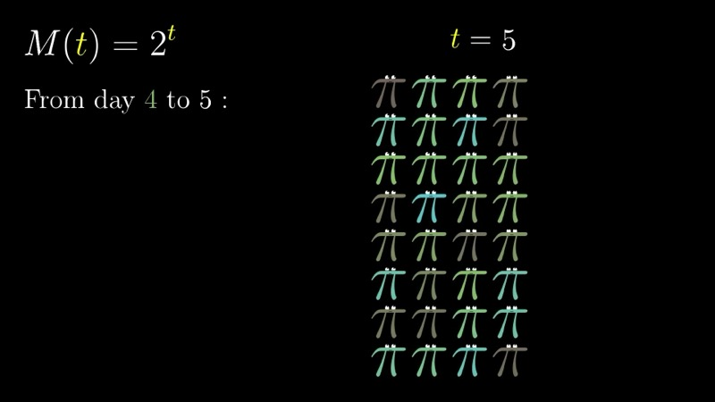
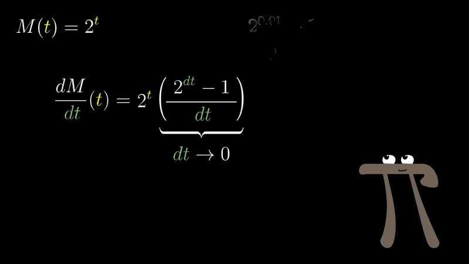
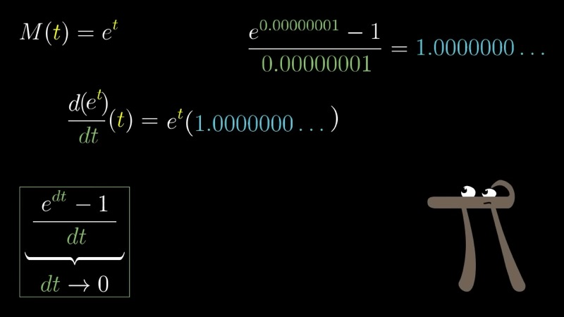
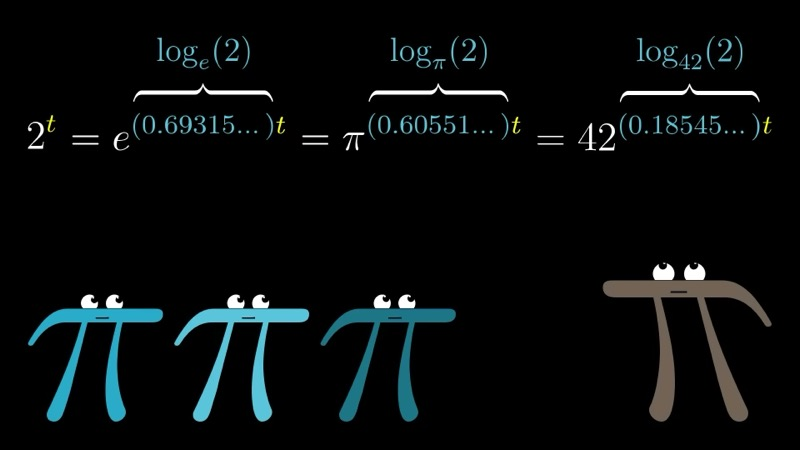

本课探讨为什么数 $e \approx 2.71828$ 在所有指数函数的底数中占据独特的地位。我们推导出对任意底数 $a > 0$ 有 $\frac{d}{dt} a^t = a^t \ln a$，并证明 $e$ 是使比例常数恰好等于 $1$ 的唯一底数——即 $\frac{d}{dt} e^t = e^t$。随后我们讨论链式法则和自然对数如何统一处理所有指数函数。

::: {.callout-note collapse="true"}
## 预备知识

- 熟悉指数函数 $a^t$ 及其基本代数性质
- 理解导数作为瞬时变化率的概念（第一至二章）
- 掌握复合函数的链式法则（第三章）
:::

## 本课内容

- $2^t$ 的导数与一个神秘比例常数的出现
- 通过分解 $a^{t+dt}$ 来分离与底数相关的常数
- $e$ 的定义性质：其指数函数等于自身导数的唯一底数
- 通过自然对数将任意指数函数改写为 $e^{kt}$
- 在人口增长、冷却过程和复利计算中的应用

## 课程视频

```{=html}
<video controls width="100%" preload="metadata">
  <source src="https://github.com/ymote/3b1b-calculus/releases/download/v1.0/05_What%27s%20so%20special%20about%20Euler%27s%20number%20e%EF%BC%9F%20%EF%BD%9C%20Chapter%205%2C%20Essence%20of%20calculus.mp4" type="video/mp4">
</video>
```

## 课程关键帧









## 核心要点

### $2^t$ 的导数：初步尝试

我们首先建立一个每天翻倍的量的模型。设 $M(t) = 2^t$ 表示时刻 $t$（以天为单位）的总质量。在一整天内，从第 $t$ 天到第 $t+1$ 天的质量变化为

$$
M(t+1) - M(t) = 2^{t+1} - 2^t = 2^t(2 - 1) = 2^t.
$$

这个观察——每天的变化量等于当前值——可能令人误以为 $\frac{d}{dt}2^t = 2^t$。然而，导数要求我们考察远小于一天的时间间隔内发生的变化。

### 分离比例常数

对于无穷小时间步长 $dt$，我们写出

$$
\frac{2^{t+dt} - 2^t}{dt} = 2^t \cdot \frac{2^{dt} - 1}{dt}.
$$

关键的代数步骤是分解 $2^{t+dt} = 2^t \cdot 2^{dt}$，这来自指数的基本性质。提取公因子 $2^t$ 后，剩余的表达式

$$
\frac{2^{dt} - 1}{dt}
$$

仅依赖于 $dt$，而不依赖于 $t$。当 $dt \to 0$ 时，该比值趋近于一个特定常数。数值计算确认

$$
\lim_{dt \to 0} \frac{2^{dt} - 1}{dt} \approx 0.6931.
$$

因此，$2^t$ 的导数并不等于自身，而是**正比于**自身：

$$
\frac{d}{dt} 2^t = 0.6931 \cdot 2^t.
$$

### 任意底数的一般规律

同样的论证适用于任意底数 $a > 0$ 的指数函数 $a^t$。我们得到

$$
\frac{d}{dt} a^t = a^t \cdot \lim_{dt \to 0} \frac{a^{dt} - 1}{dt}.
$$

右端的极限是一个仅依赖于底数 $a$ 的常数。对几个典型底数：

| 底数 $a$ | 比例常数 |
|:--------:|:-----------------------:|
| 2        | 0.6931                  |
| 3        | 1.0986                  |
| 8        | 2.0794                  |

可以观察到 $2.0794 \approx 3 \times 0.6931$，暗示着更深层的对数结构。

### 交互演示：比例常数（Desmos）

```{=html}
<div id="calc_ch05_1" class="desmos-container"></div>
<script src="https://www.desmos.com/api/v1.9/calculator.js?apiKey=dcb31709b452b1cf9dc26972add0fda6"></script>
<script>
  var calc_ch05_1 = Desmos.GraphingCalculator(document.getElementById('calc_ch05_1'), {
    expressions: true, settingsMenu: false, xAxisLabel: 'dt', yAxisLabel: ''
  });
  calc_ch05_1.setExpression({ id: 'base', latex: 'a = 2', sliderBounds: { min: 1.1, max: 10, step: 0.1 } });
  calc_ch05_1.setExpression({ id: 'ratio', latex: 'y = \\frac{a^{x} - 1}{x}', color: '#2d70b3' });
  calc_ch05_1.setExpression({ id: 'limit', latex: 'y = \\ln(a)', color: '#c74440', lineStyle: Desmos.Styles.DASHED });
  calc_ch05_1.setMathBounds({ left: -0.5, right: 2, bottom: -0.5, top: 4 });
</script>
```

调整滑块 $a$ 以改变指数底数。蓝色曲线表示 $\frac{a^{dt} - 1}{dt}$ 关于 $dt$ 的函数；可以观察到当 $dt \to 0$ 时，曲线趋近于 $\ln a$ 处的红色虚线。

### $e$ 的定义性质

一个自然的问题出现了：是否存在一个底数使比例常数恰好等于 $1$？即我们寻找满足以下条件的 $a$：

$$
\lim_{dt \to 0} \frac{a^{dt} - 1}{dt} = 1.
$$

答案是**肯定的**，这个底数记为 $e \approx 2.71828$。从某种意义上说，数 $e$ 正是由这个性质**定义**的——正如 $\pi$ 被定义为圆的周长与直径之比。

对于底数 $e$，导数公式变为

$$
\frac{d}{dt} e^t = e^t.
$$

从几何角度看，这意味着在 $e^t$ 图像上的每一点，切线的斜率等于曲线在该点的高度。

### 交互演示：$e^t$ 是自身的导数（Desmos）

```{=html}
<div id="calc_ch05_2" class="desmos-container"></div>
<script>
  var calc_ch05_2 = Desmos.GraphingCalculator(document.getElementById('calc_ch05_2'), {
    expressions: true, settingsMenu: false, xAxisLabel: 't', yAxisLabel: ''
  });
  calc_ch05_2.setExpression({ id: 'exp', latex: 'y = e^{x}', color: '#2d70b3' });
  calc_ch05_2.setExpression({ id: 'a', latex: 'a = 1', sliderBounds: { min: -2, max: 3, step: 0.01 } });
  calc_ch05_2.setExpression({ id: 'pt', latex: '(a, e^{a})', color: '#c74440', pointSize: 9 });
  calc_ch05_2.setExpression({ id: 'tangent', latex: 'y = e^{a}(x - a) + e^{a}', color: '#388c46' });
  calc_ch05_2.setExpression({ id: 'height', latex: 'x = a \\left\\{0 \\le y \\le e^{a}\\right\\}', color: '#c74440', lineStyle: Desmos.Styles.DASHED });
  calc_ch05_2.setMathBounds({ left: -3, right: 4, bottom: -2, top: 20 });
</script>
```

移动滑块 $a$ 使点沿曲线 $e^t$ 滑动。绿色切线的斜率为 $e^a$，恰好等于红色虚线段——即该点的高度。这证实了 $\frac{d}{dt}e^t = e^t$。

### 通过链式法则和自然对数建立联系

$e$ 的存在解开了神秘常数之谜。任何底数 $a > 0$ 都可以改写为

$$
a = e^{\ln a},
$$

其中 $\ln a$ 表示自然对数（即 $\log_e a$）。因此，

$$
a^t = \bigl(e^{\ln a}\bigr)^t = e^{(\ln a)\,t}.
$$

对 $e^{(\ln a)\,t}$ 应用链式法则，其中外层函数为 $e^u$（导数为 $e^u$），内层函数为 $u = (\ln a)\,t$（导数为 $\ln a$），我们得到

$$
\frac{d}{dt} a^t = \frac{d}{dt} e^{(\ln a)\,t} = (\ln a)\, e^{(\ln a)\,t} = (\ln a)\, a^t.
$$

因此，任意底数 $a$ 对应的神秘常数就是 $\ln a$：

$$
\frac{d}{dt} a^t = (\ln a)\, a^t.
$$

对于 $a = 2$，我们恢复了 $\ln 2 \approx 0.6931$；对于 $a = 8$，$\ln 8 = 3\ln 2 \approx 2.0794$。

### 交互演示：指数函数及其导数的比较（Desmos）

```{=html}
<div id="calc_ch05_3" class="desmos-container"></div>
<script>
  var calc_ch05_3 = Desmos.GraphingCalculator(document.getElementById('calc_ch05_3'), {
    expressions: true, settingsMenu: false, xAxisLabel: 't', yAxisLabel: ''
  });
  calc_ch05_3.setExpression({ id: 'base', latex: 'a = 2', sliderBounds: { min: 1.1, max: 5, step: 0.1 } });
  calc_ch05_3.setExpression({ id: 'func', latex: 'y = a^{x}', color: '#2d70b3', label: 'a^t', showLabel: true });
  calc_ch05_3.setExpression({ id: 'deriv', latex: 'y = \\ln(a) \\cdot a^{x}', color: '#c74440', label: 'ln(a) * a^t', showLabel: true });
  calc_ch05_3.setExpression({ id: 'e_line', latex: 'a = e', color: '#388c46', lineStyle: Desmos.Styles.DASHED, label: 'a = e', showLabel: true });
  calc_ch05_3.setMathBounds({ left: -2, right: 4, bottom: -2, top: 30 });
</script>
```

滑动 $a$ 观察指数函数 $a^t$（蓝色）与其导数 $(\ln a)\, a^t$（红色）之间的关系。当 $a = e \approx 2.718$ 时，两条曲线重合——函数等于自身的导数。

### 为什么在应用中使用 $e^{kt}$

许多自然现象满足如下形式的微分方程：

$$
\frac{dM}{dt} = k \, M,
$$

其中 $k$ 是比例常数。例如：

- **人口增长**：增长速率正比于当前人口规模。
- **牛顿冷却定律**：温度变化速率正比于温度差。
- **复利**：货币增长速率正比于当前余额。

该方程的解为 $M(t) = M(0)\, e^{kt}$。将指数函数写成以 $e$ 为底的形式，使比例常数 $k$ 直接出现在指数中，赋予其明确的物理意义。虽然也可以使用其他底数 $a$——因为 $a^t = e^{(\ln a)\,t}$——但以 $e$ 为底能使指数与变化率之间的关系一目了然。

### 交互演示：比例常数的数值探索（Python）

```{=html}
<div class="pyodide-container">
  <textarea class="code-input" id="code_ch05_1">
import numpy as np
import matplotlib.pyplot as plt

# Numerically compute lim (a^dt - 1)/dt as dt -> 0 for several bases
bases = [2, 3, np.e, 5, 8, 10]
dt_values = np.logspace(-1, -8, 50)

fig, ax = plt.subplots(figsize=(9, 5))

for a in bases:
    ratios = (a**dt_values - 1) / dt_values
    label = f'a = e' if np.isclose(a, np.e) else f'a = {a:.0f}'
    ax.semilogx(dt_values, ratios, label=f'{label}  (ln a = {np.log(a):.4f})')

ax.set_xlabel('dt')
ax.set_ylabel('$(a^{dt} - 1) \\,/\\, dt$')
ax.set_title('Proportionality constant converges to ln(a)')
ax.legend()
ax.grid(True, alpha=0.3)
plt.tight_layout()
plt.show()
  </textarea>
  <button class="run-btn" onclick="runPyodide('code_ch05_1', 'output_ch05_1', 'plot_ch05_1')">Run ▶</button>
  <div class="output" id="output_ch05_1"></div>
  <div class="plot-output" id="plot_ch05_1"></div>
</div>
```

### 交互演示：指数增长模型 $M(t) = M_0 \, e^{kt}$（Python）

```{=html}
<div class="pyodide-container">
  <textarea class="code-input" id="code_ch05_2">
import numpy as np
import matplotlib.pyplot as plt

# Compare exponential growth for different values of k
t = np.linspace(0, 3, 200)
M0 = 1.0
k_values = [0.5, np.log(2), 1.0, np.log(3)]

fig, (ax1, ax2) = plt.subplots(1, 2, figsize=(11, 5))

for k in k_values:
    M = M0 * np.exp(k * t)
    ax1.plot(t, M, label=f'k = {k:.4f}')

ax1.set_xlabel('Time t')
ax1.set_ylabel('$M(t) = e^{kt}$')
ax1.set_title('Exponential growth for various k')
ax1.legend()
ax1.grid(True, alpha=0.3)

# Verify derivative numerically: d/dt e^(kt) should equal k * e^(kt)
k = np.log(2)
dt = 1e-6
deriv_numerical = (np.exp(k * (t + dt)) - np.exp(k * t)) / dt
deriv_exact = k * np.exp(k * t)

ax2.plot(t, deriv_exact, label='Exact: $\\ln(2) \\cdot 2^t$', linewidth=2)
ax2.plot(t, deriv_numerical, '--', label='Numerical derivative', linewidth=2)
ax2.set_xlabel('Time t')
ax2.set_ylabel('$dM/dt$')
ax2.set_title('Derivative of $2^t = e^{(\\ln 2)\\,t}$')
ax2.legend()
ax2.grid(True, alpha=0.3)

plt.tight_layout()
plt.show()
  </textarea>
  <button class="run-btn" onclick="runPyodide('code_ch05_2', 'output_ch05_2', 'plot_ch05_2')">Run ▶</button>
  <div class="output" id="output_ch05_2"></div>
  <div class="plot-output" id="plot_ch05_2"></div>
</div>
```

## 速查表

::: {.key-formula}
| 概念 | 核心结论 |
|---|---|
| $a^t$ 的导数 | $\frac{d}{dt} a^t = (\ln a)\, a^t$ |
| $e$ 的定义性质 | $\frac{d}{dt} e^t = e^t$ |
| 链式法则形式 | $\frac{d}{dt} e^{kt} = k\, e^{kt}$ |
| 底数转换 | $a^t = e^{(\ln a)\, t}$ |
| 指数微分方程 | $\frac{dM}{dt} = kM \implies M(t) = M_0\, e^{kt}$ |
:::
