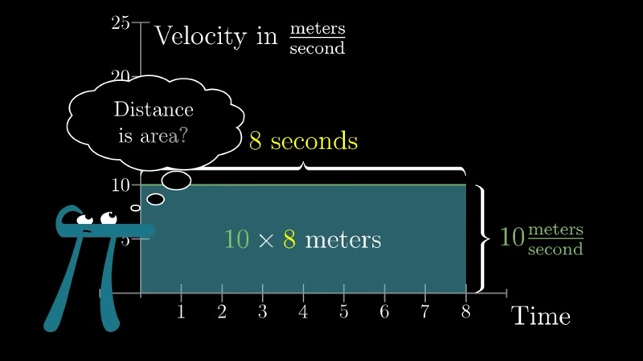
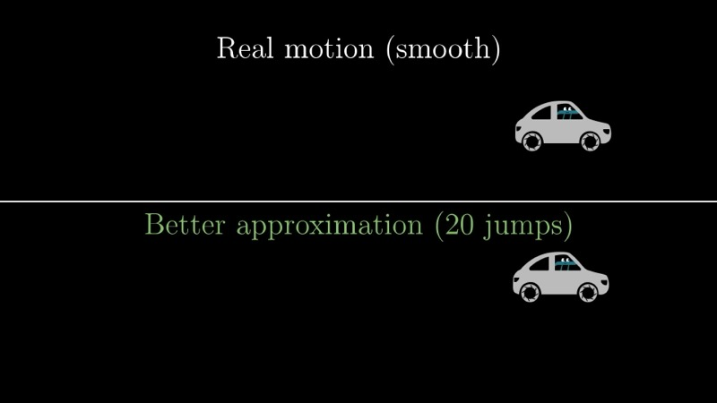
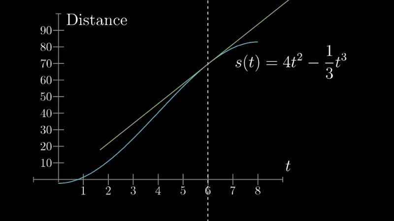
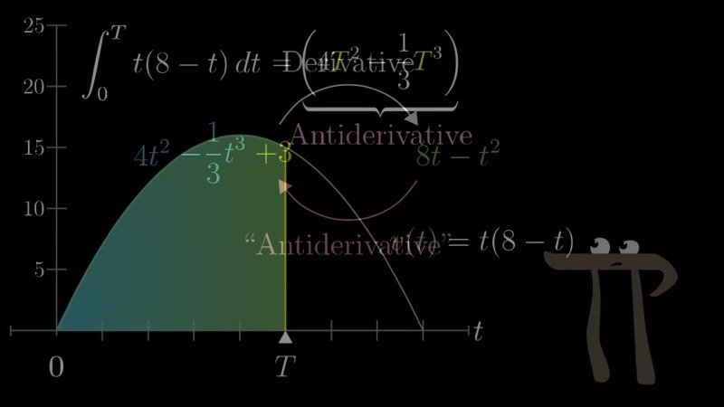

本课从"由速度恢复路程"这一问题出发，发展积分作为曲线下面积的概念。然后我们建立微积分基本定理，揭示积分与微分互为逆运算的关系，并演示如何利用原函数来计算定积分。

::: {.callout-note collapse="true"}
## 预备知识

- 理解导数和幂法则（第二至四章）
- 熟悉极限的概念（第七章）
- 能够使用求和记号以及有限和逼近的思想
:::

## 本课内容

- 通过速度函数的曲线下面积恢复路程
- 积分作为黎曼和的极限
- 面积函数及其导数
- 微积分基本定理
- 利用原函数计算定积分
- 有符号面积与被积函数为负值的情形

## 课程视频

```{=html}
<div class="video-container"><iframe src="https://www.youtube.com/embed/rfG8ce4nNh0" title="Integration and the fundamental theorem of calculus" frameborder="0" allow="accelerometer; autoplay; clipboard-write; encrypted-media; gyroscope; picture-in-picture; web-share" allowfullscreen></iframe></div>
```

## 课程关键帧









## 核心要点

### 从速度到距离：驱动问题

考虑一辆汽车，其速度由函数

$$
v(t) = t(8 - t)
$$

给出，其中 $0 \le t \le 8$ 秒。核心问题是：在这段时间内汽车行驶了多远？如果速度恒定，答案就是速度乘以时间。但由于 $v(t)$ 在不断变化，我们需要发展一种更精细的方法。

### 黎曼和近似

我们将时间区间 $[0, 8]$ 分成 $n$ 个子区间，每个宽度为 $dt = 8/n$。在每个小区间 $[t_i,\, t_i + dt]$ 上，我们将速度近似为常数，等于 $v(t_i)$。在该子区间上行驶的距离近似为

$$
\Delta s_i \approx v(t_i) \, dt.
$$

对所有子区间求和，总的近似距离为

$$
s \approx \sum_{i=0}^{n-1} v(t_i) \, dt.
$$

这个和中的每一项对应于一个高为 $v(t_i)$、宽为 $dt$ 的细矩形的面积。当 $dt \to 0$（即 $n \to \infty$）时，这个和收敛到精确的行驶距离，等于速度曲线下的面积：

$$
s = \int_0^8 v(t) \, dt = \int_0^8 t(8 - t) \, dt.
$$

### 交互演示：黎曼和近似（Desmos）

```{=html}
<div id="calc_ch08_1" class="desmos-container"></div>
<script src="https://www.desmos.com/api/v1.9/calculator.js?apiKey=dcb31709b452b1cf9dc26972add0fda6"></script>
<script>
  var calc_ch08_1 = Desmos.GraphingCalculator(document.getElementById('calc_ch08_1'), {
    expressions: true, settingsMenu: false, xAxisLabel: 't', yAxisLabel: 'v(t)'
  });
  calc_ch08_1.setExpression({ id: 'vel', latex: 'v(t) = t(8 - t)', color: '#2d70b3' });
  calc_ch08_1.setExpression({ id: 'n', latex: 'n = 8', sliderBounds: { min: 1, max: 80, step: 1 } });
  calc_ch08_1.setExpression({ id: 'dt', latex: 'd_t = \\frac{8}{n}' });
  calc_ch08_1.setExpression({ id: 'rects', latex: '0 \\le y \\le \\operatorname{floor}\\left(\\frac{x}{d_t}\\right) d_t \\left(8 - \\operatorname{floor}\\left(\\frac{x}{d_t}\\right) d_t\\right) \\left\\{0 \\le x \\le 8\\right\\}', color: '#388c46', fillOpacity: 0.3 });
  calc_ch08_1.setMathBounds({ left: -0.5, right: 9, bottom: -2, top: 20 });
</script>
```

调整滑块 $n$ 以增加矩形的数量。随着 $n$ 增大，所有矩形的总面积收敛到抛物线下的真实面积。

### 积分作为面积函数

我们现在将这一构造推广。给定一个连续函数 $f$，我们定义**面积函数**

$$
A(T) = \int_a^T f(t) \, dt,
$$

它表示 $f$ 的图像从 $t = a$ 到 $t = T$ 之间的有符号面积。在速度的语境中，$A(T)$ 就是汽车到时刻 $T$ 所行驶的距离。

### 面积函数的导数

考虑对上限施加一个微小增量 $dT$。相应的面积变化是 $T$ 与 $T + dT$ 之间的薄片：

$$
dA \approx f(T) \, dT.
$$

这个薄片近似为一个高为 $f(T)$、宽为 $dT$ 的矩形。两边除以 $dT$ 并令 $dT \to 0$，我们得到

$$
\frac{dA}{dT} = f(T).
$$

换言之，面积函数在任意一点的导数等于图像在该点的高度。这是连接积分与微分的核心洞察。

### 交互演示：面积函数及其导数（Desmos）

```{=html}
<div id="calc_ch08_2" class="desmos-container"></div>
<script>
  var calc_ch08_2 = Desmos.GraphingCalculator(document.getElementById('calc_ch08_2'), {
    expressions: true, settingsMenu: false, xAxisLabel: 't', yAxisLabel: ''
  });
  calc_ch08_2.setExpression({ id: 'v', latex: 'v(t) = t(8 - t)', color: '#2d70b3' });
  calc_ch08_2.setExpression({ id: 'S', latex: 'S(t) = 4t^2 - \\frac{t^3}{3}', color: '#388c46' });
  calc_ch08_2.setExpression({ id: 'T', latex: 'T = 5', sliderBounds: { min: 0, max: 8, step: 0.01 } });
  calc_ch08_2.setExpression({ id: 'dT', latex: 'd = 0.3', sliderBounds: { min: 0.01, max: 1, step: 0.01 } });
  calc_ch08_2.setExpression({ id: 'shade', latex: '0 \\le y \\le x(8 - x) \\left\\{0 \\le x \\le T\\right\\}', color: '#388c46', fillOpacity: 0.15 });
  calc_ch08_2.setExpression({ id: 'sliver', latex: '0 \\le y \\le x(8 - x) \\left\\{T \\le x \\le T + d\\right\\}', color: '#c74440', fillOpacity: 0.5 });
  calc_ch08_2.setMathBounds({ left: -0.5, right: 9, bottom: -10, top: 90 });
</script>
```

移动滑块 $T$ 观察阴影面积的增长。$t = T$ 处的红色薄片面积近似为 $v(T) \cdot dT$，证实 $dS/dT = v(T)$。

### 微积分基本定理

前面的论证建立了**微积分基本定理**。若 $F$ 是 $f$ 的任意原函数（即 $F'(x) = f(x)$），则

$$
\int_a^b f(t) \, dt = F(b) - F(a).
$$

证明如下。我们已经证明面积函数 $A(x) = \int_a^x f(t)\, dt$ 满足 $A'(x) = f(x)$。因此 $A$ 是 $f$ 的一个原函数。由于 $f$ 的任意两个原函数之差为常数，我们可以写 $A(x) = F(x) + C$，其中 $C$ 为某常数。在 $x = a$ 处求值得 $0 = F(a) + C$，从而 $C = -F(a)$。因此

$$
\int_a^b f(t)\, dt = A(b) = F(b) - F(a).
$$

这个结果非常深刻：要计算积分——它被定义为涉及 $f$ 在 $[a, b]$ 上所有值的求和的极限——只需在两个点处计算原函数的值即可。

### 应用微积分基本定理：速度的例子

回到速度函数 $v(t) = t(8 - t) = 8t - t^2$。我们寻找满足 $S'(t) = 8t - t^2$ 的原函数 $S(t)$。

逆用幂法则：

- $4t^2$ 的导数是 $8t$。
- $\tfrac{1}{3}t^3$ 的导数是 $t^2$。

因此

$$
S(t) = 4t^2 - \frac{t^3}{3} + C.
$$

由微积分基本定理，在 $[0, 8]$ 上行驶的总距离为

$$
\int_0^8 (8t - t^2)\, dt = S(8) - S(0) = \left(4 \cdot 64 - \frac{512}{3}\right) - 0 = 256 - \frac{512}{3} = \frac{256}{3} \approx 85.33 \text{ 米}.
$$

更一般地，在 $t = 1$ 到 $t = 7$ 之间行驶的距离为

$$
\int_1^7 (8t - t^2)\, dt = S(7) - S(1) = \left(196 - \frac{343}{3}\right) - \left(4 - \frac{1}{3}\right) = \frac{245}{3} - \frac{11}{3} = 78 \text{ 米}.
$$

注意任意常数 $C$ 在差 $S(b) - S(a)$ 中抵消了，因此可以使用任何原函数。

### 交互演示：计算定积分（Desmos）

```{=html}
<div id="calc_ch08_3" class="desmos-container"></div>
<script>
  var calc_ch08_3 = Desmos.GraphingCalculator(document.getElementById('calc_ch08_3'), {
    expressions: true, settingsMenu: false, xAxisLabel: 't', yAxisLabel: 'v(t)'
  });
  calc_ch08_3.setExpression({ id: 'vel', latex: 'v(t) = t(8 - t)', color: '#2d70b3' });
  calc_ch08_3.setExpression({ id: 'a', latex: 'a = 1', sliderBounds: { min: 0, max: 7, step: 0.1 } });
  calc_ch08_3.setExpression({ id: 'b', latex: 'b = 7', sliderBounds: { min: 1, max: 8, step: 0.1 } });
  calc_ch08_3.setExpression({ id: 'region', latex: '0 \\le y \\le x(8 - x) \\left\\{a \\le x \\le b\\right\\}', color: '#6042a6', fillOpacity: 0.3 });
  calc_ch08_3.setExpression({ id: 'Fb', latex: 'F_b = 4b^2 - \\frac{b^3}{3}' });
  calc_ch08_3.setExpression({ id: 'Fa', latex: 'F_a = 4a^2 - \\frac{a^3}{3}' });
  calc_ch08_3.setExpression({ id: 'integral', latex: 'I = F_b - F_a' });
  calc_ch08_3.setMathBounds({ left: -0.5, right: 9, bottom: -2, top: 20 });
</script>
```

调整滑块 $a$ 和 $b$ 以改变积分上下限。阴影区域表示 $\int_a^b t(8-t)\, dt = S(b) - S(a)$。

### 有符号面积与负值被积函数

当函数 $f$ 在 $[a, b]$ 的部分区间上取负值时，积分通过**有符号面积**来处理。图像位于水平轴下方的部分对积分贡献负值。在速度的语境中，负速度对应于汽车在倒退，积分计算的是区间上的净位移（而非总路程）。

形式上，如果 $f(t) < 0$ 在某个子区间上成立，黎曼和中的矩形 $f(t_i)\, dt$ 带有负号，积分反映了这一点：

$$
\int_a^b f(t)\, dt = (\text{轴上方面积}) - (\text{轴下方面积}).
$$

### 动画演示：黎曼和的收敛

```{=html}
<div class="d3-container" id="d3_ch08_riemann"></div>
<div class="d3-controls">
  <button id="d3_ch08_riemann_play">Play &#9654;</button>
  <label>Rectangles N:</label>
  <input type="range" id="d3_ch08_riemann_n" min="2" max="120" value="8" step="1">
  <span class="value-display" id="d3_ch08_riemann_n_val">N = 8</span>
  <span class="value-display" id="d3_ch08_riemann_approx"></span>
</div>
<script>
(function() {
  const W = 700, H = 400, margin = {top: 30, right: 30, bottom: 50, left: 60};
  const w = W - margin.left - margin.right, h = H - margin.top - margin.bottom;
  const tMax = 8;

  function v(t) { return t * (8 - t); }
  const exact = 256 / 3;

  const svg = d3.select("#d3_ch08_riemann").append("svg")
    .attr("viewBox", `0 0 ${W} ${H}`)
    .append("g").attr("transform", `translate(${margin.left},${margin.top})`);

  const x = d3.scaleLinear().domain([0, tMax]).range([0, w]);
  const y = d3.scaleLinear().domain([0, 18]).range([h, 0]);

  // Axes
  svg.append("g").attr("transform", `translate(0,${h})`).call(d3.axisBottom(x).ticks(8))
    .append("text").attr("x", w / 2).attr("y", 40).attr("fill", "#333")
    .attr("text-anchor", "middle").attr("font-size", "14px").text("t (seconds)");
  svg.append("g").call(d3.axisLeft(y).ticks(6))
    .append("text").attr("x", -h / 2).attr("y", -45).attr("fill", "#333")
    .attr("text-anchor", "middle").attr("transform", "rotate(-90)")
    .attr("font-size", "14px").text("v(t) = t(8 \u2212 t)");

  // The curve v(t) = t(8-t)
  const curveData = d3.range(0, tMax + 0.02, 0.02).map(function(t) { return [t, v(t)]; });
  svg.append("path").datum(curveData)
    .attr("d", d3.line().x(function(d) { return x(d[0]); }).y(function(d) { return y(d[1]); }))
    .attr("fill", "none").attr("stroke", "#2d70b3").attr("stroke-width", 2.5);

  // Exact area fill (light)
  var areaGen = d3.area()
    .x(function(d) { return x(d[0]); })
    .y0(y(0))
    .y1(function(d) { return y(d[1]); });
  svg.append("path").datum(curveData)
    .attr("d", areaGen)
    .attr("fill", "#2d70b3").attr("opacity", 0.06);

  // Label for sum value
  const sumLabel = svg.append("text").attr("x", w - 10).attr("y", 20)
    .attr("text-anchor", "end").attr("font-size", "14px").attr("font-weight", 600);

  const barsGroup = svg.append("g");

  function update(N, animate) {
    var dt = tMax / N;
    var data = d3.range(N).map(function(i) {
      var ti = i * dt;
      return { t: ti, height: v(ti), area: v(ti) * dt };
    });
    var approx = d3.sum(data, function(d) { return d.area; });

    document.getElementById("d3_ch08_riemann_n_val").textContent = "N = " + N;
    document.getElementById("d3_ch08_riemann_approx").textContent =
      "Sum = " + approx.toFixed(3) + "  |  Exact = " + exact.toFixed(3) +
      "  |  Error = " + Math.abs(approx - exact).toFixed(4);

    sumLabel.text("\u03A3 \u2248 " + approx.toFixed(3) + ",  exact = " + exact.toFixed(3));

    var bars = barsGroup.selectAll("rect").data(data, function(d, i) { return i; });

    bars.exit().transition().duration(animate ? 300 : 0)
      .attr("height", 0).attr("y", y(0)).remove();

    var enter = bars.enter().append("rect")
      .attr("x", function(d) { return x(d.t); })
      .attr("y", y(0))
      .attr("width", Math.max(1, x(dt) - x(0) - 1))
      .attr("height", 0)
      .attr("fill", "#388c46").attr("opacity", 0.6)
      .attr("stroke", "#388c46").attr("stroke-width", 0.5);

    enter.merge(bars).transition().duration(animate ? 600 : 0)
      .attr("x", function(d) { return x(d.t); })
      .attr("width", Math.max(1, x(dt) - x(0) - 1))
      .attr("y", function(d) { return y(Math.max(0, d.height)); })
      .attr("height", function(d) { return y(0) - y(Math.max(0, d.height)); });
  }

  var slider = document.getElementById("d3_ch08_riemann_n");
  slider.addEventListener("input", function() { update(+slider.value, true); });

  document.getElementById("d3_ch08_riemann_play").addEventListener("click", function() {
    var n = 2;
    slider.value = n;
    update(n, true);
    var interval = setInterval(function() {
      n = Math.min(120, n + (n < 10 ? 1 : n < 30 ? 2 : n < 60 ? 5 : 10));
      slider.value = n;
      update(n, true);
      if (n >= 120) clearInterval(interval);
    }, 700);
  });

  update(8, false);
})();
</script>
```

按 **Play** 观察黎曼和矩形在速度曲线 $v(t) = t(8 - t)$ 下不断细化。随着 $N$ 增大，求和收敛至精确积分 $\tfrac{256}{3} \approx 85.333$。

### 动画演示：微积分基本定理的实际运作

```{=html}
<div class="d3-container" id="d3_ch08_ftc"></div>
<div class="d3-controls">
  <label>Position T:</label>
  <input type="range" id="d3_ch08_ftc_T" min="0.1" max="7.9" value="4" step="0.05">
  <span class="value-display" id="d3_ch08_ftc_T_val">T = 4.00</span>
  <label style="margin-left:12px;">Sliver width dT:</label>
  <input type="range" id="d3_ch08_ftc_dT" min="0.05" max="1.5" value="0.4" step="0.05">
  <span class="value-display" id="d3_ch08_ftc_dT_val">dT = 0.40</span>
  <span class="value-display" id="d3_ch08_ftc_info"></span>
</div>
<script>
(function() {
  var W = 700, H = 520, margin = {top: 25, right: 30, bottom: 45, left: 60};
  var w = W - margin.left - margin.right;
  var hTop = 190, hBot = 190, gap = 60;
  var tMax = 8;

  function f(t) { return t * (8 - t); }
  function F(t) { return 4 * t * t - t * t * t / 3; }

  var svgRoot = d3.select("#d3_ch08_ftc").append("svg")
    .attr("viewBox", "0 0 " + W + " " + H);

  // ---- Top panel: f(t) = v(t) ----
  var gTop = svgRoot.append("g")
    .attr("transform", "translate(" + margin.left + "," + margin.top + ")");

  var xScale = d3.scaleLinear().domain([0, tMax]).range([0, w]);
  var yTop = d3.scaleLinear().domain([0, 18]).range([hTop, 0]);

  gTop.append("g").attr("transform", "translate(0," + hTop + ")").call(d3.axisBottom(xScale).ticks(8));
  gTop.append("g").call(d3.axisLeft(yTop).ticks(5));
  gTop.append("text").attr("x", w / 2).attr("y", -8).attr("text-anchor", "middle")
    .attr("font-size", "14px").attr("font-weight", 600).attr("fill", "#2d70b3")
    .text("f(t) = t(8 \u2212 t)");

  // Curve
  var curveData = d3.range(0, tMax + 0.02, 0.02).map(function(t) { return [t, f(t)]; });
  gTop.append("path").datum(curveData)
    .attr("d", d3.line().x(function(d) { return xScale(d[0]); }).y(function(d) { return yTop(d[1]); }))
    .attr("fill", "none").attr("stroke", "#2d70b3").attr("stroke-width", 2.5);

  // Shaded area [0, T]
  var shadePath = gTop.append("path").attr("fill", "#388c46").attr("opacity", 0.15);
  // Sliver [T, T+dT]
  var sliverRect = gTop.append("rect").attr("fill", "#c74440").attr("opacity", 0.55);
  // dA label
  var dALabel = gTop.append("text").attr("font-size", "13px").attr("fill", "#c74440")
    .attr("font-weight", 600).attr("text-anchor", "middle");
  // Height indicator line
  var heightLine = gTop.append("line").attr("stroke", "#c74440")
    .attr("stroke-width", 1.5).attr("stroke-dasharray", "4,3");

  // ---- Bottom panel: F(t) = antiderivative ----
  var gBot = svgRoot.append("g")
    .attr("transform", "translate(" + margin.left + "," + (margin.top + hTop + gap) + ")");

  var yBot = d3.scaleLinear().domain([0, 90]).range([hBot, 0]);

  gBot.append("g").attr("transform", "translate(0," + hBot + ")").call(d3.axisBottom(xScale).ticks(8))
    .append("text").attr("x", w / 2).attr("y", 38).attr("fill", "#333")
    .attr("text-anchor", "middle").attr("font-size", "14px").text("t (seconds)");
  gBot.append("g").call(d3.axisLeft(yBot).ticks(5));
  gBot.append("text").attr("x", w / 2).attr("y", -8).attr("text-anchor", "middle")
    .attr("font-size", "14px").attr("font-weight", 600).attr("fill", "#388c46")
    .text("F(t) = 4t\u00B2 \u2212 t\u00B3/3  (antiderivative)");

  // Antiderivative curve
  var antiData = d3.range(0, tMax + 0.02, 0.02).map(function(t) { return [t, F(t)]; });
  gBot.append("path").datum(antiData)
    .attr("d", d3.line().x(function(d) { return xScale(d[0]); }).y(function(d) { return yBot(d[1]); }))
    .attr("fill", "none").attr("stroke", "#388c46").attr("stroke-width", 2.5);

  // Dot on F(t) at T
  var dotF = gBot.append("circle").attr("r", 5).attr("fill", "#c74440");
  // Tangent line segment at T
  var tangentLine = gBot.append("line").attr("stroke", "#c74440")
    .attr("stroke-width", 2).attr("stroke-dasharray", "6,3");
  // Slope label
  var slopeLabel = gBot.append("text").attr("font-size", "12px").attr("fill", "#c74440")
    .attr("font-weight", 600);

  function update() {
    var T = +document.getElementById("d3_ch08_ftc_T").value;
    var dT = +document.getElementById("d3_ch08_ftc_dT").value;

    document.getElementById("d3_ch08_ftc_T_val").textContent = "T = " + T.toFixed(2);
    document.getElementById("d3_ch08_ftc_dT_val").textContent = "dT = " + dT.toFixed(2);

    var fT = f(T);
    var dA = fT * dT;
    var FT = F(T);

    document.getElementById("d3_ch08_ftc_info").textContent =
      "f(T) = " + fT.toFixed(2) + "  |  dA \u2248 f(T)\u00B7dT = " + dA.toFixed(3) +
      "  |  F(T) = " + FT.toFixed(2);

    // Update shaded area [0, T]
    var areaPoints = d3.range(0, T + 0.02, 0.02).map(function(t) { return [t, f(t)]; });
    if (areaPoints.length > 0) {
      var areaPath = "M" + xScale(0) + "," + yTop(0);
      areaPoints.forEach(function(d) { areaPath += " L" + xScale(d[0]) + "," + yTop(d[1]); });
      areaPath += " L" + xScale(T) + "," + yTop(0) + " Z";
      shadePath.attr("d", areaPath);
    }

    // Sliver rectangle
    var sliverH = Math.max(0, fT);
    sliverRect
      .attr("x", xScale(T))
      .attr("y", yTop(sliverH))
      .attr("width", Math.max(1, xScale(T + dT) - xScale(T)))
      .attr("height", yTop(0) - yTop(sliverH));

    // dA label
    dALabel.attr("x", xScale(T + dT / 2)).attr("y", yTop(sliverH) - 8)
      .text("dA \u2248 " + dA.toFixed(2));

    // Height line from axis to curve at T
    heightLine
      .attr("x1", xScale(T)).attr("y1", yTop(0))
      .attr("x2", xScale(T)).attr("y2", yTop(fT));

    // Dot on antiderivative
    dotF.attr("cx", xScale(T)).attr("cy", yBot(FT));

    // Tangent line: slope = f(T)
    var tangentHalf = 0.8;
    var t1 = Math.max(0, T - tangentHalf), t2 = Math.min(tMax, T + tangentHalf);
    tangentLine
      .attr("x1", xScale(t1)).attr("y1", yBot(FT + fT * (t1 - T)))
      .attr("x2", xScale(t2)).attr("y2", yBot(FT + fT * (t2 - T)));

    slopeLabel.attr("x", xScale(t2) + 5).attr("y", yBot(FT + fT * (t2 - T)) + 4)
      .text("slope = f(T) = " + fT.toFixed(2));
  }

  document.getElementById("d3_ch08_ftc_T").addEventListener("input", update);
  document.getElementById("d3_ch08_ftc_dT").addEventListener("input", update);

  update();
})();
</script>
```

移动 **Position T** 滑块探索 $f(t)$ 与其原函数 $F(t)$ 之间的联系。上方面板显示 $f(t) = t(8 - t)$，以及阴影面积 $\int_0^T f(t)\,dt$（绿色）和红色薄片 $dA \approx f(T) \cdot dT$。下方面板显示 $F(t) = 4t^2 - t^3/3$，在 $T$ 处有一个红点和一条切线，其斜率等于 $f(T)$——证实 $F'(T) = f(T)$。

## 速查表

::: {.key-formula}
| 概念 | 核心结论 |
|---|---|
| 黎曼和近似 | $\displaystyle\sum_{i=0}^{n-1} f(t_i)\, dt \;\to\; \int_a^b f(t)\, dt$，当 $dt \to 0$ |
| 面积函数的导数 | $\dfrac{d}{dT}\displaystyle\int_a^T f(t)\, dt = f(T)$ |
| 微积分基本定理 | $\displaystyle\int_a^b f(t)\, dt = F(b) - F(a)$，其中 $F' = f$ |
| 速度的例子 | $\displaystyle\int_0^8 t(8-t)\, dt = 4t^2 - \tfrac{t^3}{3}\Big\vert_0^8 = \tfrac{256}{3}$ |
| 有符号面积 | 轴下方区域对积分贡献负值 |
:::
