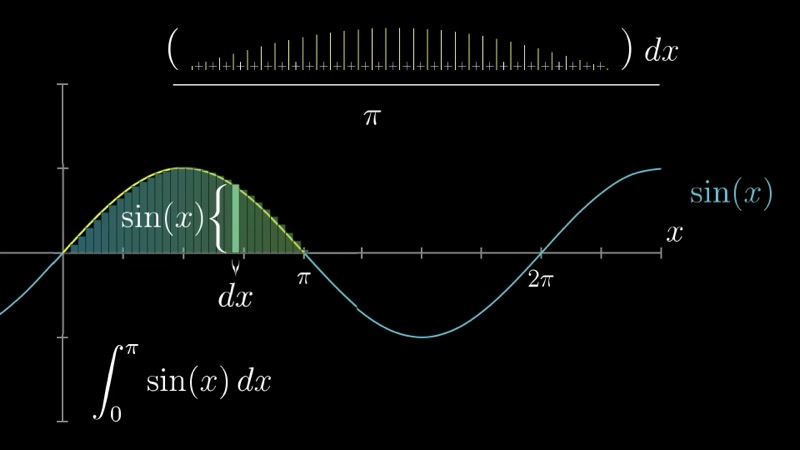
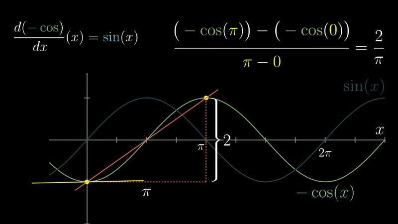
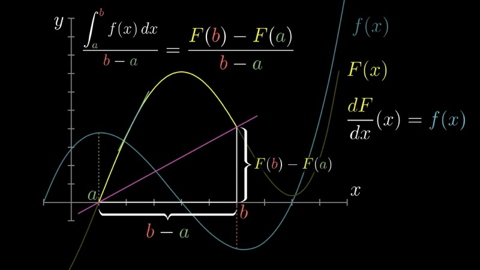

本课探讨积分与微分互为逆运算的更深层视角。通过研究连续函数平均值的计算问题——具体来说是 $\sin(x)$ 在 $[0, \pi]$ 上的平均值——我们发现函数的平均值等于其原函数在区间端点之间的斜率。这一重新表述将"曲线下面积"的概念与"另一条曲线的斜率"联系起来。

::: {.callout-note collapse="true"}
## 预备知识

- 理解定积分作为黎曼和的极限（第一、二章）
- 熟悉导数与原函数（第三、七章）
- 微积分基本定理（第八章）
- 了解基本三角函数及其导数
:::

## 本课内容

- 连续函数的平均值与积分的关系
- 通过原函数 $-\cos(x)$ 计算 $\int_0^\pi \sin(x)\, dx$
- 将平均值重新解释为原函数图像的斜率
- 切线斜率的平均值为何等于端点之间的整体斜率
- 积分与微分互逆关系的第二种直觉

## 课程视频

```{=html}
<div class="video-container"><iframe src="https://www.youtube.com/embed/FnJqaIESC2s" title="What does area have to do with slope?" frameborder="0" allow="accelerometer; autoplay; clipboard-write; encrypted-media; gyroscope; picture-in-picture; web-share" allowfullscreen></iframe></div>
```

## 课程关键帧

![$\sin(x)$ 在 $[0, \pi]$ 上的图像及其平均高度问题](../images/ch09/frame_01.jpg)







## 核心要点

### 连续变量的平均值

我们从一个看似简单的问题开始：$\sin(x)$ 在区间 $[0, \pi]$ 上的平均高度是多少？对于有限个数的集合，平均值的计算方式是将所有数求和再除以个数。然而，连续函数取无穷多个值，我们不能简单地"把它们全部相加再除以无穷大"。

解决方法是用近似。我们在 $[0, \pi]$ 上均匀取 $n$ 个点，间距为 $dx = \pi / n$。这些采样高度的平均值为

$$
\text{Average} \approx \frac{1}{n} \sum_{i=1}^{n} \sin(x_i).
$$

由于 $n = \pi / dx$，可以将其改写为

$$
\text{Average} \approx \frac{\displaystyle \sum_{i=1}^{n} \sin(x_i) \, dx}{\pi}.
$$

分子恰好是一个黎曼和。当 $dx \to 0$ 时，它收敛到定积分，从而得到连续函数平均值的基本公式：

$$
\text{Average value of } f \text{ on } [a, b] = \frac{1}{b - a} \int_a^b f(x)\, dx.
$$

用语言表述：平均值等于图像下的面积除以区间宽度。

### 正弦函数积分的计算

为计算 $\int_0^\pi \sin(x)\, dx$，我们需要 $\sin(x)$ 的一个原函数。由于 $\frac{d}{dx}[-\cos(x)] = \sin(x)$，原函数为 $F(x) = -\cos(x)$。应用微积分基本定理：

$$
\int_0^\pi \sin(x)\, dx = F(\pi) - F(0) = [-\cos(\pi)] - [-\cos(0)] = 1 - (-1) = 2.
$$

因此正弦曲线一个拱形下的面积恰好为 $2$。平均高度为

$$
\text{Average} = \frac{2}{\pi} \approx 0.6366.
$$

### 交互演示：正弦函数的平均值（Desmos）

```{=html}
<div id="calc_ch09_1" class="desmos-container"></div>
<script src="https://www.desmos.com/api/v1.9/calculator.js?apiKey=dcb31709b452b1cf9dc26972add0fda6"></script>
<script>
  var calc_ch09_1 = Desmos.GraphingCalculator(document.getElementById('calc_ch09_1'), {
    expressions: true, settingsMenu: false, xAxisLabel: 'x', yAxisLabel: 'y'
  });
  calc_ch09_1.setExpression({ id: 'sinx', latex: 'y = \\sin(x) \\left\\{0 \\le x \\le \\pi\\right\\}', color: '#2d70b3' });
  calc_ch09_1.setExpression({ id: 'n', latex: 'n = 10', sliderBounds: { min: 2, max: 80, step: 1 } });
  calc_ch09_1.setExpression({ id: 'dx', latex: 'd = \\frac{\\pi}{n}' });
  calc_ch09_1.setExpression({ id: 'rects', latex: '0 \\le y \\le \\sin\\left(\\operatorname{floor}\\left(\\frac{x}{d}\\right) \\cdot d + \\frac{d}{2}\\right) \\left\\{0 \\le x \\le \\pi\\right\\}', color: '#388c46', fillOpacity: 0.3 });
  calc_ch09_1.setExpression({ id: 'avg_line', latex: 'y = \\frac{2}{\\pi} \\left\\{0 \\le x \\le \\pi\\right\\}', color: '#c74440', lineStyle: Desmos.Styles.DASHED });
  calc_ch09_1.setExpression({ id: 'avg_label', latex: '\\frac{2}{\\pi}', color: '#c74440' });
  calc_ch09_1.setMathBounds({ left: -0.5, right: 4, bottom: -0.3, top: 1.5 });
</script>
```

调节滑块 $n$ 以增加采样点的数量。绿色矩形展示了黎曼和近似。高度 $2/\pi \approx 0.6366$ 处的红色虚线标记了精确的平均值。随着 $n$ 增大，矩形面积之和除以 $\pi$ 逐渐收敛到这个值。

### 平均值即原函数的斜率

这是本章的核心洞见。我们计算得到的平均值

$$
\frac{1}{\pi - 0}\int_0^\pi \sin(x)\, dx = \frac{F(\pi) - F(0)}{\pi - 0},
$$

恰好就是原函数 $F(x) = -\cos(x)$ 在点 $(0, F(0))$ 和 $(\pi, F(\pi))$ 之间的**割线斜率**。

更一般地，对于 $[a, b]$ 上的任意连续函数 $f$，设其原函数为 $F$，平均值公式变为

$$
\frac{1}{b - a}\int_a^b f(x)\, dx = \frac{F(b) - F(a)}{b - a}.
$$

左边是 $f$ 的平均值，右边是原函数图像在端点之间的斜率。两者是同一个量。

### 平均斜率为何等于整体斜率

由于 $f(x) = F'(x)$，$f$ 在每一点 $x$ 的值就是原函数图像在该点切线的斜率。因此，$f$ 在 $[a, b]$ 上的平均值就是 $F$ 在该区间上**所有切线斜率的平均值**。

从几何角度看，一条曲线在某区间上所有瞬时斜率的平均值应该等于端点之间的整体斜率，这是非常自然的。如果曲线的总上升量为 $\Delta F = F(b) - F(a)$，水平跨度为 $\Delta x = b - a$，那么无论曲线中间如何起伏，平均上升速率必定为 $\Delta F / \Delta x$。

这为积分与微分互逆的关系提供了第二种互补的直觉：$f$ 的积分（曲线下面积）除以区间长度等于原函数的斜率（一个类导数的量），这恰恰是因为 $f$ 本身就是原函数的导数。

### 交互演示：原函数的斜率（Desmos）

```{=html}
<div id="calc_ch09_2" class="desmos-container"></div>
<script>
  var calc_ch09_2 = Desmos.GraphingCalculator(document.getElementById('calc_ch09_2'), {
    expressions: true, settingsMenu: false, xAxisLabel: 'x', yAxisLabel: 'y'
  });
  calc_ch09_2.setExpression({ id: 'F', latex: 'F(x) = -\\cos(x)', color: '#388c46' });
  calc_ch09_2.setExpression({ id: 'a', latex: 'a = 0', sliderBounds: { min: 0, max: 3, step: 0.01 } });
  calc_ch09_2.setExpression({ id: 'b', latex: 'b = \\pi', sliderBounds: { min: 0.5, max: 6.28, step: 0.01 } });
  calc_ch09_2.setExpression({ id: 'ptA', latex: '(a, -\\cos(a))', color: '#c74440', pointStyle: Desmos.Styles.POINT, pointSize: 9 });
  calc_ch09_2.setExpression({ id: 'ptB', latex: '(b, -\\cos(b))', color: '#c74440', pointStyle: Desmos.Styles.POINT, pointSize: 9 });
  calc_ch09_2.setExpression({ id: 'secant', latex: 'y = -\\cos(a) + \\frac{-\\cos(b) + \\cos(a)}{b - a}(x - a)', color: '#c74440', lineStyle: Desmos.Styles.DASHED });
  calc_ch09_2.setMathBounds({ left: -0.5, right: 7, bottom: -1.5, top: 1.5 });
</script>
```

绿色曲线是原函数 $F(x) = -\cos(x)$。红色虚线是连接 $(a, F(a))$ 和 $(b, F(b))$ 的割线。调节滑块 $a$ 和 $b$，观察割线的斜率如何始终等于 $\sin(x)$ 在 $[a, b]$ 上的平均值。

### 交互演示：推广到任意函数（Desmos）

```{=html}
<div id="calc_ch09_3" class="desmos-container"></div>
<script>
  var calc_ch09_3 = Desmos.GraphingCalculator(document.getElementById('calc_ch09_3'), {
    expressions: true, settingsMenu: false, xAxisLabel: 'x', yAxisLabel: 'y'
  });
  calc_ch09_3.setExpression({ id: 'f', latex: 'f(x) = x^2', color: '#2d70b3' });
  calc_ch09_3.setExpression({ id: 'F', latex: 'F(x) = \\frac{x^3}{3}', color: '#388c46' });
  calc_ch09_3.setExpression({ id: 'a', latex: 'a = 0', sliderBounds: { min: -2, max: 3, step: 0.1 } });
  calc_ch09_3.setExpression({ id: 'b', latex: 'b = 3', sliderBounds: { min: 0.5, max: 5, step: 0.1 } });
  calc_ch09_3.setExpression({ id: 'shade', latex: '0 \\le y \\le x^2 \\left\\{a \\le x \\le b\\right\\}', color: '#2d70b3', fillOpacity: 0.2 });
  calc_ch09_3.setExpression({ id: 'avg_line', latex: 'y = \\frac{F(b) - F(a)}{b - a} \\left\\{a \\le x \\le b\\right\\}', color: '#c74440', lineStyle: Desmos.Styles.DASHED });
  calc_ch09_3.setMathBounds({ left: -1, right: 6, bottom: -1, top: 12 });
</script>
```

这里 $f(x) = x^2$（蓝色）及其原函数 $F(x) = x^3/3$（绿色）。阴影区域显示 $f$ 在 $[a, b]$ 上的曲线下面积。红色虚线表示平均值 $\frac{F(b) - F(a)}{b - a}$。调节 $a$ 和 $b$，验证面积除以区间宽度总是等于原函数的割线斜率。

### 从有限平均到连续平均的推广

重新审视从有限到连续的过渡是有启发意义的。给定 $n$ 个采样点 $x_1, x_2, \ldots, x_n$，间距为 $dx = (b - a)/n$，有限平均为

$$
\bar{f}_n = \frac{1}{n} \sum_{i=1}^{n} f(x_i) = \frac{1}{b - a} \sum_{i=1}^{n} f(x_i)\, dx.
$$

第二个等号来自代入 $n = (b - a)/dx$。当 $n \to \infty$（等价于 $dx \to 0$）时，分子中的黎曼和收敛到 $\int_a^b f(x)\, dx$，从而得到

$$
\bar{f} = \frac{1}{b - a}\int_a^b f(x)\, dx.
$$

这一推导凸显了微积分中反复出现的主题：当我们希望将一个离散运算（此处为有限个值的平均）推广到连续情形时，自然的工具就是积分。

### 动画演示：sin(x) 在 [0, pi] 上的平均值

```{=html}
<div class="d3-container" id="ch09_d3_avg_sin"></div>
<div class="d3-controls">
  <button id="ch09_d3_avg_sin_play">Play &#9654;</button>
  <label>Sample points N:</label>
  <input type="range" id="ch09_d3_avg_sin_n" min="2" max="200" value="5" step="1">
  <span class="value-display" id="ch09_d3_avg_sin_n_val">N = 5</span>
  <span class="value-display" id="ch09_d3_avg_sin_info"></span>
</div>
<script>
(function() {
  const W = 700, H = 400, margin = {top: 30, right: 30, bottom: 50, left: 60};
  const w = W - margin.left - margin.right, h = H - margin.top - margin.bottom;
  const a = 0, b = Math.PI;
  const exact = 2 / Math.PI;

  const svg = d3.select("#ch09_d3_avg_sin").append("svg")
    .attr("viewBox", `0 0 ${W} ${H}`)
    .append("g").attr("transform", `translate(${margin.left},${margin.top})`);

  const xScale = d3.scaleLinear().domain([0, Math.PI]).range([0, w]);
  const yScale = d3.scaleLinear().domain([0, 1.15]).range([h, 0]);

  // Axes
  svg.append("g").attr("transform", `translate(0,${h})`)
    .call(d3.axisBottom(xScale).tickValues([0, Math.PI/4, Math.PI/2, 3*Math.PI/4, Math.PI])
      .tickFormat(d => {
        if (d === 0) return "0";
        if (Math.abs(d - Math.PI/4) < 0.01) return "\u03C0/4";
        if (Math.abs(d - Math.PI/2) < 0.01) return "\u03C0/2";
        if (Math.abs(d - 3*Math.PI/4) < 0.01) return "3\u03C0/4";
        if (Math.abs(d - Math.PI) < 0.01) return "\u03C0";
        return d.toFixed(2);
      }))
    .append("text").attr("x", w/2).attr("y", 40).attr("fill", "#333")
    .attr("text-anchor", "middle").attr("font-size", "14px").text("x");

  svg.append("g").call(d3.axisLeft(yScale).ticks(6))
    .append("text").attr("x", -h/2).attr("y", -45).attr("fill", "#333")
    .attr("text-anchor", "middle").attr("transform", "rotate(-90)")
    .attr("font-size", "14px").text("sin(x)");

  // sin(x) curve
  const curveData = d3.range(0, Math.PI + 0.01, 0.01).map(t => [t, Math.sin(t)]);
  svg.append("path").datum(curveData)
    .attr("d", d3.line().x(d => xScale(d[0])).y(d => yScale(d[1])))
    .attr("fill", "none").attr("stroke", "#2d70b3").attr("stroke-width", 2.5);

  // Exact average line
  svg.append("line")
    .attr("x1", xScale(0)).attr("x2", xScale(Math.PI))
    .attr("y1", yScale(exact)).attr("y2", yScale(exact))
    .attr("stroke", "#c74440").attr("stroke-width", 1.5)
    .attr("stroke-dasharray", "6,4");

  svg.append("text")
    .attr("x", xScale(Math.PI) + 5).attr("y", yScale(exact) + 4)
    .attr("font-size", "12px").attr("fill", "#c74440").text("2/\u03C0 \u2248 0.6366");

  // Approx average line (will be updated)
  const approxLine = svg.append("line")
    .attr("x1", xScale(0)).attr("x2", xScale(Math.PI))
    .attr("stroke", "#e8a735").attr("stroke-width", 1.5)
    .attr("stroke-dasharray", "3,3");

  const approxLabel = svg.append("text")
    .attr("x", 5).attr("font-size", "12px").attr("fill", "#e8a735");

  const barsGroup = svg.append("g");
  const dotsGroup = svg.append("g");

  function update(N, animate) {
    const dx = (b - a) / N;
    const samples = d3.range(N).map(i => {
      const xi = a + (i + 0.5) * dx;
      return {x: xi, y: Math.sin(xi), left: a + i * dx};
    });
    const avg = d3.mean(samples, d => d.y);
    const error = Math.abs(avg - exact);

    document.getElementById("ch09_d3_avg_sin_n_val").textContent = `N = ${N}`;
    document.getElementById("ch09_d3_avg_sin_info").textContent =
      `Approx = ${avg.toFixed(6)}  |  Exact = ${exact.toFixed(6)}  |  Error = ${error.toFixed(6)}`;

    // Update approx average line
    approxLine
      .attr("y1", yScale(avg)).attr("y2", yScale(avg));
    approxLabel
      .attr("y", yScale(avg) - 6)
      .text(`Approx = ${avg.toFixed(4)}`);

    // Bars
    const bars = barsGroup.selectAll("rect").data(samples, (d, i) => i);
    bars.exit().transition().duration(animate ? 200 : 0).attr("height", 0).attr("y", yScale(0)).remove();

    const barW = Math.max(1, xScale(dx) - xScale(0) - (N < 30 ? 1 : 0));
    const enter = bars.enter().append("rect")
      .attr("x", d => xScale(d.left))
      .attr("y", yScale(0))
      .attr("width", barW)
      .attr("height", 0)
      .attr("fill", "#388c46").attr("opacity", 0.5);

    enter.merge(bars).transition().duration(animate ? 500 : 0)
      .attr("x", d => xScale(d.left))
      .attr("width", barW)
      .attr("y", d => yScale(d.y))
      .attr("height", d => yScale(0) - yScale(d.y));

    // Dots on curve
    const dots = dotsGroup.selectAll("circle").data(samples, (d, i) => i);
    dots.exit().remove();
    const enterDots = dots.enter().append("circle")
      .attr("r", N <= 50 ? 3 : 1.5)
      .attr("fill", "#2d70b3");
    enterDots.merge(dots)
      .attr("cx", d => xScale(d.x))
      .attr("cy", d => yScale(d.y))
      .attr("r", N <= 50 ? 3 : 1.5);
  }

  const slider = document.getElementById("ch09_d3_avg_sin_n");
  slider.addEventListener("input", () => update(+slider.value, true));

  document.getElementById("ch09_d3_avg_sin_play").addEventListener("click", function() {
    let n = 2;
    slider.value = n;
    update(n, true);
    const steps = [2,3,4,5,6,8,10,13,16,20,25,30,40,50,65,80,100,130,160,200];
    let idx = 0;
    const interval = setInterval(() => {
      idx++;
      if (idx >= steps.length) { clearInterval(interval); return; }
      n = steps[idx];
      slider.value = n;
      update(n, true);
    }, 600);
  });

  update(5, false);
})();
</script>
```

点击 **Play** 观看采样点数量逐步增长。绿色柱形显示 $\sin(x)$ 的各采样高度，橙色虚线追踪近似平均值。随着 $N$ 增大，近似平均值收敛到精确值 $2/\pi \approx 0.6366$（红色虚线）。

### 动画演示：原函数斜率等于平均值

```{=html}
<div class="d3-container" id="ch09_d3_secant"></div>
<div class="d3-controls">
  <button id="ch09_d3_secant_play">Play &#9654;</button>
  <label>Interval [0, b]:</label>
  <input type="range" id="ch09_d3_secant_b" min="0.3" max="6.28" value="3.14" step="0.02">
  <span class="value-display" id="ch09_d3_secant_b_val">b = &pi;</span>
  <span class="value-display" id="ch09_d3_secant_info"></span>
</div>
<script>
(function() {
  const W = 700, H = 420, margin = {top: 30, right: 30, bottom: 50, left: 60};
  const w = W - margin.left - margin.right, h = H - margin.top - margin.bottom;

  const svg = d3.select("#ch09_d3_secant").append("svg")
    .attr("viewBox", `0 0 ${W} ${H}`)
    .append("g").attr("transform", `translate(${margin.left},${margin.top})`);

  // Split into two panels: top for sin(x) + shaded area, bottom for -cos(x) + secant
  const hTop = h * 0.45, hBot = h * 0.45, gap = h * 0.10;

  const xScale = d3.scaleLinear().domain([0, 2 * Math.PI]).range([0, w]);
  const yTopScale = d3.scaleLinear().domain([-0.2, 1.15]).range([hTop, 0]);
  const yBotScale = d3.scaleLinear().domain([-1.3, 1.3]).range([hBot, 0]);

  const topG = svg.append("g");
  const botG = svg.append("g").attr("transform", `translate(0,${hTop + gap})`);

  // Top axes
  topG.append("g").attr("transform", `translate(0,${hTop})`)
    .call(d3.axisBottom(xScale).ticks(7).tickFormat(d => {
      if (d === 0) return "0";
      if (Math.abs(d - Math.PI) < 0.1) return "\u03C0";
      if (Math.abs(d - 2*Math.PI) < 0.1) return "2\u03C0";
      return d.toFixed(1);
    }));
  topG.append("g").call(d3.axisLeft(yTopScale).ticks(4));
  topG.append("text").attr("x", w/2).attr("y", -10)
    .attr("text-anchor", "middle").attr("font-size", "13px").attr("font-weight", 600)
    .attr("fill", "#2d70b3").text("f(x) = sin(x)  \u2014  shaded area / width = average value");

  // Bottom axes
  botG.append("g").attr("transform", `translate(0,${hBot})`)
    .call(d3.axisBottom(xScale).ticks(7).tickFormat(d => {
      if (d === 0) return "0";
      if (Math.abs(d - Math.PI) < 0.1) return "\u03C0";
      if (Math.abs(d - 2*Math.PI) < 0.1) return "2\u03C0";
      return d.toFixed(1);
    }));
  botG.append("g").call(d3.axisLeft(yBotScale).ticks(5));
  botG.append("text").attr("x", w/2).attr("y", -10)
    .attr("text-anchor", "middle").attr("font-size", "13px").attr("font-weight", 600)
    .attr("fill", "#388c46").text("F(x) = \u2212cos(x)  \u2014  secant slope = average value");

  // sin(x) curve
  const sinData = d3.range(0, 2 * Math.PI + 0.01, 0.02).map(t => [t, Math.sin(t)]);
  topG.append("path").datum(sinData)
    .attr("d", d3.line().x(d => xScale(d[0])).y(d => yTopScale(d[1])))
    .attr("fill", "none").attr("stroke", "#2d70b3").attr("stroke-width", 2);

  // -cos(x) curve
  const cosData = d3.range(0, 2 * Math.PI + 0.01, 0.02).map(t => [t, -Math.cos(t)]);
  botG.append("path").datum(cosData)
    .attr("d", d3.line().x(d => xScale(d[0])).y(d => yBotScale(d[1])))
    .attr("fill", "none").attr("stroke", "#388c46").attr("stroke-width", 2);

  // Zero lines
  topG.append("line").attr("x1", 0).attr("x2", w)
    .attr("y1", yTopScale(0)).attr("y2", yTopScale(0))
    .attr("stroke", "#aaa").attr("stroke-width", 0.5);
  botG.append("line").attr("x1", 0).attr("x2", w)
    .attr("y1", yBotScale(0)).attr("y2", yBotScale(0))
    .attr("stroke", "#aaa").attr("stroke-width", 0.5);

  // Shaded area (clip path for top panel)
  const areaPath = topG.append("path")
    .attr("fill", "#2d70b3").attr("opacity", 0.2);

  // Average line on top panel
  const avgLine = topG.append("line")
    .attr("stroke", "#c74440").attr("stroke-width", 1.5).attr("stroke-dasharray", "6,4");

  // Secant line on bottom panel
  const secantLine = botG.append("line")
    .attr("stroke", "#c74440").attr("stroke-width", 2).attr("stroke-dasharray", "6,4");

  // Endpoint dots on bottom panel
  const dotA = botG.append("circle").attr("r", 5).attr("fill", "#c74440");
  const dotB = botG.append("circle").attr("r", 5).attr("fill", "#c74440");

  // Vertical marker line on top panel for b
  const bMarkerTop = topG.append("line")
    .attr("stroke", "#999").attr("stroke-width", 1).attr("stroke-dasharray", "3,3");
  const bMarkerBot = botG.append("line")
    .attr("stroke", "#999").attr("stroke-width", 1).attr("stroke-dasharray", "3,3");

  function update(bVal) {
    const aVal = 0;
    const Fa = -Math.cos(aVal);
    const Fb = -Math.cos(bVal);
    const slope = (Fb - Fa) / (bVal - aVal);
    const avgVal = slope; // average of sin(x) on [0,b] = secant slope

    document.getElementById("ch09_d3_secant_b_val").textContent =
      `b = ${bVal.toFixed(2)}`;
    document.getElementById("ch09_d3_secant_info").textContent =
      `Average sin(x) = ${avgVal.toFixed(4)}  |  Secant slope = ${slope.toFixed(4)}`;

    // Shaded area
    const pts = d3.range(aVal, bVal + 0.01, 0.02).map(t => [t, Math.max(0, Math.sin(t))]);
    const areaD = "M" + xScale(aVal) + "," + yTopScale(0) + " " +
      pts.map(d => `L${xScale(d[0])},${yTopScale(d[1])}`).join(" ") +
      ` L${xScale(bVal)},${yTopScale(0)} Z`;
    areaPath.attr("d", areaD);

    // Average line
    avgLine
      .attr("x1", xScale(aVal)).attr("x2", xScale(bVal))
      .attr("y1", yTopScale(avgVal)).attr("y2", yTopScale(avgVal));

    // Secant line on bottom (extend slightly beyond endpoints)
    const ext = 0.3;
    secantLine
      .attr("x1", xScale(Math.max(0, aVal - ext)))
      .attr("x2", xScale(Math.min(2*Math.PI, bVal + ext)))
      .attr("y1", yBotScale(Fa + slope * (-ext)))
      .attr("y2", yBotScale(Fa + slope * (bVal - aVal + ext)));

    // Dots
    dotA.attr("cx", xScale(aVal)).attr("cy", yBotScale(Fa));
    dotB.attr("cx", xScale(bVal)).attr("cy", yBotScale(Fb));

    // Vertical markers
    bMarkerTop
      .attr("x1", xScale(bVal)).attr("x2", xScale(bVal))
      .attr("y1", yTopScale(0)).attr("y2", yTopScale(1.15));
    bMarkerBot
      .attr("x1", xScale(bVal)).attr("x2", xScale(bVal))
      .attr("y1", yBotScale(-1.3)).attr("y2", yBotScale(1.3));
  }

  const slider = document.getElementById("ch09_d3_secant_b");
  slider.addEventListener("input", () => update(+slider.value));

  document.getElementById("ch09_d3_secant_play").addEventListener("click", function() {
    let bVal = 0.3;
    slider.value = bVal;
    update(bVal);
    const target = Math.PI;
    const interval = setInterval(() => {
      bVal += 0.06;
      if (bVal >= target) { bVal = target; clearInterval(interval); }
      slider.value = bVal;
      update(bVal);
    }, 40);
  });

  update(Math.PI);
})();
</script>
```

点击 **Play** 动画展示右端点 $b$ 从接近 $0$ 扫到 $\pi$。上方面板显示 $\sin(x)$ 的阴影面积和平均高度处的红色虚线。下方面板显示 $F(x) = -\cos(x)$ 及连接 $(0, F(0))$ 和 $(b, F(b))$ 的红色割线。割线斜率始终等于 $\sin(x)$ 在 $[0, b]$ 上的平均值，直观地展示面积与斜率是同一枚硬币的两面。

## 速查表

::: {.key-formula}
| 概念 | 核心结论 |
|---|---|
| $f$ 在 $[a, b]$ 上的平均值 | $\displaystyle \bar{f} = \frac{1}{b-a}\int_a^b f(x)\,dx$ |
| $\sin(x)$ 在 $[0, \pi]$ 上的平均值 | $\displaystyle \frac{1}{\pi}\int_0^\pi \sin(x)\,dx = \frac{2}{\pi} \approx 0.6366$ |
| 平均值即原函数斜率 | $\displaystyle \frac{1}{b-a}\int_a^b f(x)\,dx = \frac{F(b) - F(a)}{b - a}$ |
| 面积与斜率的关联 | $f(x) = F'(x)$，因此 $f$ 的平均值（面积$\div$宽度）等于 $F$ 的平均斜率（上升量$\div$跨度） |
:::
