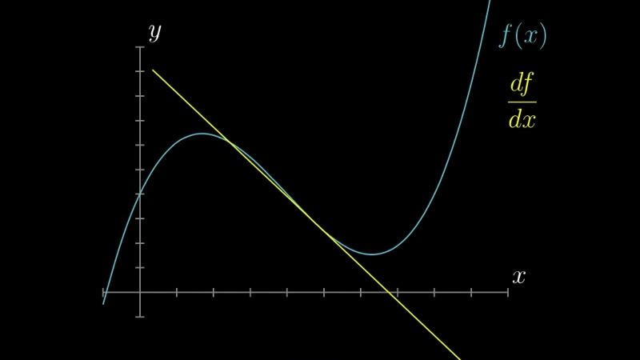
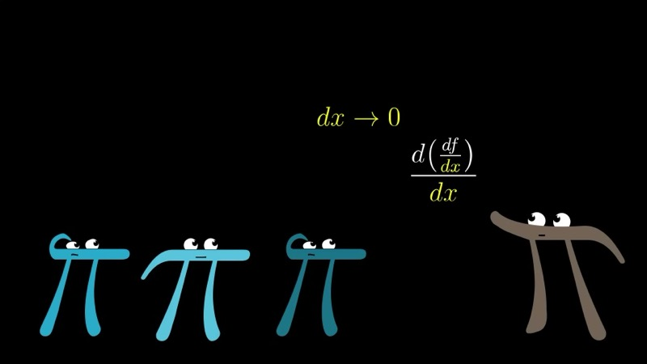
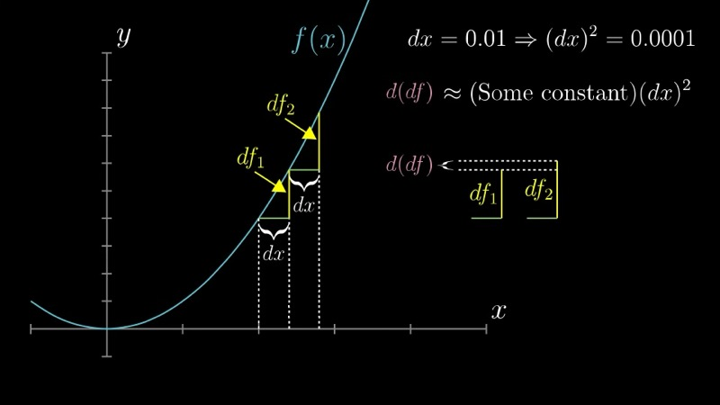
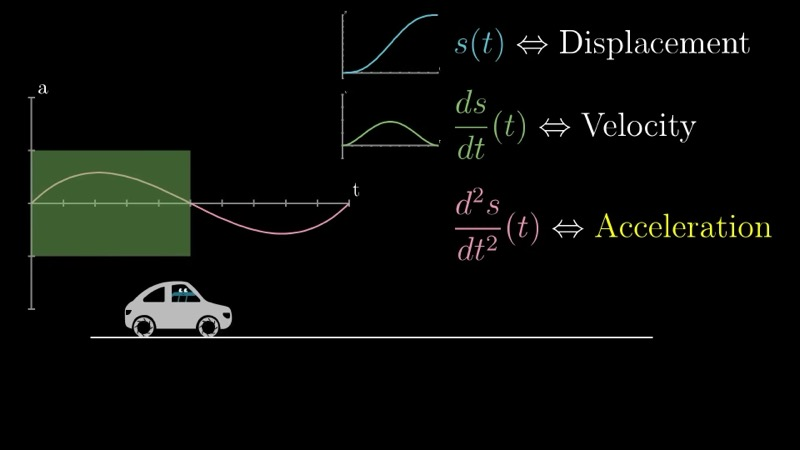

本课引入高阶导数，重点讨论二阶导数及其凹凸性的几何解释和加速度的物理解释。我们还简要介绍三阶导数以及高阶导数在函数逼近中的作用。

::: {.callout-note collapse="true"}
## 预备知识

- 理解导数作为瞬时变化率的含义（第二至三章）
- 熟悉标准导数公式和记号 $\frac{df}{dx}$（第三章）
- 具备一维运动中位置、速度和加速度的基本知识
:::

## 本课内容

- 二阶导数：导数的导数
- 凹凸性：图像的曲率与 $f''(x)$ 的正负
- 记号 $\frac{d^2 f}{dx^2}$ 的理解
- 物理解释：加速度与急动度
- 高阶导数在函数逼近中的作用

## 课程视频

```{=html}
<video controls width="100%" preload="metadata">
  <source src="https://github.com/ymote/3b1b-calculus/releases/download/v1.0/10_Higher%20order%20derivatives%20%EF%BD%9C%20Chapter%2010%2C%20Essence%20of%20calculus.mp4" type="video/mp4">
</video>
```

## 课程关键帧









## 核心要点

### 二阶导数

给定函数 $f(x)$，其一阶导数 $f'(x)$ 衡量 $f$ 相对于 $x$ 的变化率。**二阶导数**就是一阶导数的导数：

$$
f''(x) = \frac{d}{dx}\bigl[f'(x)\bigr].
$$

用莱布尼茨记号写作

$$
\frac{d^2 f}{dx^2}.
$$

$f'(x)$ 告诉我们 $f$ 图像在每一点的斜率，而 $f''(x)$ 则告诉我们斜率本身如何变化。准确地说，它是"变化率的变化率"。

### 理解记号

记号 $\frac{d^2 f}{dx^2}$ 可以如下理解。从某个输入值 $x$ 出发，向右连续走两个大小为 $dx$ 的小步。第一步使函数值产生变化 $df_1$，第二步产生变化 $df_2$。量

$$
d(df) = df_2 - df_1
$$

衡量的是 $f$ 变化方式的变化——即"变化的变化"。对于较小的 $dx$，$d(df)$ 通常与 $dx^2$ 成正比。二阶导数于是定义为极限比值：

$$
\frac{d^2 f}{dx^2} = \lim_{dx \to 0} \frac{d(df)}{dx^2}.
$$

例如，若 $dx = 0.01$，我们预期 $d(df)$ 的量级为 $0.0001$，因此比值在极限中保持有限且有意义。

### 凹凸性与 $f''(x)$ 的正负

二阶导数直接提供了 $f$ 图像**凹凸性**（曲率）的信息：

- **凸的（$f''(x) > 0$）**：图像向上弯曲，斜率 $f'(x)$ 递增。几何上，切线位于曲线下方。

- **凹的（$f''(x) < 0$）**：图像向下弯曲，斜率 $f'(x)$ 递减。切线位于曲线上方。

- **拐点（$f''(x) = 0$ 且有符号变化）**：凹凸性从上凸转为下凹或反之。在这些点处，局部意义上没有曲率。

在某点处二阶导数为较大正值的函数在该处急剧上凸，而二阶导数为较小正值的函数仅轻微上凸。

### 交互演示：凹凸性与二阶导数（Desmos）

```{=html}
<div id="calc_ch10_1" class="desmos-container"></div>
<script src="https://www.desmos.com/api/v1.9/calculator.js?apiKey=dcb31709b452b1cf9dc26972add0fda6"></script>
<script>
  var calc_ch10_1 = Desmos.GraphingCalculator(document.getElementById('calc_ch10_1'), {
    expressions: true, settingsMenu: false, xAxisLabel: 'x', yAxisLabel: ''
  });
  calc_ch10_1.setExpression({ id: 'f', latex: 'f(x) = x^3 - 3x', color: '#2d70b3' });
  calc_ch10_1.setExpression({ id: 'fp', latex: 'g(x) = 3x^2 - 3', color: '#388c46' });
  calc_ch10_1.setExpression({ id: 'fpp', latex: 'h(x) = 6x', color: '#c74440' });
  calc_ch10_1.setExpression({ id: 'a', latex: 'a = 0', sliderBounds: { min: -2.5, max: 2.5, step: 0.01 } });
  calc_ch10_1.setExpression({ id: 'pt_f', latex: '(a, f(a))', color: '#2d70b3', showLabel: true, label: 'f(a)' });
  calc_ch10_1.setExpression({ id: 'pt_fp', latex: '(a, g(a))', color: '#388c46', showLabel: true, label: "f'(a)" });
  calc_ch10_1.setExpression({ id: 'pt_fpp', latex: '(a, h(a))', color: '#c74440', showLabel: true, label: "f''(a)" });
  calc_ch10_1.setExpression({ id: 'tangent', latex: 'y = g(a)(x - a) + f(a)', color: '#6042a6', lineStyle: Desmos.Styles.DASHED });
  calc_ch10_1.setMathBounds({ left: -3, right: 3, bottom: -5, top: 5 });
</script>
```

拖动滑块 $a$ 沿曲线 $f(x) = x^3 - 3x$（蓝色）移动。绿色曲线显示 $f'(x) = 3x^2 - 3$，红色曲线显示 $f''(x) = 6x$。可以观察到，当 $f''(a) > 0$（即 $a > 0$）时，$f$ 的图像是上凸的，虚线切线位于曲线下方。

### 物理解释：加速度

二阶导数最具体的解释之一出现在运动学中。设 $s(t)$ 表示一个沿直线运动的物体的位置关于时间 $t$ 的函数。则：

- 一阶导数 $s'(t) = v(t)$ 是**速度**——位置的变化率。

- 二阶导数 $s''(t) = a(t)$ 是**加速度**——速度的变化率。

加速度告诉我们速度本身如何变化。正的二阶导数表示物体在（正方向上）加速，产生被推入座椅的感觉。负的二阶导数表示减速。

例如，考虑位置函数 $s(t) = t^3 - 6t^2 + 9t$。则：

$$
v(t) = s'(t) = 3t^2 - 12t + 9, \qquad a(t) = s''(t) = 6t - 12.
$$

加速度在 $t = 2$ 时为零，当 $t < 2$ 时为负（物体在减速），当 $t > 2$ 时为正（物体在加速）。

### 交互演示：位置、速度与加速度（Desmos）

```{=html}
<div id="calc_ch10_2" class="desmos-container"></div>
<script>
  var calc_ch10_2 = Desmos.GraphingCalculator(document.getElementById('calc_ch10_2'), {
    expressions: true, settingsMenu: false, xAxisLabel: 't', yAxisLabel: ''
  });
  calc_ch10_2.setExpression({ id: 's', latex: 's(t) = t^3 - 6t^2 + 9t', color: '#2d70b3' });
  calc_ch10_2.setExpression({ id: 'v', latex: 'v(t) = 3t^2 - 12t + 9', color: '#388c46' });
  calc_ch10_2.setExpression({ id: 'acc', latex: 'a(t) = 6t - 12', color: '#c74440' });
  calc_ch10_2.setExpression({ id: 't0', latex: 't_0 = 1', sliderBounds: { min: 0, max: 4, step: 0.01 } });
  calc_ch10_2.setExpression({ id: 'pt_s', latex: '(t_0, s(t_0))', color: '#2d70b3', showLabel: true, label: 's(t)' });
  calc_ch10_2.setExpression({ id: 'pt_v', latex: '(t_0, v(t_0))', color: '#388c46', showLabel: true, label: 'v(t)' });
  calc_ch10_2.setExpression({ id: 'pt_a', latex: '(t_0, a(t_0))', color: '#c74440', showLabel: true, label: 'a(t)' });
  calc_ch10_2.setMathBounds({ left: -0.5, right: 4.5, bottom: -8, top: 12 });
</script>
```

使用滑块 $t_0$ 来追踪运动 $s(t) = t^3 - 6t^2 + 9t$ 的位置 $s(t)$（蓝色）、速度 $v(t)$（绿色）和加速度 $a(t)$（红色）。注意当加速度在 $t = 2$ 处过零时，速度达到最小值。

### 三阶导数及更高阶

**三阶导数** $f'''(x) = \frac{d^3 f}{dx^3}$ 衡量加速度的变化率。在物理学中，这个量被称为**急动度**（jerk）。当急动度不为零时，加速度本身在变化，从而产生力在变化的感觉。

更一般地，可以递归定义 $n$ 阶导数 $f^{(n)}(x)$：

$$
f^{(n)}(x) = \frac{d}{dx}\bigl[f^{(n-1)}(x)\bigr], \quad n \geq 1,
$$

其中 $f^{(0)}(x) = f(x)$。高阶导数在泰勒级数理论中至关重要，函数在点 $a$ 处的 $n$ 阶导数决定了 $f$ 在 $a$ 附近多项式逼近的第 $n$ 个系数。

### 交互演示：泰勒多项式与高阶导数（Desmos）

```{=html}
<div id="calc_ch10_3" class="desmos-container"></div>
<script>
  var calc_ch10_3 = Desmos.GraphingCalculator(document.getElementById('calc_ch10_3'), {
    expressions: true, settingsMenu: false, xAxisLabel: 'x', yAxisLabel: ''
  });
  calc_ch10_3.setExpression({ id: 'f', latex: 'f(x) = \\cos(x)', color: '#2d70b3' });
  calc_ch10_3.setExpression({ id: 'n', latex: 'n = 2', sliderBounds: { min: 0, max: 8, step: 2 } });
  calc_ch10_3.setExpression({ id: 'T0', latex: 'T_0(x) = 1', color: '#bbbbbb', lineStyle: Desmos.Styles.DASHED });
  calc_ch10_3.setExpression({ id: 'T2', latex: 'T_2(x) = 1 - \\frac{x^2}{2}', color: '#388c46', lineStyle: Desmos.Styles.DASHED });
  calc_ch10_3.setExpression({ id: 'T4', latex: 'T_4(x) = 1 - \\frac{x^2}{2} + \\frac{x^4}{24}', color: '#c74440', lineStyle: Desmos.Styles.DASHED });
  calc_ch10_3.setExpression({ id: 'T6', latex: 'T_6(x) = 1 - \\frac{x^2}{2} + \\frac{x^4}{24} - \\frac{x^6}{720}', color: '#6042a6', lineStyle: Desmos.Styles.DASHED });
  calc_ch10_3.setExpression({ id: 'T8', latex: 'T_8(x) = 1 - \\frac{x^2}{2} + \\frac{x^4}{24} - \\frac{x^6}{720} + \\frac{x^8}{40320}', color: '#000000', lineStyle: Desmos.Styles.DASHED });
  calc_ch10_3.setMathBounds({ left: -5, right: 5, bottom: -2, top: 2 });
</script>
```

实线蓝色曲线是 $f(x) = \cos(x)$。虚线曲线显示以 $x = 0$ 为中心、阶数递增的泰勒多项式逼近。逼近中每增加一项都依赖于 $\cos(x)$ 在原点处更高阶的导数，说明了这些导数在函数逼近中不可或缺的作用。

### 交互演示：计算与可视化高阶导数（Python）

```{=html}
<div class="pyodide-container">
  <textarea class="code-input" id="code_ch10_1">
import numpy as np
import matplotlib.pyplot as plt

# Define f(x) = x^3 - 6x^2 + 9x and its derivatives
x = np.linspace(-0.5, 4.5, 300)
f  = x**3 - 6*x**2 + 9*x
fp = 3*x**2 - 12*x + 9
fpp = 6*x - 12

fig, axes = plt.subplots(1, 3, figsize=(12, 4), sharex=True)

axes[0].plot(x, f, color='#2d70b3', linewidth=2)
axes[0].axhline(0, color='grey', linewidth=0.5)
axes[0].set_title("$s(t) = t^3 - 6t^2 + 9t$")
axes[0].set_ylabel("Position")
axes[0].set_xlabel("t")

axes[1].plot(x, fp, color='#388c46', linewidth=2)
axes[1].axhline(0, color='grey', linewidth=0.5)
axes[1].set_title("$v(t) = 3t^2 - 12t + 9$")
axes[1].set_ylabel("Velocity")
axes[1].set_xlabel("t")

axes[2].plot(x, fpp, color='#c74440', linewidth=2)
axes[2].axhline(0, color='grey', linewidth=0.5)
axes[2].set_title("$a(t) = 6t - 12$")
axes[2].set_ylabel("Acceleration")
axes[2].set_xlabel("t")

# Shade concavity regions on the position plot
axes[0].fill_between(x, f, where=(fpp > 0), alpha=0.15, color='green', label='Concave up')
axes[0].fill_between(x, f, where=(fpp < 0), alpha=0.15, color='red', label='Concave down')
axes[0].legend(fontsize=8)

plt.tight_layout()
plt.show()
  </textarea>
  <button class="run-btn" onclick="runPyodide('code_ch10_1', 'output_ch10_1', 'plot_ch10_1')">Run ▶</button>
  <div class="output" id="output_ch10_1"></div>
  <div class="plot-output" id="plot_ch10_1"></div>
</div>
```

### 交互演示：有限差分法数值计算二阶导数（Python）

```{=html}
<div class="pyodide-container">
  <textarea class="code-input" id="code_ch10_2">
import numpy as np
import matplotlib.pyplot as plt

# Numerically approximate the second derivative using central differences
def numerical_second_derivative(f, x, h=1e-4):
    """Compute f''(x) using the central difference formula:
       f''(x) ≈ [f(x+h) - 2f(x) + f(x-h)] / h^2
    """
    return (f(x + h) - 2*f(x) + f(x - h)) / h**2

# Test with f(x) = sin(x), whose exact second derivative is -sin(x)
f = np.sin
x = np.linspace(0, 2*np.pi, 200)

exact = -np.sin(x)
numerical = numerical_second_derivative(f, x)

fig, (ax1, ax2) = plt.subplots(2, 1, figsize=(8, 6), sharex=True)

ax1.plot(x, np.sin(x), color='#2d70b3', linewidth=2, label='$f(x) = \\sin(x)$')
ax1.plot(x, exact, color='#c74440', linewidth=2, label="$f''(x) = -\\sin(x)$")
ax1.plot(x, numerical, 'k--', linewidth=1, alpha=0.7, label='Numerical approx')
ax1.legend()
ax1.set_ylabel('Value')
ax1.set_title('Exact vs. numerical second derivative')
ax1.grid(True, alpha=0.3)

ax2.semilogy(x, np.abs(exact - numerical) + 1e-16, color='#6042a6')
ax2.set_xlabel('x')
ax2.set_ylabel('Absolute error')
ax2.set_title('Error in numerical second derivative ($h = 10^{-4}$)')
ax2.grid(True, alpha=0.3)

plt.tight_layout()
plt.show()
  </textarea>
  <button class="run-btn" onclick="runPyodide('code_ch10_2', 'output_ch10_2', 'plot_ch10_2')">Run ▶</button>
  <div class="output" id="output_ch10_2"></div>
  <div class="plot-output" id="plot_ch10_2"></div>
</div>
```

## 速查表

::: {.key-formula}
| 概念 | 核心结论 |
|---|---|
| 二阶导数 | $f''(x) = \frac{d^2 f}{dx^2} = \lim_{dx \to 0} \frac{f(x + 2dx) - 2f(x+dx) + f(x)}{dx^2}$ |
| 上凸 | $f''(x) > 0$：斜率递增，切线位于曲线下方 |
| 下凹 | $f''(x) < 0$：斜率递减，切线位于曲线上方 |
| 加速度 | 若 $s(t)$ 为位置，则 $s''(t) = a(t)$ 为加速度 |
| 急动度（三阶导数） | $f'''(x) = \frac{d^3 f}{dx^3}$：加速度的变化率 |
:::
