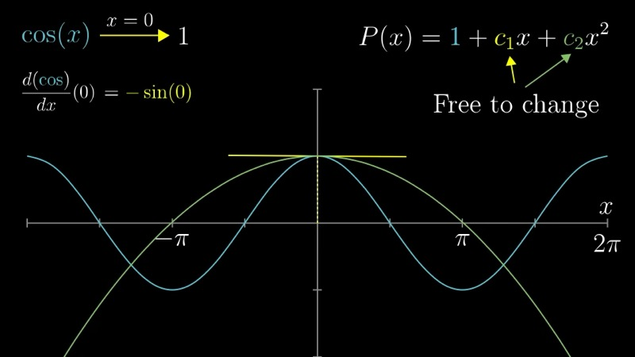
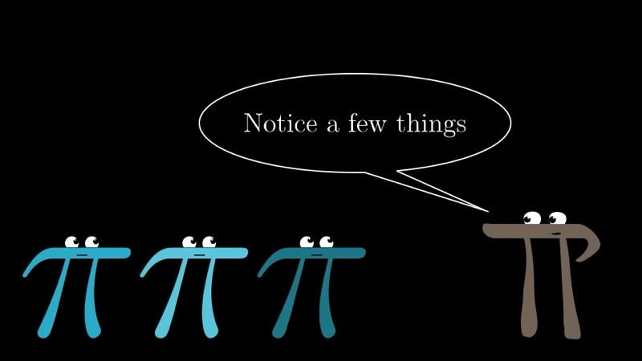
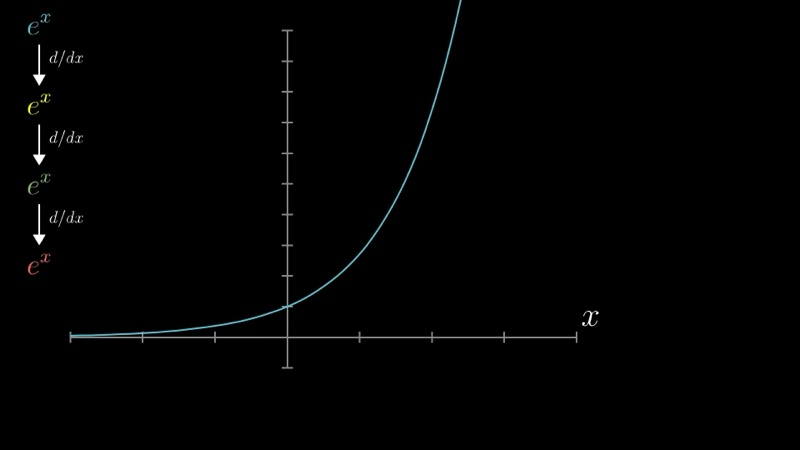
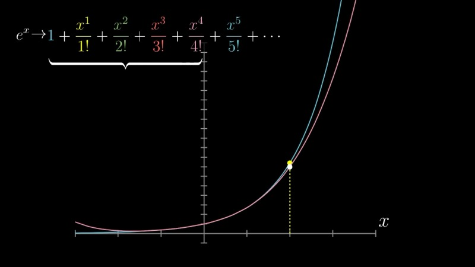

本课发展泰勒级数理论——用多项式系统地逼近函数。我们从构造 $\cos(x)$ 在 $x = 0$ 附近的二次逼近开始，然后推广到高阶泰勒多项式，最后讨论所得无穷级数的收敛性质。

::: {.callout-note collapse="true"}
## 预备知识

- 熟悉直到高阶的导数（第二至四章、第十章）
- 理解 $e^x$、$\sin(x)$、$\cos(x)$ 和 $\ln(x)$（第五章）
- 微积分基本定理（第一、八章）
- 熟练使用阶乘记号：$n! = 1 \cdot 2 \cdot 3 \cdots n$
:::

## 本课内容

- 通过在某一点匹配导数来构造多项式逼近
- 阶乘在泰勒系数中的作用
- $\cos(x)$、$e^x$ 和 $\ln(x)$ 的泰勒多项式
- 通过微积分基本定理对二阶项的几何解释
- 泰勒级数的收敛、发散与收敛半径

## 课程视频

```{=html}
<div class="video-container"><iframe src="https://www.youtube.com/embed/3d6DsjIBzJ4" title="Taylor series" frameborder="0" allow="accelerometer; autoplay; clipboard-write; encrypted-media; gyroscope; picture-in-picture; web-share" allowfullscreen></iframe></div>
```

## 课程关键帧









## 核心要点

### 动机：为什么用多项式逼近

数学和物理中出现的许多函数——$\cos(\theta)$、$e^x$、$\ln(x)$——在精确形式下难以计算、微分或积分。相比之下，多项式的处理非常简单：只需要加法和乘法，其导数和积分遵循初等法则。本章的核心思想是，我们可以系统地构造多项式来逼近给定函数在选定点附近的行为，随着包含更多项，精度不断提高。

物理学中的一个经典例子是摆。摆的势能涉及 $1 - \cos(\theta)$，这会导致复杂的方程。如果我们用逼近 $1 - \theta^2/2$ 来替换 $\cos(\theta)$，问题就简化为熟悉的简谐振子，物理图像变得清晰透明。

### 构造 $\cos(x)$ 的二次逼近

我们寻求一个多项式 $P(x) = c_0 + c_1 x + c_2 x^2$，使其在 $x = 0$ 附近最好地近似 $\cos(x)$。我们通过施加三个条件来确定三个系数：多项式与 $\cos(x)$ 在 $x = 0$ 处的函数值、一阶导数和二阶导数必须一致。

**匹配函数值。** 在 $x = 0$ 处，$\cos(0) = 1$。将多项式在 $x = 0$ 处求值得 $P(0) = c_0$。因此，

$$
c_0 = 1.
$$

**匹配一阶导数。** $\cos(x)$ 的导数是 $-\sin(x)$，在 $x = 0$ 处等于 $0$。$P(x)$ 的导数是 $c_1 + 2c_2 x$，在 $x = 0$ 处等于 $c_1$。因此，

$$
c_1 = 0.
$$

**匹配二阶导数。** $\cos(x)$ 的二阶导数是 $-\cos(x)$，在 $x = 0$ 处等于 $-1$。$P(x)$ 的二阶导数是 $2c_2$。令它们相等：

$$
2c_2 = -1 \quad \Longrightarrow \quad c_2 = -\frac{1}{2}.
$$

因此二次逼近为

$$
\cos(x) \approx 1 - \frac{x^2}{2}.
$$

作为具体验证：$P(0.1) = 1 - 0.005 = 0.995$，与真值 $\cos(0.1) = 0.99500\ldots$ 精确到五位小数。

### 高阶项与阶乘的作用

我们可以通过添加高阶项来改善逼近。假设扩展为一般的 $n$ 次多项式：

$$
P(x) = c_0 + c_1 x + c_2 x^2 + c_3 x^3 + c_4 x^4 + \cdots
$$

一个关键的结构性观察是：当我们对 $x^n$ 取 $n$ 次导数时，幂法则层层递推产生系数 $n!$。例如，$x^4$ 的四阶导数是 $4 \cdot 3 \cdot 2 \cdot 1 = 4! = 24$。这意味着 $P(x)$ 的 $n$ 阶导数在 $x = 0$ 处的值为 $n! \cdot c_n$。

为匹配 $f$ 在 $x = 0$ 处的 $n$ 阶导数，我们因此需要

$$
n! \cdot c_n = f^{(n)}(0) \quad \Longrightarrow \quad c_n = \frac{f^{(n)}(0)}{n!}.
$$

另一个重要性质是，添加高阶项不会破坏已经确定的系数。当我们在 $x = 0$ 处计算第 $k$ 阶导数时，所有次数大于 $k$ 的项都消失了（因为每个这样的项在 $k$ 次微分后仍保留一个 $x$ 的因子）。因此每个系数恰好由一个且仅一个导数控制。

### $\cos(x)$ 的泰勒多项式

$\cos(x)$ 的逐阶导数遵循一个循环模式：

| $n$ | $f^{(n)}(x)$ | $f^{(n)}(0)$ |
|-----|---------------|---------------|
| 0   | $\cos(x)$     | $1$           |
| 1   | $-\sin(x)$    | $0$           |
| 2   | $-\cos(x)$    | $-1$          |
| 3   | $\sin(x)$     | $0$           |
| 4   | $\cos(x)$     | $1$           |

模式 $1, 0, -1, 0$ 以周期四重复。将这些值代入通项公式，$\cos(x)$ 的 $2N$ 次泰勒多项式为

$$
\cos(x) \approx \sum_{k=0}^{N} \frac{(-1)^k}{(2k)!} x^{2k} = 1 - \frac{x^2}{2!} + \frac{x^4}{4!} - \frac{x^6}{6!} + \cdots
$$

每增加一项都进一步约束多项式，使其模拟 $\cos(x)$ 在原点附近的曲率、曲率变化率以及更高阶的行为。

### 交互演示：$\cos(x)$ 的泰勒多项式（Desmos）

```{=html}
<div id="calc_ch11_1" class="desmos-container"></div>
<script src="https://www.desmos.com/api/v1.9/calculator.js?apiKey=dcb31709b452b1cf9dc26972add0fda6"></script>
<script>
  var calc_ch11_1 = Desmos.GraphingCalculator(document.getElementById('calc_ch11_1'), {
    expressions: true, settingsMenu: false, xAxisLabel: 'x', yAxisLabel: 'y'
  });
  calc_ch11_1.setExpression({ id: 'cos', latex: 'y = \\cos(x)', color: '#2d70b3', lineWidth: 3 });
  calc_ch11_1.setExpression({ id: 'n', latex: 'N = 2', sliderBounds: { min: 0, max: 10, step: 1 } });
  calc_ch11_1.setExpression({ id: 'T2', latex: 'y = 1 - \\frac{x^2}{2} \\left\\{N \\ge 1\\right\\}', color: '#c74440', lineStyle: Desmos.Styles.DASHED });
  calc_ch11_1.setExpression({ id: 'T4', latex: 'y = 1 - \\frac{x^2}{2} + \\frac{x^4}{24} \\left\\{N \\ge 2\\right\\}', color: '#388c46', lineStyle: Desmos.Styles.DASHED });
  calc_ch11_1.setExpression({ id: 'T6', latex: 'y = 1 - \\frac{x^2}{2} + \\frac{x^4}{24} - \\frac{x^6}{720} \\left\\{N \\ge 3\\right\\}', color: '#6042a6', lineStyle: Desmos.Styles.DASHED });
  calc_ch11_1.setExpression({ id: 'T8', latex: 'y = 1 - \\frac{x^2}{2} + \\frac{x^4}{24} - \\frac{x^6}{720} + \\frac{x^8}{40320} \\left\\{N \\ge 4\\right\\}', color: '#e07020', lineStyle: Desmos.Styles.DASHED });
  calc_ch11_1.setExpression({ id: 'T10', latex: 'y = 1 - \\frac{x^2}{2} + \\frac{x^4}{24} - \\frac{x^6}{720} + \\frac{x^8}{40320} - \\frac{x^{10}}{3628800} \\left\\{N \\ge 5\\right\\}', color: '#c7a540', lineStyle: Desmos.Styles.DASHED });
  calc_ch11_1.setMathBounds({ left: -7, right: 7, bottom: -2, top: 2 });
</script>
```

调节滑块 $N$ 以逐步显示 $\cos(x)$ 的泰勒多项式逼近。随着多项式阶数的增加，逼近在原点周围更大的区间内保持准确。

### 一般泰勒多项式

对于一个充分可微的一般函数 $f$，以 $x = 0$ 为中心的 $n$ 次泰勒多项式（又称麦克劳林多项式）为

$$
P_n(x) = \sum_{k=0}^{n} \frac{f^{(k)}(0)}{k!} \, x^k = f(0) + f'(0)\,x + \frac{f''(0)}{2!}\,x^2 + \frac{f'''(0)}{3!}\,x^3 + \cdots
$$

每一项都有精确的含义：

- 常数项 $f(0)$ 匹配 $f$ 在原点的值。
- 线性项 $f'(0) \, x$ 匹配斜率（一阶导数）。
- 二次项 $\frac{f''(0)}{2!} x^2$ 匹配凹凸性（二阶导数）。
- 后续每一项匹配下一阶的导数。

### 以任意点为中心的泰勒多项式

如果我们希望在某点 $x = a$ 而非 $x = 0$ 附近逼近 $f$，则将多项式写成 $(x - a)$ 的幂次形式：

$$
P_n(x) = \sum_{k=0}^{n} \frac{f^{(k)}(a)}{k!} (x - a)^k.
$$

这确保了 $P_n$ 的所有导数在 $x = a$ 处与 $f$ 的导数一致。从几何角度看，改变 $a$ 就是平移逼近最精确的区域。

### $e^x$ 的泰勒多项式

函数 $e^x$ 提供了一个特别优雅的例子。由于 $e^x$ 的导数就是自身，在 $x = 0$ 处计算的每阶导数都等于 $1$。因此泰勒多项式为

$$
e^x \approx \sum_{k=0}^{n} \frac{x^k}{k!} = 1 + x + \frac{x^2}{2!} + \frac{x^3}{3!} + \frac{x^4}{4!} + \cdots
$$

### 交互演示：$e^x$ 的泰勒多项式（Desmos）

```{=html}
<div id="calc_ch11_2" class="desmos-container"></div>
<script>
  var calc_ch11_2 = Desmos.GraphingCalculator(document.getElementById('calc_ch11_2'), {
    expressions: true, settingsMenu: false, xAxisLabel: 'x', yAxisLabel: 'y'
  });
  calc_ch11_2.setExpression({ id: 'exp', latex: 'y = e^x', color: '#2d70b3', lineWidth: 3 });
  calc_ch11_2.setExpression({ id: 'n', latex: 'n = 1', sliderBounds: { min: 1, max: 10, step: 1 } });
  calc_ch11_2.setExpression({ id: 'T1', latex: 'y = 1 + x \\left\\{n \\ge 1\\right\\}', color: '#c74440', lineStyle: Desmos.Styles.DASHED });
  calc_ch11_2.setExpression({ id: 'T2', latex: 'y = 1 + x + \\frac{x^2}{2} \\left\\{n \\ge 2\\right\\}', color: '#388c46', lineStyle: Desmos.Styles.DASHED });
  calc_ch11_2.setExpression({ id: 'T3', latex: 'y = 1 + x + \\frac{x^2}{2} + \\frac{x^3}{6} \\left\\{n \\ge 3\\right\\}', color: '#6042a6', lineStyle: Desmos.Styles.DASHED });
  calc_ch11_2.setExpression({ id: 'T4', latex: 'y = 1 + x + \\frac{x^2}{2} + \\frac{x^3}{6} + \\frac{x^4}{24} \\left\\{n \\ge 4\\right\\}', color: '#e07020', lineStyle: Desmos.Styles.DASHED });
  calc_ch11_2.setExpression({ id: 'T5', latex: 'y = 1 + x + \\frac{x^2}{2} + \\frac{x^3}{6} + \\frac{x^4}{24} + \\frac{x^5}{120} \\left\\{n \\ge 5\\right\\}', color: '#c7a540', lineStyle: Desmos.Styles.DASHED });
  calc_ch11_2.setMathBounds({ left: -5, right: 5, bottom: -5, top: 30 });
</script>
```

增大滑块 $n$ 以添加更多项。$e^x$ 的泰勒多项式在每个输入值处都收敛到真实函数，无论距原点有多远。

### 通过微积分基本定理的几何解释

对于二阶泰勒项，存在一个富有启发性的几何视角。考虑函数 $F(x) = \int_a^x g(t)\, dt$，其中 $g$ 是 $F$ 的导数。由微积分基本定理，$F'(x) = g(x)$。

对于从 $a$ 到 $x$ 的有限步长，$F$ 的变化量可以如下分解。一阶逼近给出一个面积为 $g(a) \cdot (x - a)$ 的矩形。二阶修正则考虑到 $g$ 本身在变化：额外的面积大致构成一个底为 $(x - a)$、高为 $g'(a)(x - a)$ 的三角形。这个三角形的面积为

$$
\frac{1}{2} g'(a)(x - a)^2 = \frac{1}{2} F''(a)(x - a)^2.
$$

这恰好就是 $F$ 以 $a$ 为中心的泰勒多项式中的二阶项。泰勒展开中的每一项都在曲线下面积增量方面有直接的几何对应。

### 从泰勒多项式到泰勒级数

有限项的泰勒多项式称为**泰勒多项式**。当我们允许无穷多项时，所得表达式就是**泰勒级数**：

$$
\sum_{k=0}^{\infty} \frac{f^{(k)}(a)}{k!} (x - a)^k.
$$

这个无穷和是否等于 $f(x)$，取决于部分和是否收敛。如果部分和序列 $P_1(x), P_2(x), P_3(x), \ldots$ 趋向于一个确定的值，我们就说级数在点 $x$ 处**收敛**。

### 收敛性与收敛半径

不同的函数表现出不同的收敛行为：

- **$e^x$：** 泰勒级数对每个实数 $x$ 都收敛到 $e^x$。收敛半径为无穷大。

- **$\sin(x)$ 和 $\cos(x)$：** 这些级数也对所有 $x$ 收敛，反映了三角函数是"整函数"（处处解析）这一事实。

- **以 $x = 1$ 为中心的 $\ln(x)$：** 泰勒级数为
  $$
  \ln(x) = (x-1) - \frac{(x-1)^2}{2} + \frac{(x-1)^3}{3} - \cdots
  $$
  该级数仅在 $0 < x \le 2$ 时收敛。在此区间之外，部分和剧烈振荡，无法趋近 $\ln(x)$，尽管函数本身是良好定义的。**收敛半径**为 $1$。

收敛半径定义了从中心 $a$ 出发、级数能忠实地表示 $f$ 的距离范围。超出此半径，单点 $a$ 处的导数信息不足以确定函数的行为。

### 交互演示：$\ln(x)$ 级数的收敛性（Desmos）

```{=html}
<div id="calc_ch11_3" class="desmos-container"></div>
<script>
  var calc_ch11_3 = Desmos.GraphingCalculator(document.getElementById('calc_ch11_3'), {
    expressions: true, settingsMenu: false, xAxisLabel: 'x', yAxisLabel: 'y'
  });
  calc_ch11_3.setExpression({ id: 'ln', latex: 'y = \\ln(x)', color: '#2d70b3', lineWidth: 3 });
  calc_ch11_3.setExpression({ id: 'n', latex: 'n = 1', sliderBounds: { min: 1, max: 12, step: 1 } });
  calc_ch11_3.setExpression({ id: 'T1', latex: 'y = (x-1) \\left\\{n \\ge 1\\right\\}', color: '#c74440', lineStyle: Desmos.Styles.DASHED });
  calc_ch11_3.setExpression({ id: 'T2', latex: 'y = (x-1) - \\frac{(x-1)^2}{2} \\left\\{n \\ge 2\\right\\}', color: '#388c46', lineStyle: Desmos.Styles.DASHED });
  calc_ch11_3.setExpression({ id: 'T3', latex: 'y = (x-1) - \\frac{(x-1)^2}{2} + \\frac{(x-1)^3}{3} \\left\\{n \\ge 3\\right\\}', color: '#6042a6', lineStyle: Desmos.Styles.DASHED });
  calc_ch11_3.setExpression({ id: 'T4', latex: 'y = (x-1) - \\frac{(x-1)^2}{2} + \\frac{(x-1)^3}{3} - \\frac{(x-1)^4}{4} \\left\\{n \\ge 4\\right\\}', color: '#e07020', lineStyle: Desmos.Styles.DASHED });
  calc_ch11_3.setExpression({ id: 'T5', latex: 'y = (x-1) - \\frac{(x-1)^2}{2} + \\frac{(x-1)^3}{3} - \\frac{(x-1)^4}{4} + \\frac{(x-1)^5}{5} \\left\\{n \\ge 5\\right\\}', color: '#c7a540', lineStyle: Desmos.Styles.DASHED });
  calc_ch11_3.setExpression({ id: 'bound1', latex: 'x = 0', color: '#aaaaaa', lineStyle: Desmos.Styles.DOTTED });
  calc_ch11_3.setExpression({ id: 'bound2', latex: 'x = 2', color: '#aaaaaa', lineStyle: Desmos.Styles.DOTTED });
  calc_ch11_3.setMathBounds({ left: -1, right: 4, bottom: -4, top: 4 });
</script>
```

增大滑块 $n$ 以向 $\ln(x)$ 的泰勒级数（以 $x = 1$ 为中心）中添加更多项。在区间 $(0, 2]$ 内，逼近收敛到真实函数。在此区间之外，部分和发散，展示了有限收敛半径的现象。

### 核心洞见

泰勒级数的整个构造建立在一条基本原理之上：**函数在单一点处的各阶导数编码了函数在该点附近的行为信息。** 泰勒多项式将这些导数信息转化为一个显式的多项式逼近。每增加一项就纳入了更高一阶的导数，从而在中心点的更大邻域内产生更忠实的逼近。

### 动画演示：$\cos(x)$ 泰勒多项式逐项构建

```{=html}
<div class="d3-container" id="ch11_d3_taylor_cos"></div>
<div class="d3-controls">
  <button id="ch11_d3_taylor_cos_play">Play &#9654;</button>
  <button id="ch11_d3_taylor_cos_reset">Reset</button>
  <label>Max order (2k):</label>
  <input type="range" id="ch11_d3_taylor_cos_order" min="0" max="16" value="0" step="2">
  <span class="value-display" id="ch11_d3_taylor_cos_order_val">Order 0</span>
</div>
<script src="https://d3js.org/d3.v7.min.js"></script>
<script>
(function() {
  const W = 720, H = 400, margin = {top: 30, right: 30, bottom: 50, left: 60};
  const w = W - margin.left - margin.right, h = H - margin.top - margin.bottom;

  const svg = d3.select("#ch11_d3_taylor_cos").append("svg")
    .attr("viewBox", `0 0 ${W} ${H}`)
    .append("g").attr("transform", `translate(${margin.left},${margin.top})`);

  const xScale = d3.scaleLinear().domain([-2 * Math.PI, 2 * Math.PI]).range([0, w]);
  const yScale = d3.scaleLinear().domain([-2, 2]).range([h, 0]);

  // Axes
  svg.append("g").attr("transform", `translate(0,${h})`).call(d3.axisBottom(xScale).ticks(8))
    .append("text").attr("x", w / 2).attr("y", 40).attr("fill", "#333")
    .attr("text-anchor", "middle").attr("font-size", "14px").text("x");
  svg.append("g").call(d3.axisLeft(yScale).ticks(8))
    .append("text").attr("x", -h / 2).attr("y", -45).attr("fill", "#333")
    .attr("text-anchor", "middle").attr("transform", "rotate(-90)")
    .attr("font-size", "14px").text("y");

  // Clipping rect so polynomials don't overflow
  svg.append("defs").append("clipPath").attr("id", "ch11-clip-cos")
    .append("rect").attr("width", w).attr("height", h);

  const plotArea = svg.append("g").attr("clip-path", "url(#ch11-clip-cos)");

  // Grid lines
  svg.insert("g", ":first-child").selectAll("line.hgrid")
    .data(yScale.ticks(8)).enter().append("line")
    .attr("x1", 0).attr("x2", w).attr("y1", d => yScale(d)).attr("y2", d => yScale(d))
    .attr("stroke", "#e0e0e0").attr("stroke-width", 0.5);

  // Num points for curves
  const numPts = 500;
  const xs = d3.range(numPts).map(i => -2 * Math.PI + (4 * Math.PI) * i / (numPts - 1));

  // cos(x) true curve
  const cosData = xs.map(xv => [xv, Math.cos(xv)]);
  const lineGen = d3.line().x(d => xScale(d[0])).y(d => yScale(d[1]));
  plotArea.append("path").datum(cosData)
    .attr("d", lineGen)
    .attr("fill", "none").attr("stroke", "#2d70b3").attr("stroke-width", 2.5);

  // Label
  svg.append("text").attr("x", xScale(5.2)).attr("y", yScale(Math.cos(5.2)) - 10)
    .attr("font-size", "13px").attr("fill", "#2d70b3").attr("font-weight", 600).text("cos(x)");

  // Factorial helper
  function factorial(n) { let r = 1; for (let i = 2; i <= n; i++) r *= i; return r; }

  // Taylor polynomial for cos(x) up to order 2k
  function taylorCos(xv, maxK) {
    let s = 0;
    for (let k = 0; k <= maxK; k++) {
      s += Math.pow(-1, k) * Math.pow(xv, 2 * k) / factorial(2 * k);
    }
    return s;
  }

  // Colors for each order
  const colors = ["#c74440", "#388c46", "#6042a6", "#e07020", "#c7a540",
                  "#2196F3", "#9C27B0", "#FF5722", "#00BCD4"];

  // Group for Taylor polynomial paths
  const taylorGroup = plotArea.append("g");

  // Legend group
  const legendGroup = svg.append("g").attr("transform", `translate(${w - 140}, 5)`);

  // Current displayed order
  let currentMaxK = 0;
  const pathMap = {};

  function addOrder(k, animate) {
    if (pathMap[k]) return; // already drawn
    const data = xs.map(xv => {
      const yv = taylorCos(xv, k);
      return [xv, Math.max(-10, Math.min(10, yv))];
    });
    const path = taylorGroup.append("path").datum(data)
      .attr("d", lineGen)
      .attr("fill", "none")
      .attr("stroke", colors[k % colors.length])
      .attr("stroke-width", 1.8)
      .attr("stroke-dasharray", "6,3")
      .attr("opacity", 0.85);

    if (animate) {
      const totalLen = path.node().getTotalLength();
      path.attr("stroke-dasharray", totalLen)
        .attr("stroke-dashoffset", totalLen)
        .transition().duration(800).ease(d3.easeLinear)
        .attr("stroke-dashoffset", 0)
        .on("end", function() {
          d3.select(this).attr("stroke-dasharray", "6,3");
        });
    }

    pathMap[k] = path;

    // Add legend entry
    const yOff = k * 18;
    legendGroup.append("line")
      .attr("x1", 0).attr("x2", 20).attr("y1", yOff + 6).attr("y2", yOff + 6)
      .attr("stroke", colors[k % colors.length]).attr("stroke-width", 2)
      .attr("stroke-dasharray", "4,2").attr("class", "ch11-legend-" + k);
    legendGroup.append("text")
      .attr("x", 25).attr("y", yOff + 10)
      .attr("font-size", "11px").attr("fill", "#333").attr("class", "ch11-legend-" + k)
      .text("Order " + (2 * k));
  }

  function removeOrdersAbove(maxK) {
    Object.keys(pathMap).forEach(k => {
      if (+k > maxK) {
        pathMap[k].remove();
        delete pathMap[k];
        legendGroup.selectAll(".ch11-legend-" + k).remove();
      }
    });
  }

  function updateToOrder(maxK, animate) {
    currentMaxK = maxK;
    removeOrdersAbove(maxK);
    for (let k = 0; k <= maxK; k++) {
      addOrder(k, animate && !pathMap[k]);
    }
    document.getElementById("ch11_d3_taylor_cos_order_val").textContent = "Order " + (2 * maxK);
    document.getElementById("ch11_d3_taylor_cos_order").value = 2 * maxK;
  }

  // Slider control
  const slider = document.getElementById("ch11_d3_taylor_cos_order");
  slider.addEventListener("input", function() {
    updateToOrder(+this.value / 2, true);
  });

  // Play button: animate orders appearing one by one
  document.getElementById("ch11_d3_taylor_cos_play").addEventListener("click", function() {
    // Start from current state or 0
    let k = 0;
    // Reset first
    removeOrdersAbove(-1);
    currentMaxK = -1;
    function step() {
      if (k > 8) return;
      addOrder(k, true);
      currentMaxK = k;
      document.getElementById("ch11_d3_taylor_cos_order_val").textContent = "Order " + (2 * k);
      document.getElementById("ch11_d3_taylor_cos_order").value = 2 * k;
      k++;
      setTimeout(step, 1000);
    }
    step();
  });

  // Reset button
  document.getElementById("ch11_d3_taylor_cos_reset").addEventListener("click", function() {
    removeOrdersAbove(-1);
    currentMaxK = 0;
    document.getElementById("ch11_d3_taylor_cos_order").value = 0;
    document.getElementById("ch11_d3_taylor_cos_order_val").textContent = "Order 0";
    addOrder(0, false);
  });

  // Initial state: show order 0
  addOrder(0, false);
})();
</script>
```

点击 **Play** 观看 $\cos(x)$ 的泰勒多项式逼近逐一出现——从常数逼近（0阶）到16次。每个后续多项式在更宽的区间上紧贴真实的余弦曲线。使用滑块跳转到指定阶数。

### 动画演示：$\ln(1+x)$ 的收敛半径

```{=html}
<div class="d3-container" id="ch11_d3_ln_conv"></div>
<div class="d3-controls">
  <button id="ch11_d3_ln_conv_play">Play &#9654;</button>
  <button id="ch11_d3_ln_conv_reset">Reset</button>
  <label>Number of terms:</label>
  <input type="range" id="ch11_d3_ln_conv_n" min="1" max="30" value="1" step="1">
  <span class="value-display" id="ch11_d3_ln_conv_n_val">n = 1</span>
</div>
<script>
(function() {
  const W = 720, H = 420, margin = {top: 30, right: 30, bottom: 50, left: 60};
  const w = W - margin.left - margin.right, h = H - margin.top - margin.bottom;

  const svg = d3.select("#ch11_d3_ln_conv").append("svg")
    .attr("viewBox", `0 0 ${W} ${H}`)
    .append("g").attr("transform", `translate(${margin.left},${margin.top})`);

  const xDomain = [-1.8, 2.5];
  const yDomain = [-4, 3];
  const xScale = d3.scaleLinear().domain(xDomain).range([0, w]);
  const yScale = d3.scaleLinear().domain(yDomain).range([h, 0]);

  // Axes
  svg.append("g").attr("transform", `translate(0,${h})`).call(d3.axisBottom(xScale).ticks(8))
    .append("text").attr("x", w / 2).attr("y", 40).attr("fill", "#333")
    .attr("text-anchor", "middle").attr("font-size", "14px").text("x");
  svg.append("g").call(d3.axisLeft(yScale).ticks(8))
    .append("text").attr("x", -h / 2).attr("y", -45).attr("fill", "#333")
    .attr("text-anchor", "middle").attr("transform", "rotate(-90)")
    .attr("font-size", "14px").text("y");

  // Grid
  svg.insert("g", ":first-child").selectAll("line.hgrid")
    .data(yScale.ticks(8)).enter().append("line")
    .attr("x1", 0).attr("x2", w).attr("y1", d => yScale(d)).attr("y2", d => yScale(d))
    .attr("stroke", "#e0e0e0").attr("stroke-width", 0.5);

  // Convergence boundaries: x = -1 and x = 1
  svg.append("line")
    .attr("x1", xScale(-1)).attr("x2", xScale(-1)).attr("y1", 0).attr("y2", h)
    .attr("stroke", "#c74440").attr("stroke-width", 1.5).attr("stroke-dasharray", "6,4");
  svg.append("line")
    .attr("x1", xScale(1)).attr("x2", xScale(1)).attr("y1", 0).attr("y2", h)
    .attr("stroke", "#c74440").attr("stroke-width", 1.5).attr("stroke-dasharray", "6,4");

  // Shaded convergence region
  svg.append("rect")
    .attr("x", xScale(-1)).attr("y", 0)
    .attr("width", xScale(1) - xScale(-1)).attr("height", h)
    .attr("fill", "#388c46").attr("opacity", 0.06);

  // Labels for boundaries
  svg.append("text").attr("x", xScale(-1)).attr("y", -5)
    .attr("text-anchor", "middle").attr("font-size", "12px").attr("fill", "#c74440")
    .text("x = -1");
  svg.append("text").attr("x", xScale(1)).attr("y", -5)
    .attr("text-anchor", "middle").attr("font-size", "12px").attr("fill", "#c74440")
    .text("x = 1");
  svg.append("text").attr("x", xScale(0)).attr("y", -5)
    .attr("text-anchor", "middle").attr("font-size", "11px").attr("fill", "#388c46")
    .text("|x| < 1 : converges");

  // Clip path
  svg.select("defs").remove();
  svg.append("defs").append("clipPath").attr("id", "ch11-clip-ln")
    .append("rect").attr("width", w).attr("height", h);
  const plotArea = svg.append("g").attr("clip-path", "url(#ch11-clip-ln)");

  // ln(1+x) true curve for x > -1
  const numPts = 600;
  const xs = d3.range(numPts).map(i => xDomain[0] + (xDomain[1] - xDomain[0]) * i / (numPts - 1));
  const lineGen = d3.line().x(d => xScale(d[0])).y(d => yScale(d[1])).defined(d => isFinite(d[1]));

  const lnData = xs.filter(xv => xv > -0.999).map(xv => [xv, Math.log(1 + xv)]);
  plotArea.append("path").datum(lnData)
    .attr("d", lineGen)
    .attr("fill", "none").attr("stroke", "#2d70b3").attr("stroke-width", 2.5);

  // Label for ln(1+x)
  svg.append("text").attr("x", xScale(2.0)).attr("y", yScale(Math.log(3)) - 8)
    .attr("font-size", "13px").attr("fill", "#2d70b3").attr("font-weight", 600).text("ln(1+x)");

  // Taylor series for ln(1+x): sum_{k=1}^{n} (-1)^{k+1} x^k / k
  function taylorLn(xv, n) {
    let s = 0;
    for (let k = 1; k <= n; k++) {
      s += Math.pow(-1, k + 1) * Math.pow(xv, k) / k;
    }
    return s;
  }

  const colors = ["#c74440", "#388c46", "#6042a6", "#e07020", "#c7a540",
                  "#2196F3", "#9C27B0", "#FF5722", "#00BCD4", "#795548"];

  const taylorGroup = plotArea.append("g");
  let currentPath = null;
  let currentN = 0;

  function drawTaylor(n, animate) {
    // Remove old path
    if (currentPath) currentPath.remove();
    currentN = n;

    const data = xs.map(xv => {
      const yv = taylorLn(xv, n);
      // Clamp to visible range for drawing
      return [xv, Math.max(yDomain[0] - 1, Math.min(yDomain[1] + 1, yv))];
    });

    const colorIdx = (n - 1) % colors.length;
    currentPath = taylorGroup.append("path").datum(data)
      .attr("d", lineGen)
      .attr("fill", "none")
      .attr("stroke", colors[colorIdx])
      .attr("stroke-width", 1.8)
      .attr("stroke-dasharray", "6,3")
      .attr("opacity", 0.9);

    if (animate) {
      const totalLen = currentPath.node().getTotalLength();
      currentPath.attr("stroke-dasharray", totalLen)
        .attr("stroke-dashoffset", totalLen)
        .transition().duration(600).ease(d3.easeLinear)
        .attr("stroke-dashoffset", 0)
        .on("end", function() {
          d3.select(this).attr("stroke-dasharray", "6,3");
        });
    }

    document.getElementById("ch11_d3_ln_conv_n_val").textContent = "n = " + n;
    document.getElementById("ch11_d3_ln_conv_n").value = n;
  }

  // Also show ghost trails of previous partial sums for context
  const ghostGroup = plotArea.insert("g", ":first-child");
  let ghostPaths = [];

  function clearGhosts() {
    ghostPaths.forEach(p => p.remove());
    ghostPaths = [];
  }

  function addGhost(n) {
    const data = xs.map(xv => {
      const yv = taylorLn(xv, n);
      return [xv, Math.max(yDomain[0] - 1, Math.min(yDomain[1] + 1, yv))];
    });
    const colorIdx = (n - 1) % colors.length;
    const p = ghostGroup.append("path").datum(data)
      .attr("d", lineGen)
      .attr("fill", "none")
      .attr("stroke", colors[colorIdx])
      .attr("stroke-width", 0.8)
      .attr("stroke-dasharray", "3,3")
      .attr("opacity", 0.3);
    ghostPaths.push(p);
  }

  // Slider
  document.getElementById("ch11_d3_ln_conv_n").addEventListener("input", function() {
    const n = +this.value;
    clearGhosts();
    for (let k = 1; k < n; k++) addGhost(k);
    drawTaylor(n, true);
  });

  // Play: animate terms accumulating
  document.getElementById("ch11_d3_ln_conv_play").addEventListener("click", function() {
    clearGhosts();
    if (currentPath) currentPath.remove();
    currentPath = null;
    let n = 1;
    function step() {
      if (n > 30) return;
      if (n > 1) addGhost(n - 1);
      drawTaylor(n, true);
      n++;
      setTimeout(step, 500);
    }
    step();
  });

  // Reset
  document.getElementById("ch11_d3_ln_conv_reset").addEventListener("click", function() {
    clearGhosts();
    if (currentPath) currentPath.remove();
    currentPath = null;
    currentN = 0;
    document.getElementById("ch11_d3_ln_conv_n").value = 1;
    document.getElementById("ch11_d3_ln_conv_n_val").textContent = "n = 1";
    drawTaylor(1, false);
  });

  // Initial state
  drawTaylor(1, false);
})();
</script>
```

点击 **Play** 观看泰勒级数 $\ln(1+x) = x - \frac{x^2}{2} + \frac{x^3}{3} - \cdots$ 的部分和逐项累积。在收敛半径 $|x| < 1$（绿色阴影区域）内，逐次部分和收敛到 $\ln(1+x)$。在此区间外，部分和以增长的振幅振荡，展示发散行为。红色虚线标记了 $x = -1$ 和 $x = 1$ 处的收敛边界。

## 速查表

::: {.key-formula}
| 概念 | 核心结论 |
|---|---|
| 泰勒多项式（以 $x = 0$ 为中心） | $P_n(x) = \displaystyle\sum_{k=0}^{n} \frac{f^{(k)}(0)}{k!}\, x^k$ |
| 泰勒多项式（以 $x = a$ 为中心） | $P_n(x) = \displaystyle\sum_{k=0}^{n} \frac{f^{(k)}(a)}{k!}\, (x-a)^k$ |
| 余弦级数 | $\cos(x) = 1 - \frac{x^2}{2!} + \frac{x^4}{4!} - \frac{x^6}{6!} + \cdots$ |
| 指数级数 | $e^x = 1 + x + \frac{x^2}{2!} + \frac{x^3}{3!} + \cdots$ |
| 系数公式 | $c_n = \frac{f^{(n)}(a)}{n!}$ |
| 收敛半径 | 级数收敛的距中心 $a$ 的最大距离 |
:::
