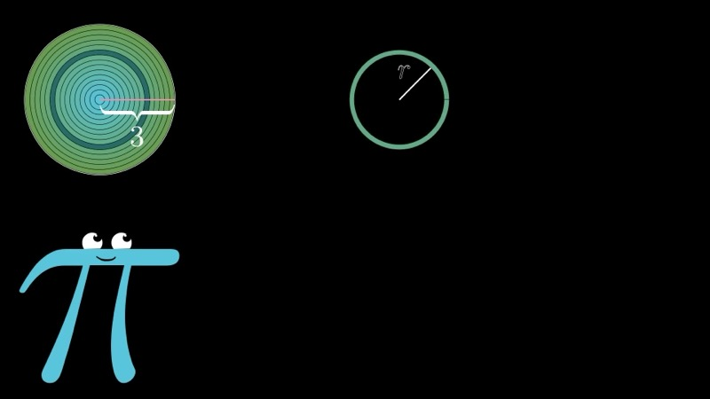
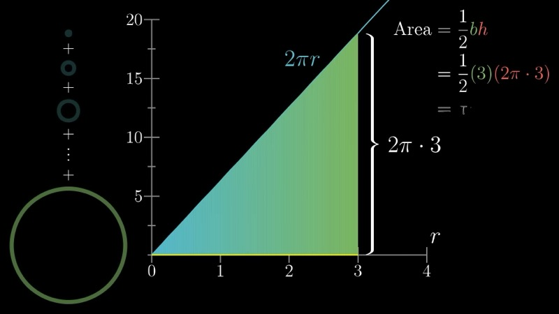
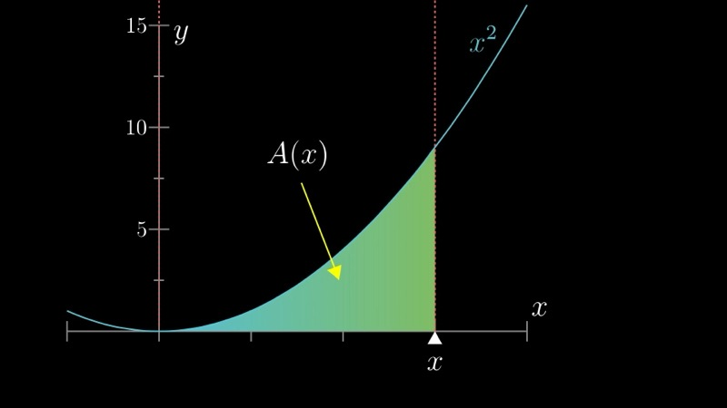
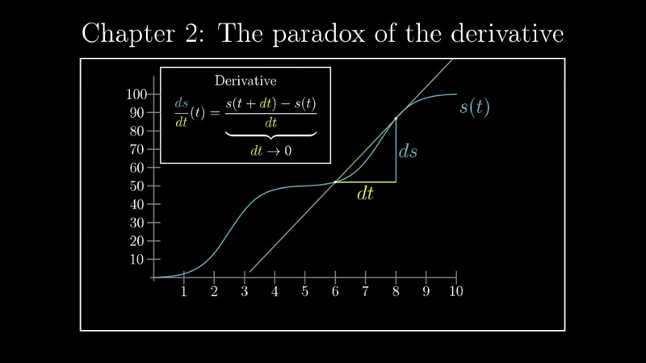

This lesson develops the foundational intuition behind calculus through a single
geometric question: why is the area of a circle $\pi r^2$? Through this lens,
we introduce the three central ideas of calculus — integrals, derivatives, and
the fundamental theorem connecting them.

::: {.callout-note collapse="true"}
## Prerequisites

- Familiarity with the area formulas for basic geometric shapes (rectangles, triangles)
- Understanding of the concept of a function $f(x)$
- Comfort with the notation $\sum$ for finite sums
:::

## Topics Covered

- Approximating circular area via concentric ring decomposition
- The integral as the limit of Riemann sums
- The derivative as instantaneous rate of change
- The Fundamental Theorem of Calculus: integration and differentiation as inverse operations

## Lecture Video

```{=html}
<div class="video-container">
  <iframe src="https://www.youtube.com/embed/WUvTyaaNkzM" title="The essence of calculus" frameborder="0" allow="accelerometer; autoplay; clipboard-write; encrypted-media; gyroscope; picture-in-picture; web-share" allowfullscreen></iframe>
</div>
```

## Key Video Frames









## Key Concepts

### Approximating the Area of a Circle

We begin with a circle of radius $R$ and seek to determine its area. The strategy
is to decompose the circle into many concentric rings, each of inner radius $r$
and infinitesimal thickness $dr$. When we "unroll" each ring, it forms a thin
rectangle of width $2\pi r$ (the circumference) and height $dr$.

The area of each such ring is therefore approximately

$$
dA = 2\pi r \, dr.
$$

Summing over all rings from $r = 0$ to $r = R$, we obtain the total area as

$$
A = \sum_{r} 2\pi r \, dr.
$$

As we let $dr \to 0$, this discrete sum becomes a Riemann integral:

$$
A = \int_0^R 2\pi r \, dr.
$$

### Evaluating the Integral Geometrically

The function $f(r) = 2\pi r$ is a straight line through the origin with slope $2\pi$.
The region under this line from $r = 0$ to $r = R$ is a triangle with base $R$
and height $2\pi R$. Its area is

$$
A = \frac{1}{2} \cdot R \cdot 2\pi R = \pi R^2,
$$

which is precisely the classical formula for the area of a circle.

### Interactive Desmos Graph: Ring Decomposition

```{=html}
<div id="calc1" class="desmos-container"></div>
<script src="https://www.desmos.com/api/v1.9/calculator.js?apiKey=dcb31709b452b1cf9dc26972add0fda6"></script>
<script>
  var calc1 = Desmos.GraphingCalculator(document.getElementById('calc1'), {
    expressions: true, settingsMenu: false, xAxisLabel: 'r', yAxisLabel: 'f(r)'
  });
  calc1.setExpression({ id: 'line', latex: 'y = 2\\pi x', color: '#2d70b3' });
  calc1.setExpression({ id: 'R', latex: 'R = 3', sliderBounds: { min: 0.5, max: 5, step: 0.1 } });
  calc1.setExpression({ id: 'n', latex: 'n = 10', sliderBounds: { min: 1, max: 50, step: 1 } });
  calc1.setExpression({ id: 'dr', latex: 'd_r = \\frac{R}{n}' });
  calc1.setExpression({ id: 'rects', latex: '0 \\le y \\le 2\\pi \\operatorname{floor}\\left(\\frac{x}{d_r}\\right) d_r \\left\\{0 \\le x \\le R\\right\\}', color: '#388c46', fillOpacity: 0.3 });
  calc1.setExpression({ id: 'area_label', latex: 'A = \\pi R^2', color: '#c74440' });
  calc1.setMathBounds({ left: -0.5, right: 6, bottom: -2, top: 35 });
</script>
```

Adjust the slider $n$ to increase the number of rings. As $n$ grows, the sum of
rectangular areas converges to the triangular area $\pi R^2$.

### The Integral as an Area Function

More generally, given any continuous function $f(x)$, we define its **integral** from $a$ to $x$ as

$$
A(x) = \int_a^x f(t) \, dt,
$$

which represents the (signed) area under the curve $f$ from $a$ to $x$.

### The Derivative as a Rate of Change

Consider incrementing $x$ by a small quantity $dx$. The corresponding change in
the area function is

$$
dA \approx f(x) \, dx.
$$

Dividing both sides by $dx$, we find

$$
\frac{dA}{dx} \approx f(x).
$$

In the limit as $dx \to 0$, this becomes an exact equality:

$$
\frac{dA}{dx} = f(x).
$$

This ratio — the **derivative** — measures how sensitive the output of $A$ is to
small perturbations of its input.

### Interactive Desmos Graph: Derivative of the Area Function

```{=html}
<div id="calc2" class="desmos-container"></div>
<script>
  var calc2 = Desmos.GraphingCalculator(document.getElementById('calc2'), {
    expressions: true, settingsMenu: false, xAxisLabel: 'x', yAxisLabel: ''
  });
  calc2.setExpression({ id: 'f', latex: 'f(x) = x^2', color: '#2d70b3' });
  calc2.setExpression({ id: 'A', latex: 'A(x) = \\frac{x^3}{3}', color: '#388c46' });
  calc2.setExpression({ id: 'a', latex: 'a = 2', sliderBounds: { min: 0, max: 4, step: 0.01 } });
  calc2.setExpression({ id: 'dx', latex: 'd = 0.3', sliderBounds: { min: 0.01, max: 1, step: 0.01 } });
  calc2.setExpression({ id: 'sliver', latex: '0 \\le y \\le x^2 \\left\\{a \\le x \\le a + d\\right\\}', color: '#c74440', fillOpacity: 0.5 });
  calc2.setExpression({ id: 'shade', latex: '0 \\le y \\le x^2 \\left\\{0 \\le x \\le a\\right\\}', color: '#388c46', fillOpacity: 0.2 });
  calc2.setMathBounds({ left: -0.5, right: 5, bottom: -1, top: 20 });
</script>
```

Move the slider $a$ to observe how the thin sliver of area $dA$ (in red) at position $x = a$
is approximately $f(a) \cdot dx = a^2 \cdot dx$, confirming that the derivative of
the area function equals the original function.

### The Fundamental Theorem of Calculus

The observation above constitutes the **Fundamental Theorem of Calculus**: if
$A(x) = \int_a^x f(t)\, dt$, then

$$
\frac{d}{dx} A(x) = f(x).
$$

In other words, differentiation and integration are inverse operations. The derivative
of the area function recovers the original integrand.

This result has a profound practical consequence: to evaluate the integral
$\int_a^b f(t)\, dt$, it suffices to find any **antiderivative** $F$ such that
$F'(x) = f(x)$, and then compute $F(b) - F(a)$.

### Animated: Ring Decomposition of a Circle

```{=html}
<div class="d3-container" id="d3_ch01_rings"></div>
<div class="d3-controls">
  <button id="d3_ch01_rings_play">Play ▶</button>
  <label>Rings N:</label>
  <input type="range" id="d3_ch01_rings_n" min="2" max="80" value="4" step="1">
  <span class="value-display" id="d3_ch01_rings_n_val">N = 4</span>
  <span class="value-display" id="d3_ch01_rings_approx"></span>
</div>
<script>
(function() {
  const W = 700, H = 380, margin = {top: 30, right: 30, bottom: 50, left: 60};
  const w = W - margin.left - margin.right, h = H - margin.top - margin.bottom;
  const R = 3;
  const svg = d3.select("#d3_ch01_rings").append("svg")
    .attr("viewBox", `0 0 ${W} ${H}`)
    .append("g").attr("transform", `translate(${margin.left},${margin.top})`);

  const x = d3.scaleLinear().domain([0, R]).range([0, w]);
  const y = d3.scaleLinear().domain([0, 2 * Math.PI * R]).range([h, 0]);

  svg.append("g").attr("transform", `translate(0,${h})`).call(d3.axisBottom(x).ticks(6))
    .append("text").attr("x", w/2).attr("y", 40).attr("fill", "#333")
    .attr("text-anchor", "middle").attr("font-size", "14px").text("Radius r");
  svg.append("g").call(d3.axisLeft(y).ticks(6))
    .append("text").attr("x", -h/2).attr("y", -45).attr("fill", "#333")
    .attr("text-anchor", "middle").attr("transform", "rotate(-90)")
    .attr("font-size", "14px").text("2πr");

  // The line f(r) = 2πr
  const lineData = d3.range(0, R + 0.01, 0.01).map(r => [r, 2 * Math.PI * r]);
  svg.append("path").datum(lineData)
    .attr("d", d3.line().x(d => x(d[0])).y(d => y(d[1])))
    .attr("fill", "none").attr("stroke", "#2d70b3").attr("stroke-width", 2);

  // Triangle area (exact)
  svg.append("path")
    .attr("d", `M${x(0)},${y(0)} L${x(R)},${y(2*Math.PI*R)} L${x(R)},${y(0)} Z`)
    .attr("fill", "#2d70b3").attr("opacity", 0.08);

  // Area label
  const areaLabel = svg.append("text").attr("x", w - 10).attr("y", 20)
    .attr("text-anchor", "end").attr("font-size", "15px").attr("font-weight", 600);

  const barsGroup = svg.append("g");

  function update(N, animate) {
    const dr = R / N;
    const data = d3.range(N).map(i => ({r: i * dr, area: 2 * Math.PI * (i * dr) * dr, h: 2 * Math.PI * (i * dr)}));
    const approx = data.reduce((s, d) => s + d.area, 0);
    const exact = Math.PI * R * R;

    document.getElementById("d3_ch01_rings_n_val").textContent = `N = ${N}`;
    document.getElementById("d3_ch01_rings_approx").textContent =
      `Approx = ${approx.toFixed(4)}  |  πR² = ${exact.toFixed(4)}  |  Error = ${Math.abs(approx - exact).toFixed(4)}`;

    areaLabel.text(`Σ ≈ ${approx.toFixed(3)},  πR² = ${exact.toFixed(3)}`);

    const bars = barsGroup.selectAll("rect").data(data, (d, i) => i);
    bars.exit().transition().duration(animate ? 300 : 0).attr("height", 0).attr("y", y(0)).remove();

    const enter = bars.enter().append("rect")
      .attr("x", d => x(d.r))
      .attr("y", y(0))
      .attr("width", Math.max(1, x(dr) - x(0) - 1))
      .attr("height", 0)
      .attr("fill", "#388c46").attr("opacity", 0.65);

    enter.merge(bars).transition().duration(animate ? 600 : 0)
      .attr("x", d => x(d.r))
      .attr("width", Math.max(1, x(dr) - x(0) - 1))
      .attr("y", d => y(d.h))
      .attr("height", d => y(0) - y(d.h));
  }

  const slider = document.getElementById("d3_ch01_rings_n");
  slider.addEventListener("input", () => update(+slider.value, true));

  document.getElementById("d3_ch01_rings_play").addEventListener("click", function() {
    let n = 2;
    slider.value = n;
    update(n, true);
    const interval = setInterval(() => {
      n = Math.min(80, n + (n < 10 ? 1 : n < 30 ? 2 : 5));
      slider.value = n;
      update(n, true);
      if (n >= 80) clearInterval(interval);
    }, 700);
  });

  update(4, false);
})();
</script>
```

Press **Play** to watch the ring bars accumulate under the line $f(r) = 2\pi r$.
As $N$ increases, the sum of bar areas converges to the exact triangular area $\pi R^2$.

### Animated: Convergence of the Approximation

```{=html}
<div class="d3-container" id="d3_ch01_conv"></div>
<div class="d3-controls">
  <button id="d3_ch01_conv_play">Play ▶</button>
  <button id="d3_ch01_conv_reset">Reset</button>
  <span class="value-display" id="d3_ch01_conv_info"></span>
</div>
<script>
(function() {
  const W = 700, H = 360, margin = {top: 30, right: 30, bottom: 50, left: 70};
  const w = W - margin.left - margin.right, h = H - margin.top - margin.bottom;
  const R = 3, exact = Math.PI * R * R;

  const Ns = d3.range(2, 101);
  const data = Ns.map(N => {
    const dr = R / N;
    const approx = d3.sum(d3.range(N), i => 2 * Math.PI * (i * dr) * dr);
    return {N, error: Math.abs(approx - exact), approx};
  });

  const svg = d3.select("#d3_ch01_conv").append("svg")
    .attr("viewBox", `0 0 ${W} ${H}`)
    .append("g").attr("transform", `translate(${margin.left},${margin.top})`);

  const x = d3.scaleLinear().domain([2, 100]).range([0, w]);
  const yErr = d3.scaleLog().domain([d3.min(data, d => d.error), d3.max(data, d => d.error)]).range([h, 0]);

  svg.append("g").attr("transform", `translate(0,${h})`).call(d3.axisBottom(x).ticks(10))
    .append("text").attr("x", w/2).attr("y", 40).attr("fill", "#333")
    .attr("text-anchor", "middle").attr("font-size", "14px").text("Number of rings N");
  svg.append("g").call(d3.axisLeft(yErr).ticks(5, ".1e"))
    .append("text").attr("x", -h/2).attr("y", -55).attr("fill", "#333")
    .attr("text-anchor", "middle").attr("transform", "rotate(-90)")
    .attr("font-size", "14px").text("Absolute error |Aₙ − πR²|");

  // Reference line for O(1/N)
  const refData = [{N: 2, error: data[0].error}, {N: 100, error: data[0].error * 2 / 100}];
  svg.append("line")
    .attr("x1", x(2)).attr("y1", yErr(refData[0].error))
    .attr("x2", x(100)).attr("y2", yErr(refData[1].error))
    .attr("stroke", "#999").attr("stroke-dasharray", "6,4").attr("stroke-width", 1);
  svg.append("text").attr("x", x(80)).attr("y", yErr(refData[1].error) - 10)
    .attr("fill", "#999").attr("font-size", "12px").text("O(1/N)");

  const lineFn = d3.line().x(d => x(d.N)).y(d => yErr(d.error));
  const pathGroup = svg.append("g");
  const dotsGroup = svg.append("g");

  // Animated marker
  const marker = svg.append("circle").attr("r", 6).attr("fill", "#c74440")
    .attr("stroke", "white").attr("stroke-width", 2).attr("opacity", 0);
  const vLine = svg.append("line").attr("stroke", "#c74440").attr("stroke-dasharray", "3,3")
    .attr("stroke-width", 1).attr("opacity", 0);

  const info = document.getElementById("d3_ch01_conv_info");
  let animTimer = null;

  function reset() {
    if (animTimer) { clearInterval(animTimer); animTimer = null; }
    pathGroup.selectAll("*").remove();
    dotsGroup.selectAll("*").remove();
    marker.attr("opacity", 0);
    vLine.attr("opacity", 0);
    info.textContent = "Press Play to animate";
  }

  function play() {
    reset();
    let idx = 0;
    const step = 2;
    marker.attr("opacity", 1);
    vLine.attr("opacity", 1);

    // Draw the full path faintly as guide
    pathGroup.append("path").datum(data)
      .attr("d", lineFn).attr("fill", "none").attr("stroke", "#c74440").attr("stroke-width", 1).attr("opacity", 0.15);

    // Animated path drawn progressively
    const animPath = pathGroup.append("path")
      .attr("fill", "none").attr("stroke", "#c74440").attr("stroke-width", 2.5);

    animTimer = setInterval(() => {
      if (idx >= data.length) { clearInterval(animTimer); animTimer = null; return; }
      const slice = data.slice(0, idx + 1);
      animPath.datum(slice).attr("d", lineFn);

      const d = data[idx];
      marker.transition().duration(40)
        .attr("cx", x(d.N)).attr("cy", yErr(d.error));
      vLine.transition().duration(40)
        .attr("x1", x(d.N)).attr("y1", yErr(d.error))
        .attr("x2", x(d.N)).attr("y2", h);

      // Drop a dot every 10 steps
      if (idx % 10 === 0) {
        dotsGroup.append("circle")
          .attr("cx", x(d.N)).attr("cy", yErr(d.error))
          .attr("r", 0).attr("fill", "#c74440").attr("opacity", 0.7)
          .transition().duration(200).attr("r", 4);
      }

      info.textContent = `N = ${d.N}  |  Approx = ${d.approx.toFixed(4)}  |  πR² = ${exact.toFixed(4)}  |  Error = ${d.error.toFixed(6)}`;
      idx += step;
    }, 50);
  }

  document.getElementById("d3_ch01_conv_play").addEventListener("click", play);
  document.getElementById("d3_ch01_conv_reset").addEventListener("click", reset);
  info.textContent = "Press Play to animate";
})();
</script>
```

The error decreases as $O(1/N)$, confirming first-order convergence of the
left-endpoint Riemann sum.

## Summary

::: {.key-formula}
| Concept | Key Result |
|---|---|
| Area of a circle | $A = \int_0^R 2\pi r\, dr = \pi R^2$ |
| Derivative of area | $\frac{dA}{dR} = 2\pi R$ (the circumference) |
| General integral | $A(x) = \int_a^x f(t)\, dt$ |
| Fundamental Theorem | $\frac{d}{dx}\int_a^x f(t)\,dt = f(x)$ |
:::
