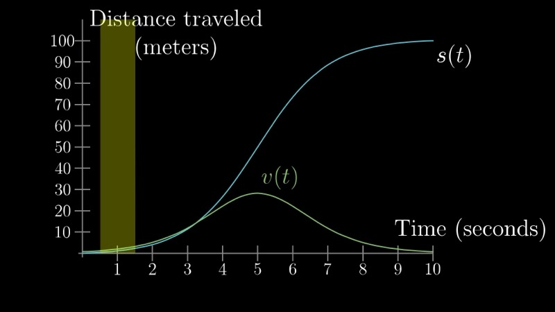
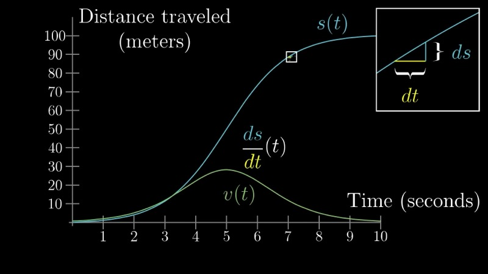
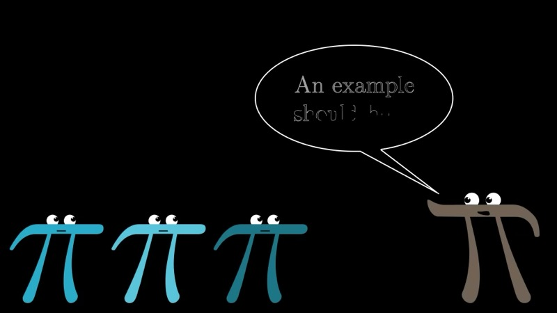
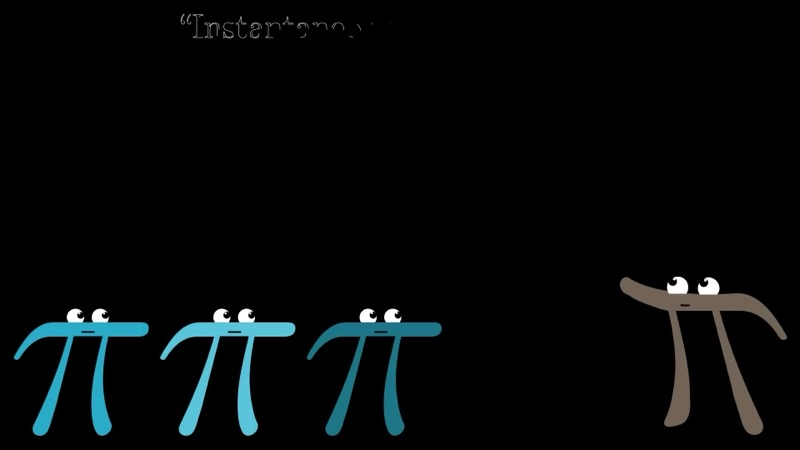

This lesson confronts a fundamental conceptual difficulty: the phrase
"instantaneous rate of change" is, strictly speaking, an oxymoron. Change
requires two distinct moments in time, yet we speak of velocity *at* a single
instant. We resolve this paradox by defining the derivative as the limit of
the difference quotient $ds/dt$ as $dt \to 0$, and we illustrate the definition
with the concrete example $s(t) = t^3$.

::: {.callout-note collapse="true"}
## Prerequisites

- The concept of a function $f(x)$ and its graph
- Basic algebraic manipulation (expanding a binomial cube)
- The idea of an integral and area under a curve (Chapter 1)
:::

## Topics Covered

- The paradox of "instantaneous rate of change"
- Velocity as the ratio $ds/dt$ for a small but finite $dt$
- The derivative as the limit of $ds/dt$ as $dt \to 0$
- The tangent line as a geometric interpretation of the derivative
- Worked derivation: $\frac{d}{dt} t^3 = 3t^2$
- The derivative as a "best constant approximation" for the rate of change

## Lecture Video

```{=html}
<div class="video-container"><iframe src="https://www.youtube.com/embed/9vKqVkMQHKk" title="The paradox of the derivative" frameborder="0" allow="accelerometer; autoplay; clipboard-write; encrypted-media; gyroscope; picture-in-picture; web-share" allowfullscreen></iframe></div>
```

## Key Video Frames









## Key Concepts

### The Paradox: Change in an Instant

We begin with a deceptively simple question: what does it mean for a car to
have a velocity at a single moment in time?

Consider a car that starts at rest, accelerates, and then decelerates to a stop
at a point 100 meters away, with the entire journey taking 10 seconds. We
denote the distance traveled as a function of time by $s(t)$, and we seek the
velocity at any given instant.

Intuitively, velocity is "distance traveled per unit time." To compute it, we
need *two* distinct moments:

$$
v = \frac{\Delta s}{\Delta t} = \frac{s(t_2) - s(t_1)}{t_2 - t_1}.
$$

Yet a speedometer appears to report a speed at a *single* moment. If we
restrict our attention to one instant, there is no elapsed time, no distance
traversed, and hence no meaningful ratio. The notion of "instantaneous rate
of change" is, in this sense, contradictory.

### Resolving the Paradox with Small Nudges

A physical speedometer sidesteps this difficulty by measuring the distance
traveled over a *very small* interval of time. We formalize this idea as
follows. Let $dt$ denote a small, positive increment in time, and let

$$
ds = s(t + dt) - s(t)
$$

be the corresponding change in distance. Then the ratio

$$
\frac{ds}{dt} = \frac{s(t + dt) - s(t)}{dt}
$$

represents the average velocity over the interval $[t, \, t + dt]$.
Geometrically, this ratio is the slope of the **secant line** passing through
the two points $(t, s(t))$ and $(t + dt, \, s(t + dt))$ on the graph of $s$.

### The Derivative as a Limit

In pure mathematics, the derivative is *not* the ratio $ds/dt$ for any
particular finite choice of $dt$. Rather, it is the value that this ratio
approaches as $dt \to 0$:

$$
\frac{ds}{dt} \;=\; \lim_{dt \to 0} \frac{s(t + dt) - s(t)}{dt}.
$$

As $dt$ shrinks, the two points on the graph draw closer together, and the
secant line converges to the **tangent line** at the point $(t, s(t))$. The
slope of this tangent line is the derivative.

It is important to note what this definition does *not* say. We do not set
$dt = 0$ (which would produce $0/0$), nor do we claim that $dt$ is
"infinitely small." The quantity $dt$ remains finite and nonzero throughout;
we simply examine the *trend* of the ratio as $dt$ becomes arbitrarily small.

### Interactive Desmos Graph: Secant to Tangent Line

```{=html}
<div id="calc_ch02_1" class="desmos-container"></div>
<script src="https://www.desmos.com/api/v1.9/calculator.js?apiKey=dcb31709b452b1cf9dc26972add0fda6"></script>
<script>
  var calc_ch02_1 = Desmos.GraphingCalculator(document.getElementById('calc_ch02_1'), {
    expressions: true, settingsMenu: false, xAxisLabel: 't', yAxisLabel: 's(t)'
  });
  calc_ch02_1.setExpression({ id: 'st', latex: 's(t) = t^3', color: '#2d70b3' });
  calc_ch02_1.setExpression({ id: 'a', latex: 'a = 2', sliderBounds: { min: 0, max: 3, step: 0.01 } });
  calc_ch02_1.setExpression({ id: 'dt', latex: 'd = 1.0', sliderBounds: { min: 0.01, max: 2, step: 0.01 } });
  calc_ch02_1.setExpression({ id: 'pt1', latex: '(a, a^3)', color: '#c74440', pointStyle: 'POINT', pointSize: 8 });
  calc_ch02_1.setExpression({ id: 'pt2', latex: '(a+d, (a+d)^3)', color: '#c74440', pointStyle: 'POINT', pointSize: 8 });
  calc_ch02_1.setExpression({ id: 'secant', latex: 'y - a^3 = \\frac{(a+d)^3 - a^3}{d}(x - a)', color: '#388c46', lineWidth: 2 });
  calc_ch02_1.setExpression({ id: 'tangent', latex: 'y - a^3 = 3a^2(x - a)', color: '#c74440', lineStyle: Desmos.Styles.DASHED, lineWidth: 1.5 });
  calc_ch02_1.setMathBounds({ left: -0.5, right: 4, bottom: -5, top: 30 });
</script>
```

Adjust the slider $d$ (representing $dt$) toward zero and observe how the
green secant line converges to the dashed red tangent line. The slope of the
tangent line at $t = a$ is $3a^2$, the derivative of $t^3$.

### A Concrete Derivation: $s(t) = t^3$

To make the definition concrete, suppose the distance function is
$s(t) = t^3$. We compute the derivative at a specific time, say $t = 2$.

The difference quotient is

$$
\frac{ds}{dt} = \frac{(2 + dt)^3 - 2^3}{dt}.
$$

Expanding the cube:

$$
(2 + dt)^3 = 2^3 + 3 \cdot 2^2 \cdot dt + 3 \cdot 2 \cdot dt^2 + dt^3
            = 8 + 12\,dt + 6\,dt^2 + dt^3.
$$

Subtracting $2^3 = 8$:

$$
(2 + dt)^3 - 8 = 12\,dt + 6\,dt^2 + dt^3.
$$

Dividing by $dt$:

$$
\frac{ds}{dt} = 12 + 6\,dt + dt^2.
$$

As $dt \to 0$, the terms $6\,dt$ and $dt^2$ vanish, leaving

$$
\left.\frac{ds}{dt}\right|_{t=2} = 12 = 3 \cdot 2^2.
$$

There is nothing special about $t = 2$. Repeating the same argument at a
general time $t$, we replace 2 with $t$ and expand $(t + dt)^3$:

$$
\frac{(t + dt)^3 - t^3}{dt}
= \frac{3t^2\,dt + 3t\,dt^2 + dt^3}{dt}
= 3t^2 + 3t\,dt + dt^2.
$$

Taking the limit as $dt \to 0$:

$$
\frac{d}{dt}\, t^3 = 3t^2.
$$

### Interactive Desmos Graph: The Power Rule in Action

```{=html}
<div id="calc_ch02_2" class="desmos-container"></div>
<script>
  var calc_ch02_2 = Desmos.GraphingCalculator(document.getElementById('calc_ch02_2'), {
    expressions: true, settingsMenu: false, xAxisLabel: 't', yAxisLabel: ''
  });
  calc_ch02_2.setExpression({ id: 'st', latex: 's(t) = t^3', color: '#2d70b3' });
  calc_ch02_2.setExpression({ id: 'v', latex: 'v(t) = 3t^2', color: '#388c46' });
  calc_ch02_2.setExpression({ id: 'a', latex: 'a = 1.5', sliderBounds: { min: 0, max: 3, step: 0.01 } });
  calc_ch02_2.setExpression({ id: 'pt_s', latex: '(a, a^3)', color: '#2d70b3', pointStyle: 'POINT', pointSize: 8, label: 's(a)', showLabel: true });
  calc_ch02_2.setExpression({ id: 'pt_v', latex: '(a, 3a^2)', color: '#388c46', pointStyle: 'POINT', pointSize: 8, label: 'v(a)', showLabel: true });
  calc_ch02_2.setMathBounds({ left: -0.5, right: 4, bottom: -2, top: 30 });
</script>
```

Move the slider $a$ to trace both the distance function $s(t) = t^3$ (blue) and
its derivative $v(t) = 3t^2$ (green) simultaneously. Notice that when $s(t)$ is
steep, $v(t)$ is large, and when $s(t)$ flattens, $v(t)$ approaches zero.

### Interactive Desmos Graph: The Difference Quotient Surface

```{=html}
<div id="calc_ch02_3" class="desmos-container"></div>
<script>
  var calc_ch02_3 = Desmos.GraphingCalculator(document.getElementById('calc_ch02_3'), {
    expressions: true, settingsMenu: false, xAxisLabel: 't', yAxisLabel: 'ds/dt'
  });
  calc_ch02_3.setExpression({ id: 'true_deriv', latex: 'y = 3x^2', color: '#c74440', lineWidth: 2.5 });
  calc_ch02_3.setExpression({ id: 'dt_val', latex: 'h = 1.0', sliderBounds: { min: 0.01, max: 2, step: 0.01 } });
  calc_ch02_3.setExpression({ id: 'diff_quot', latex: 'y = \\frac{(x+h)^3 - x^3}{h}', color: '#2d70b3', lineWidth: 1.5 });
  calc_ch02_3.setExpression({ id: 'label_true', latex: 'y = 3x^2', color: '#c74440', label: '3t²  (derivative)', showLabel: true, hidden: true });
  calc_ch02_3.setMathBounds({ left: -0.5, right: 4, bottom: -2, top: 50 });
</script>
```

Drag the slider $h$ (representing $dt$) toward zero. The blue curve shows
the difference quotient $\frac{(t+h)^3 - t^3}{h}$ for the current value of
$h$, while the red curve shows the true derivative $3t^2$. As $h \to 0$, the
two curves coincide.

### The Derivative is Not "Change at an Instant"

Consider the car traveling according to $s(t) = t^3$. At $t = 0$, the
derivative is $3(0)^2 = 0$. Does this mean the car is *not moving* at $t = 0$?

If we examine an actual interval, say $[0, 0.1]$, we find that the car
travels $s(0.1) - s(0) = 0.001$ meters in $0.1$ seconds, giving an average
velocity of $0.01$ m/s. The car *is* moving, but the ratio $ds/dt$ becomes
arbitrarily small as $dt \to 0$.

The correct interpretation is: a derivative of zero at $t = 0$ means that
the **best constant approximation** for the velocity near $t = 0$ is zero.
The phrase "instantaneous rate of change" should therefore be understood as a
convenient shorthand for this limiting notion, not as a literal description
of change occurring at a single instant.

### Animated: Secant Line Approaching the Tangent

```{=html}
<div class="d3-container" id="d3_ch02_secant"></div>
<div class="d3-controls">
  <button id="d3_ch02_secant_play">Play &#9654;</button>
  <label>t₀:</label>
  <input type="range" id="d3_ch02_secant_t0" min="0.2" max="2.8" value="2" step="0.05">
  <span class="value-display" id="d3_ch02_secant_t0_val">t₀ = 2.00</span>
  <label>dt:</label>
  <input type="range" id="d3_ch02_secant_dt" min="0.01" max="2" value="1.5" step="0.01">
  <span class="value-display" id="d3_ch02_secant_dt_val">dt = 1.50</span>
  <span class="value-display" id="d3_ch02_secant_slope_val"></span>
</div>
<script>
(function() {
  var W = 700, H = 420, margin = {top: 30, right: 30, bottom: 50, left: 60};
  var w = W - margin.left - margin.right, h = H - margin.top - margin.bottom;
  var tMax = 3.2, sMax = 30;

  function s(t) { return t * t * t; }
  function dsDt(t) { return 3 * t * t; }

  var svg = d3.select("#d3_ch02_secant").append("svg")
    .attr("viewBox", "0 0 " + W + " " + H)
    .append("g").attr("transform", "translate(" + margin.left + "," + margin.top + ")");

  var xScale = d3.scaleLinear().domain([0, tMax]).range([0, w]);
  var yScale = d3.scaleLinear().domain([0, sMax]).range([h, 0]);

  // Axes
  svg.append("g").attr("transform", "translate(0," + h + ")").call(d3.axisBottom(xScale).ticks(8))
    .append("text").attr("x", w / 2).attr("y", 40).attr("fill", "#333")
    .attr("text-anchor", "middle").attr("font-size", "14px").text("t");
  svg.append("g").call(d3.axisLeft(yScale).ticks(6))
    .append("text").attr("x", -h / 2).attr("y", -45).attr("fill", "#333")
    .attr("text-anchor", "middle").attr("transform", "rotate(-90)")
    .attr("font-size", "14px").text("s(t) = t\u00B3");

  // Curve s(t) = t^3
  var curveData = d3.range(0, tMax + 0.01, 0.02).map(function(t) { return [t, s(t)]; });
  svg.append("path").datum(curveData)
    .attr("d", d3.line().x(function(d) { return xScale(d[0]); }).y(function(d) { return yScale(d[1]); }))
    .attr("fill", "none").attr("stroke", "#2d70b3").attr("stroke-width", 2.5);

  // Tangent line (dashed red)
  var tangentLine = svg.append("line")
    .attr("stroke", "#c74440").attr("stroke-width", 1.5)
    .attr("stroke-dasharray", "6,4").attr("opacity", 0.8);

  // Secant line (solid green)
  var secantLine = svg.append("line")
    .attr("stroke", "#388c46").attr("stroke-width", 2.5).attr("opacity", 0.9);

  // Points
  var ptA = svg.append("circle").attr("r", 5).attr("fill", "#c74440");
  var ptB = svg.append("circle").attr("r", 5).attr("fill", "#388c46");

  // Vertical/horizontal guide for ds and dt
  var guideDt = svg.append("line").attr("stroke", "#888").attr("stroke-width", 1).attr("stroke-dasharray", "3,3");
  var guideDs = svg.append("line").attr("stroke", "#888").attr("stroke-width", 1).attr("stroke-dasharray", "3,3");
  var labelDt = svg.append("text").attr("font-size", "12px").attr("fill", "#888").attr("text-anchor", "middle");
  var labelDs = svg.append("text").attr("font-size", "12px").attr("fill", "#888").attr("text-anchor", "middle");

  // Slope labels
  var slopeLabel = svg.append("text").attr("font-size", "14px").attr("font-weight", 600)
    .attr("text-anchor", "start");

  function clampLine(t0, slope, s0) {
    // Extend a line through (t0, s0) with given slope across the visible region
    var tL = 0, tR = tMax;
    var sL = s0 + slope * (tL - t0);
    var sR = s0 + slope * (tR - t0);
    // Clamp to y bounds
    if (sL < 0) { tL = t0 - s0 / slope; sL = 0; }
    if (sL > sMax) { tL = t0 + (sMax - s0) / slope; sL = sMax; }
    if (sR < 0) { tR = t0 - s0 / slope; sR = 0; }
    if (sR > sMax) { tR = t0 + (sMax - s0) / slope; sR = sMax; }
    return {x1: xScale(tL), y1: yScale(sL), x2: xScale(tR), y2: yScale(sR)};
  }

  function update(animate) {
    var t0 = +document.getElementById("d3_ch02_secant_t0").value;
    var dt = +document.getElementById("d3_ch02_secant_dt").value;
    var s0 = s(t0);
    var s1 = s(t0 + dt);
    var secantSlope = (s1 - s0) / dt;
    var tangentSlope = dsDt(t0);

    document.getElementById("d3_ch02_secant_t0_val").textContent = "t\u2080 = " + t0.toFixed(2);
    document.getElementById("d3_ch02_secant_dt_val").textContent = "dt = " + dt.toFixed(2);
    document.getElementById("d3_ch02_secant_slope_val").textContent =
      "Secant slope = " + secantSlope.toFixed(3) + "  |  True derivative = " + tangentSlope.toFixed(3);

    var dur = animate ? 400 : 0;

    // Tangent line
    var tl = clampLine(t0, tangentSlope, s0);
    tangentLine.transition().duration(dur)
      .attr("x1", tl.x1).attr("y1", tl.y1).attr("x2", tl.x2).attr("y2", tl.y2);

    // Secant line
    var sl = clampLine(t0, secantSlope, s0);
    secantLine.transition().duration(dur)
      .attr("x1", sl.x1).attr("y1", sl.y1).attr("x2", sl.x2).attr("y2", sl.y2);

    // Points
    ptA.transition().duration(dur).attr("cx", xScale(t0)).attr("cy", yScale(s0));
    ptB.transition().duration(dur).attr("cx", xScale(t0 + dt)).attr("cy", yScale(s1));

    // dt guide (horizontal from A to below B)
    guideDt.transition().duration(dur)
      .attr("x1", xScale(t0)).attr("y1", yScale(s0))
      .attr("x2", xScale(t0 + dt)).attr("y2", yScale(s0));
    labelDt.transition().duration(dur)
      .attr("x", xScale(t0 + dt / 2)).attr("y", yScale(s0) + 15).text("dt");

    // ds guide (vertical from end of dt guide up to B)
    guideDs.transition().duration(dur)
      .attr("x1", xScale(t0 + dt)).attr("y1", yScale(s0))
      .attr("x2", xScale(t0 + dt)).attr("y2", yScale(s1));
    labelDs.transition().duration(dur)
      .attr("x", xScale(t0 + dt) + 15).attr("y", yScale((s0 + s1) / 2)).text("ds");

    // Slope label
    slopeLabel.transition().duration(dur)
      .attr("x", 10).attr("y", 20)
      .text("ds/dt = " + secantSlope.toFixed(3));
    slopeLabel.attr("fill", Math.abs(secantSlope - tangentSlope) < 0.5 ? "#388c46" : "#2d70b3");
  }

  document.getElementById("d3_ch02_secant_t0").addEventListener("input", function() { update(true); });
  document.getElementById("d3_ch02_secant_dt").addEventListener("input", function() { update(true); });

  document.getElementById("d3_ch02_secant_play").addEventListener("click", function() {
    var slider = document.getElementById("d3_ch02_secant_dt");
    var dtVals = [2, 1.5, 1.0, 0.7, 0.5, 0.35, 0.25, 0.18, 0.12, 0.08, 0.05, 0.03, 0.02, 0.01];
    var idx = 0;
    slider.value = dtVals[0];
    update(true);
    var interval = setInterval(function() {
      idx++;
      if (idx >= dtVals.length) { clearInterval(interval); return; }
      slider.value = dtVals[idx];
      update(true);
    }, 600);
  });

  update(false);
})();
</script>
```

Press **Play** to watch the green secant line converge toward the dashed red
tangent line as $dt$ shrinks toward zero. The displayed slope of the secant
line approaches the true derivative $3t_0^2$. Adjust $t_0$ to examine the
convergence at different points on the curve $s(t) = t^3$.

### Animated: Derivative Function Emerging Point by Point

```{=html}
<div class="d3-container" id="d3_ch02_deriv"></div>
<div class="d3-controls">
  <button id="d3_ch02_deriv_play">Play &#9654;</button>
  <button id="d3_ch02_deriv_reset">Reset</button>
  <label>dt:</label>
  <input type="range" id="d3_ch02_deriv_dt" min="0.01" max="1.5" value="0.5" step="0.01">
  <span class="value-display" id="d3_ch02_deriv_dt_val">dt = 0.50</span>
  <label>Speed:</label>
  <input type="range" id="d3_ch02_deriv_speed" min="20" max="200" value="80" step="10">
  <span class="value-display" id="d3_ch02_deriv_speed_val">80 ms</span>
</div>
<script>
(function() {
  var W = 700, H = 440, margin = {top: 30, right: 30, bottom: 50, left: 60};
  var w = W - margin.left - margin.right, h = H - margin.top - margin.bottom;
  var tMax = 3.2, yMax = 30;

  function s(t) { return t * t * t; }
  function dsDt(t) { return 3 * t * t; }

  var svg = d3.select("#d3_ch02_deriv").append("svg")
    .attr("viewBox", "0 0 " + W + " " + H)
    .append("g").attr("transform", "translate(" + margin.left + "," + margin.top + ")");

  var xScale = d3.scaleLinear().domain([0, tMax]).range([0, w]);
  var yScale = d3.scaleLinear().domain([0, yMax]).range([h, 0]);

  // Axes
  svg.append("g").attr("transform", "translate(0," + h + ")").call(d3.axisBottom(xScale).ticks(8))
    .append("text").attr("x", w / 2).attr("y", 40).attr("fill", "#333")
    .attr("text-anchor", "middle").attr("font-size", "14px").text("t");
  svg.append("g").call(d3.axisLeft(yScale).ticks(6))
    .append("text").attr("x", -h / 2).attr("y", -45).attr("fill", "#333")
    .attr("text-anchor", "middle").attr("transform", "rotate(-90)")
    .attr("font-size", "14px").text("ds/dt");

  // True derivative curve 3t^2 (drawn faintly as reference)
  var trueData = d3.range(0, tMax + 0.01, 0.02).map(function(t) { return [t, dsDt(t)]; });
  svg.append("path").datum(trueData)
    .attr("d", d3.line().x(function(d) { return xScale(d[0]); }).y(function(d) { return yScale(d[1]); }))
    .attr("fill", "none").attr("stroke", "#c74440").attr("stroke-width", 2)
    .attr("stroke-dasharray", "6,4").attr("opacity", 0.5);

  // Label for true derivative
  svg.append("text").attr("x", xScale(2.9)).attr("y", yScale(dsDt(2.9)) - 10)
    .attr("fill", "#c74440").attr("font-size", "13px").attr("text-anchor", "end")
    .text("3t\u00B2 (true derivative)");

  // Group for difference quotient dots
  var dotsGroup = svg.append("g");

  // Connecting path for the difference quotient points
  var dqPath = svg.append("path")
    .attr("fill", "none").attr("stroke", "#2d70b3").attr("stroke-width", 2).attr("opacity", 0.8);

  // Vertical marker showing current sample point
  var marker = svg.append("line")
    .attr("stroke", "#388c46").attr("stroke-width", 2).attr("opacity", 0);

  var currentDots = [];
  var animInterval = null;

  function computePoints(dt) {
    var pts = [];
    for (var t = 0; t <= tMax; t += 0.05) {
      var dq = (s(t + dt) - s(t)) / dt;
      pts.push({t: t, dq: dq, exact: dsDt(t)});
    }
    return pts;
  }

  function drawAllDots(pts, animate) {
    var dur = animate ? 300 : 0;

    // Update path
    var lineGen = d3.line()
      .x(function(d) { return xScale(d.t); })
      .y(function(d) { return yScale(d.dq); });
    dqPath.transition().duration(dur).attr("d", lineGen(pts));

    // Update dots
    var dots = dotsGroup.selectAll("circle").data(pts, function(d, i) { return i; });
    dots.exit().transition().duration(dur).attr("r", 0).remove();

    var enter = dots.enter().append("circle")
      .attr("cx", function(d) { return xScale(d.t); })
      .attr("cy", function(d) { return yScale(d.dq); })
      .attr("r", 0)
      .attr("fill", "#2d70b3").attr("opacity", 0.7);

    enter.merge(dots).transition().duration(dur)
      .attr("cx", function(d) { return xScale(d.t); })
      .attr("cy", function(d) { return yScale(d.dq); })
      .attr("r", 3);
  }

  function reset() {
    if (animInterval) { clearInterval(animInterval); animInterval = null; }
    dotsGroup.selectAll("circle").remove();
    dqPath.attr("d", null);
    marker.attr("opacity", 0);
    currentDots = [];
  }

  function playAnimation() {
    reset();
    var dt = +document.getElementById("d3_ch02_deriv_dt").value;
    var speed = +document.getElementById("d3_ch02_deriv_speed").value;
    var allPts = computePoints(dt);
    var idx = 0;

    animInterval = setInterval(function() {
      if (idx >= allPts.length) {
        clearInterval(animInterval);
        animInterval = null;
        marker.attr("opacity", 0);
        return;
      }

      var p = allPts[idx];
      currentDots.push(p);

      // Add dot with animation
      dotsGroup.append("circle")
        .attr("cx", xScale(p.t)).attr("cy", yScale(p.dq))
        .attr("r", 0).attr("fill", "#2d70b3").attr("opacity", 0.7)
        .transition().duration(150).attr("r", 3);

      // Update connecting path
      var lineGen = d3.line()
        .x(function(d) { return xScale(d.t); })
        .y(function(d) { return yScale(d.dq); });
      dqPath.attr("d", lineGen(currentDots));

      // Marker
      marker.attr("opacity", 0.6)
        .attr("x1", xScale(p.t)).attr("y1", yScale(0))
        .attr("x2", xScale(p.t)).attr("y2", yScale(p.dq));

      idx++;
    }, speed);
  }

  document.getElementById("d3_ch02_deriv_play").addEventListener("click", playAnimation);
  document.getElementById("d3_ch02_deriv_reset").addEventListener("click", reset);

  document.getElementById("d3_ch02_deriv_dt").addEventListener("input", function() {
    var dt = +this.value;
    document.getElementById("d3_ch02_deriv_dt_val").textContent = "dt = " + dt.toFixed(2);
    if (!animInterval && currentDots.length === 0) {
      // If not animating and nothing drawn, show all at once as preview
      var pts = computePoints(dt);
      drawAllDots(pts, true);
    }
  });

  document.getElementById("d3_ch02_deriv_speed").addEventListener("input", function() {
    document.getElementById("d3_ch02_deriv_speed_val").textContent = this.value + " ms";
  });
})();
</script>
```

Press **Play** to watch the derivative function $3t^2$ emerge point by point.
At each sampled value of $t$, the difference quotient $(s(t + dt) - s(t))/dt$
is computed and plotted as a blue dot. The blue dots trace out a curve that
converges to the dashed red reference curve $3t^2$ as you decrease $dt$ with
the slider. This demonstrates how the derivative function is constructed from
local slope measurements across the entire domain.

## Summary

::: {.key-formula}
| Concept | Key Result |
|---|---|
| Difference quotient | $\dfrac{s(t + dt) - s(t)}{dt}$ (average rate of change over $[t, t+dt]$) |
| Derivative (limit definition) | $\dfrac{ds}{dt} = \displaystyle\lim_{dt \to 0} \frac{s(t+dt) - s(t)}{dt}$ |
| Geometric interpretation | Slope of the tangent line to $s(t)$ at the point $t$ |
| Worked example | $\dfrac{d}{dt}\, t^3 = 3t^2$ |
| Conceptual interpretation | The derivative is the best constant approximation for the rate of change near a point |
:::
