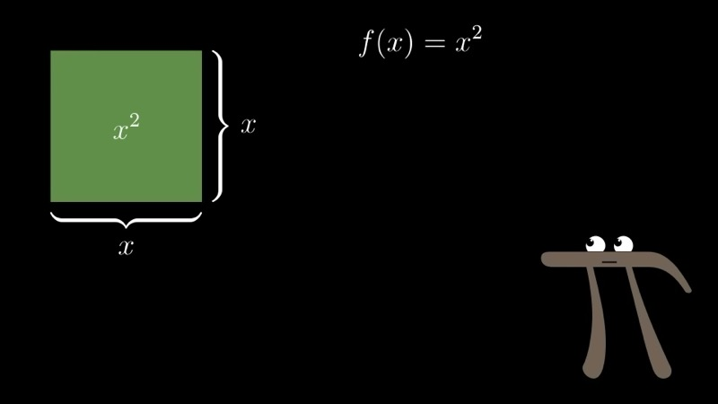
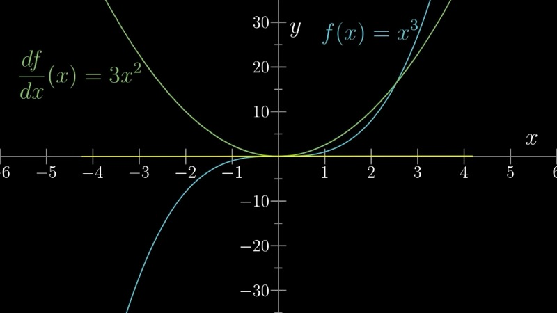
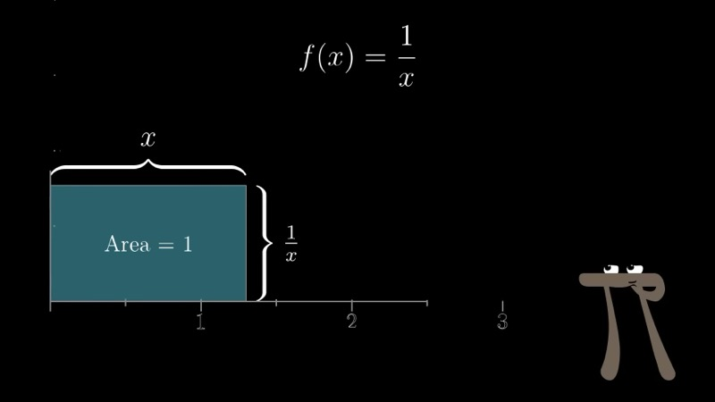
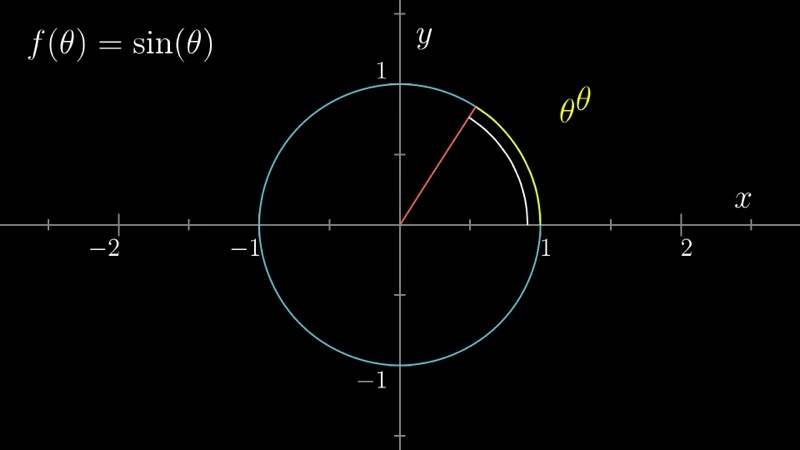

This lesson develops the standard derivative formulas -- the power rule, the
derivative of $1/x$, and the derivative of $\sin(\theta)$ -- not through
algebraic manipulation alone, but through geometric reasoning. By visualising
each function as a concrete geometric quantity (an area, a volume, a height on
the unit circle), we see why the formulas must take the forms they do.

::: {.callout-note collapse="true"}
## Prerequisites

- Understanding of the derivative as the ratio $df/dx$ for a small nudge $dx$ (Chapter 2)
- Familiarity with polynomial expressions and basic exponent rules
- Knowledge of the unit-circle definitions of $\sin\theta$ and $\cos\theta$
:::

## Topics Covered

- Geometric derivation of $\frac{d}{dx}x^2 = 2x$ via area of a square
- Geometric derivation of $\frac{d}{dx}x^3 = 3x^2$ via volume of a cube
- The general power rule: $\frac{d}{dx}x^n = nx^{n-1}$
- Geometric derivation of $\frac{d}{dx}(1/x) = -1/x^2$ via a constant-area rectangle
- Geometric derivation of $\frac{d}{dx}\sin\theta = \cos\theta$ via the unit circle

## Lecture Video

```{=html}
<div class="video-container"><iframe src="https://www.youtube.com/embed/S0_qX4VJhMQ" title="Derivative formulas through geometry" frameborder="0" allow="accelerometer; autoplay; clipboard-write; encrypted-media; gyroscope; picture-in-picture; web-share" allowfullscreen></iframe></div>
```

## Key Video Frames









## Key Concepts

### The Derivative of $x^2$: Area of a Square

We interpret $f(x) = x^2$ literally as the area of a square with side length
$x$. When we increase $x$ by a small nudge $dx$, the new area is
$(x + dx)^2$. The change in area consists of three pieces:

- two thin rectangles, each of area $x \cdot dx$,
- one tiny square of area $(dx)^2$.

Since $(dx)^2$ is negligible compared with $dx$ as $dx \to 0$, the change in
area is

$$
df = 2x\,dx + (dx)^2 \approx 2x\,dx.
$$

Dividing both sides by $dx$,

$$
\frac{df}{dx} = 2x.
$$

### The Derivative of $x^3$: Volume of a Cube

We interpret $g(x) = x^3$ as the volume of a cube with side length $x$.
Increasing $x$ by $dx$ adds new volume that is dominated by three thin
square slabs, each with volume $x^2 \cdot dx$. The remaining slivers along
the edges (proportional to $dx^2$) and the tiny corner cube (proportional
to $dx^3$) are all negligible. Therefore,

$$
dg = 3x^2\,dx + \mathcal{O}(dx^2),
$$

and

$$
\frac{dg}{dx} = 3x^2.
$$

### The General Power Rule

The pattern above extends to any positive integer $n$. When we expand
$(x + dx)^n$, the first term is $x^n$ (the original value). The next
collection of terms arises from choosing $dx$ from exactly one of the $n$
factors and $x$ from the remaining $n - 1$ factors. There are $n$ such
choices, giving

$$
(x + dx)^n = x^n + n\,x^{n-1}\,dx + \mathcal{O}(dx^2).
$$

All higher-order terms involve $dx^2$ or higher powers and therefore vanish
in the limit. We conclude:

$$
\boxed{\frac{d}{dx}\,x^n = n\,x^{n-1}.}
$$

This is the **power rule**. Although it is often applied mechanically -- "bring
the exponent down and subtract one" -- the geometric picture reminds us that
each of the $n$ terms $x^{n-1}\,dx$ corresponds to one "face" of the
higher-dimensional cube that gains a thin layer of thickness $dx$.

### Interactive Desmos Graph: The Power Rule

```{=html}
<div id="calc_ch03_1" class="desmos-container"></div>
<script src="https://www.desmos.com/api/v1.9/calculator.js?apiKey=dcb31709b452b1cf9dc26972add0fda6"></script>
<script>
  var calc_ch03_1 = Desmos.GraphingCalculator(document.getElementById('calc_ch03_1'), {
    expressions: true, settingsMenu: false, xAxisLabel: 'x', yAxisLabel: 'y'
  });
  calc_ch03_1.setExpression({ id: 'n', latex: 'n = 2', sliderBounds: { min: 1, max: 6, step: 1 } });
  calc_ch03_1.setExpression({ id: 'f', latex: 'f(x) = x^{n}', color: '#2d70b3' });
  calc_ch03_1.setExpression({ id: 'df', latex: 'g(x) = n \\cdot x^{n-1}', color: '#c74440' });
  calc_ch03_1.setExpression({ id: 'a', latex: 'a = 1.5', sliderBounds: { min: -3, max: 3, step: 0.01 } });
  calc_ch03_1.setExpression({ id: 'tangent', latex: 'y - a^{n} = n a^{n-1}(x - a)', color: '#388c46', lineStyle: Desmos.Styles.DASHED });
  calc_ch03_1.setExpression({ id: 'pt', latex: '(a, a^{n})', color: '#388c46', pointSize: 8 });
  calc_ch03_1.setMathBounds({ left: -3, right: 4, bottom: -5, top: 20 });
</script>
```

Use the slider $n$ to select different powers. The blue curve is $x^n$, the
red curve is its derivative $nx^{n-1}$, and the dashed green line is the
tangent to $x^n$ at the point $x = a$. Adjusting $a$ confirms that the slope
of the tangent equals the value of the derivative at that point.

### The Derivative of $1/x$: A Constant-Area Rectangle

We consider $f(x) = 1/x$ and interpret it geometrically. Picture a rectangle
of fixed area $1$ whose width is $x$; its height must then be $1/x$. If the
width increases by $dx$, the rectangle gains a thin vertical strip of area
$(1/x)\,dx$ on the right. To keep the total area equal to $1$, the height
must decrease by some amount $d(1/x)$, removing a thin horizontal strip of
area approximately $x \cdot |d(1/x)|$ from the top. Setting the gained area
equal to the lost area:

$$
\frac{1}{x}\,dx \approx -\,x\,d\!\left(\frac{1}{x}\right).
$$

(The negative sign accounts for the fact that the height decreases.) Solving
for the derivative,

$$
\frac{d}{dx}\!\left(\frac{1}{x}\right) = -\frac{1}{x^2}.
$$

This is consistent with the power rule applied to $x^{-1}$: bringing the
exponent $-1$ down and reducing it by one gives $-1 \cdot x^{-2} = -1/x^2$.

### Interactive Desmos Graph: The Constant-Area Rectangle for $1/x$

```{=html}
<div id="calc_ch03_2" class="desmos-container"></div>
<script>
  var calc_ch03_2 = Desmos.GraphingCalculator(document.getElementById('calc_ch03_2'), {
    expressions: true, settingsMenu: false, xAxisLabel: 'x', yAxisLabel: 'y'
  });
  calc_ch03_2.setExpression({ id: 'curve', latex: 'y = \\frac{1}{x} \\left\\{x > 0\\right\\}', color: '#2d70b3' });
  calc_ch03_2.setExpression({ id: 'x0', latex: 'x_0 = 2', sliderBounds: { min: 0.5, max: 5, step: 0.01 } });
  calc_ch03_2.setExpression({ id: 'rect', latex: '0 \\le y \\le \\frac{1}{x_0} \\left\\{0 \\le x \\le x_0\\right\\}', color: '#388c46', fillOpacity: 0.25 });
  calc_ch03_2.setExpression({ id: 'deriv', latex: 'y = -\\frac{1}{x^2} \\left\\{x > 0\\right\\}', color: '#c74440' });
  calc_ch03_2.setExpression({ id: 'pt', latex: '(x_0, \\frac{1}{x_0})', color: '#388c46', pointSize: 8 });
  calc_ch03_2.setMathBounds({ left: -0.5, right: 6, bottom: -2, top: 3 });
</script>
```

The green shaded region always has area $1$. Move the slider $x_0$ and observe
how the rectangle reshapes itself: as the width grows, the height $1/x_0$
shrinks. The red curve shows the derivative $-1/x^2$, which is always negative,
confirming that $1/x$ is a decreasing function for $x > 0$.

### The Derivative of $\sin\theta$: The Unit Circle

We recall that $\sin\theta$ is defined as the $y$-coordinate (height) of the
point on the unit circle after traversing an arc of length $\theta$ from the
rightmost point. To find the derivative, we consider what happens when
$\theta$ increases by a tiny amount $d\theta$.

The small arc of length $d\theta$ along the circumference, when the circle is
viewed up close, is essentially the hypotenuse of a tiny right triangle. The
vertical leg of this triangle -- the change in height -- is $d(\sin\theta)$.
The angle that this small triangle makes with the vertical is itself $\theta$
(by a similar-triangles argument with the large triangle formed by the radius).

From the geometry of this small right triangle,

$$
\frac{d(\sin\theta)}{d\theta} = \frac{\text{adjacent side}}{\text{hypotenuse}} = \cos\theta.
$$

Therefore,

$$
\boxed{\frac{d}{d\theta}\sin\theta = \cos\theta.}
$$

An analogous argument on the unit circle (examining the change in the
$x$-coordinate) yields the companion result:

$$
\frac{d}{d\theta}\cos\theta = -\sin\theta.
$$

### Interactive Desmos Graph: Derivative of Sine on the Unit Circle

```{=html}
<div id="calc_ch03_3" class="desmos-container"></div>
<script>
  var calc_ch03_3 = Desmos.GraphingCalculator(document.getElementById('calc_ch03_3'), {
    expressions: true, settingsMenu: false, xAxisLabel: 'θ', yAxisLabel: 'y'
  });
  calc_ch03_3.setExpression({ id: 'sin', latex: 'y = \\sin(x)', color: '#2d70b3' });
  calc_ch03_3.setExpression({ id: 'cos', latex: 'y = \\cos(x)', color: '#c74440' });
  calc_ch03_3.setExpression({ id: 't', latex: 't = 1', sliderBounds: { min: 0, max: 6.28, step: 0.01 } });
  calc_ch03_3.setExpression({ id: 'tangent', latex: 'y - \\sin(t) = \\cos(t)(x - t)', color: '#388c46', lineStyle: Desmos.Styles.DASHED });
  calc_ch03_3.setExpression({ id: 'pt', latex: '(t, \\sin(t))', color: '#388c46', pointSize: 8 });
  calc_ch03_3.setMathBounds({ left: -0.5, right: 7, bottom: -2, top: 2 });
</script>
```

The blue curve is $\sin\theta$ and the red curve is $\cos\theta$. The dashed
green line is the tangent to the sine curve at $\theta = t$. Observe that the
slope of this tangent always equals the value of the cosine at that point.

### Animated: The Nudged Square — Geometric View of $d(x^2)$

```{=html}
<div class="d3-container" id="ch03_nudged_square"></div>
<div class="d3-controls">
  <button id="ch03_nudged_square_play">Play ▶</button>
  <label>x:</label>
  <input type="range" id="ch03_nudged_square_x" min="1" max="4" value="2" step="0.1">
  <span class="value-display" id="ch03_nudged_square_x_val">x = 2.0</span>
  <label>dx:</label>
  <input type="range" id="ch03_nudged_square_dx" min="0.05" max="1.5" value="0.6" step="0.05">
  <span class="value-display" id="ch03_nudged_square_dx_val">dx = 0.60</span>
  <span class="value-display" id="ch03_nudged_square_info"></span>
</div>
<script>
(function() {
  const W = 700, H = 500, margin = {top: 40, right: 40, bottom: 50, left: 60};
  const w = W - margin.left - margin.right, h = H - margin.top - margin.bottom;

  const svg = d3.select("#ch03_nudged_square").append("svg")
    .attr("viewBox", `0 0 ${W} ${H}`)
    .append("g").attr("transform", `translate(${margin.left},${margin.top})`);

  // Title
  svg.append("text").attr("x", w / 2).attr("y", -15)
    .attr("text-anchor", "middle").attr("font-size", "16px").attr("font-weight", 600)
    .text("Nudged Square: (x + dx)² = x² + 2x·dx + dx²");

  const xSlider = document.getElementById("ch03_nudged_square_x");
  const dxSlider = document.getElementById("ch03_nudged_square_dx");
  const xVal = document.getElementById("ch03_nudged_square_x_val");
  const dxVal = document.getElementById("ch03_nudged_square_dx_val");
  const infoSpan = document.getElementById("ch03_nudged_square_info");

  function draw(animate) {
    const xv = +xSlider.value;
    const dxv = +dxSlider.value;
    const total = xv + dxv;
    const dur = animate ? 600 : 0;

    xVal.textContent = `x = ${xv.toFixed(1)}`;
    dxVal.textContent = `dx = ${dxv.toFixed(2)}`;

    const area2x = 2 * xv * dxv;
    const areaDx2 = dxv * dxv;
    infoSpan.textContent = `  2x·dx = ${area2x.toFixed(3)}   |   dx² = ${areaDx2.toFixed(4)}   |   dA = ${(area2x + areaDx2).toFixed(3)}`;

    // Scale to fit
    const scale = d3.scaleLinear().domain([0, 5.5]).range([0, Math.min(w, h)]);

    svg.selectAll(".sq-part").remove();
    svg.selectAll(".sq-label").remove();
    svg.selectAll(".sq-brace").remove();

    const g = svg.append("g").attr("class", "sq-part");

    // Original square x²
    g.append("rect")
      .attr("x", scale(0)).attr("y", scale(0))
      .attr("width", 0).attr("height", 0)
      .attr("fill", "#2d70b3").attr("opacity", 0.35)
      .attr("stroke", "#1a4a7a").attr("stroke-width", 1.5)
      .transition().duration(dur)
      .attr("width", scale(xv)).attr("height", scale(xv));

    // Label x²
    g.append("text").attr("class", "sq-label")
      .attr("x", scale(xv / 2)).attr("y", scale(xv / 2) + 5)
      .attr("text-anchor", "middle").attr("font-size", "18px").attr("font-weight", 700)
      .attr("fill", "#1a4a7a").attr("opacity", 0)
      .transition().duration(dur).delay(dur * 0.3).attr("opacity", 1)
      .text("x²");

    // Right thin rectangle (x · dx)
    g.append("rect")
      .attr("x", scale(xv)).attr("y", scale(0))
      .attr("width", 0).attr("height", scale(xv))
      .attr("fill", "#c74440").attr("opacity", 0.5)
      .attr("stroke", "#8b2020").attr("stroke-width", 1)
      .transition().duration(dur).delay(dur * 0.4)
      .attr("width", scale(dxv));

    // Top thin rectangle (x · dx)
    g.append("rect")
      .attr("x", scale(0)).attr("y", scale(xv))
      .attr("width", scale(xv)).attr("height", 0)
      .attr("fill", "#c74440").attr("opacity", 0.5)
      .attr("stroke", "#8b2020").attr("stroke-width", 1)
      .transition().duration(dur).delay(dur * 0.4)
      .attr("height", scale(dxv));

    // Label the two red rectangles
    g.append("text").attr("class", "sq-label")
      .attr("x", scale(xv + dxv / 2)).attr("y", scale(xv / 2) + 5)
      .attr("text-anchor", "middle").attr("font-size", "13px").attr("font-weight", 600)
      .attr("fill", "#8b2020").attr("opacity", 0)
      .transition().duration(dur).delay(dur * 0.7).attr("opacity", 1)
      .text("x·dx");

    g.append("text").attr("class", "sq-label")
      .attr("x", scale(xv / 2)).attr("y", scale(xv + dxv / 2) + 5)
      .attr("text-anchor", "middle").attr("font-size", "13px").attr("font-weight", 600)
      .attr("fill", "#8b2020").attr("opacity", 0)
      .transition().duration(dur).delay(dur * 0.7).attr("opacity", 1)
      .text("x·dx");

    // Corner square (dx)²
    g.append("rect")
      .attr("x", scale(xv)).attr("y", scale(xv))
      .attr("width", 0).attr("height", 0)
      .attr("fill", "#388c46").attr("opacity", 0.6)
      .attr("stroke", "#1f5e2a").attr("stroke-width", 1)
      .transition().duration(dur).delay(dur * 0.7)
      .attr("width", scale(dxv)).attr("height", scale(dxv));

    // Label corner square
    if (dxv >= 0.3) {
      g.append("text").attr("class", "sq-label")
        .attr("x", scale(xv + dxv / 2)).attr("y", scale(xv + dxv / 2) + 5)
        .attr("text-anchor", "middle").attr("font-size", "11px").attr("font-weight", 600)
        .attr("fill", "#1f5e2a").attr("opacity", 0)
        .transition().duration(dur).delay(dur * 0.9).attr("opacity", 1)
        .text("dx²");
    }

    // Dimension braces / labels along edges
    // Bottom edge: x
    g.append("text").attr("class", "sq-label")
      .attr("x", scale(xv / 2)).attr("y", scale(0) - 8)
      .attr("text-anchor", "middle").attr("font-size", "14px").attr("fill", "#333")
      .text("x");

    // Bottom edge: dx
    g.append("text").attr("class", "sq-label")
      .attr("x", scale(xv + dxv / 2)).attr("y", scale(0) - 8)
      .attr("text-anchor", "middle").attr("font-size", "14px").attr("fill", "#c74440")
      .text("dx");

    // Left edge: x
    g.append("text").attr("class", "sq-label")
      .attr("x", scale(0) - 12).attr("y", scale(xv / 2) + 5)
      .attr("text-anchor", "middle").attr("font-size", "14px").attr("fill", "#333")
      .text("x");

    // Left edge: dx
    g.append("text").attr("class", "sq-label")
      .attr("x", scale(0) - 14).attr("y", scale(xv + dxv / 2) + 5)
      .attr("text-anchor", "middle").attr("font-size", "14px").attr("fill", "#c74440")
      .text("dx");
  }

  xSlider.addEventListener("input", () => draw(true));
  dxSlider.addEventListener("input", () => draw(true));

  document.getElementById("ch03_nudged_square_play").addEventListener("click", function() {
    // Animate dx shrinking from 1.5 to 0.05
    let dxCur = 1.5;
    dxSlider.value = dxCur;
    draw(true);
    const interval = setInterval(() => {
      dxCur = Math.max(0.05, dxCur - 0.1);
      dxSlider.value = dxCur;
      draw(true);
      if (dxCur <= 0.05) clearInterval(interval);
    }, 500);
  });

  draw(false);
})();
</script>
```

Press **Play** to watch $dx$ shrink toward zero. As it does, the two red
rectangles (each of area $x \cdot dx$) dominate the new area, while the
green corner square ($dx^2$) becomes negligible -- confirming that
$\frac{d}{dx}x^2 = 2x$.

### Animated: Power Rule — Derivative vs Finite Difference

```{=html}
<div class="d3-container" id="ch03_power_rule_bars"></div>
<div class="d3-controls">
  <button id="ch03_power_rule_bars_play">Play ▶</button>
  <label>dx (h):</label>
  <input type="range" id="ch03_power_rule_bars_h" min="0.001" max="0.5" value="0.1" step="0.001">
  <span class="value-display" id="ch03_power_rule_bars_h_val">h = 0.1000</span>
  <span class="value-display" id="ch03_power_rule_bars_info"></span>
</div>
<script>
(function() {
  const W = 700, H = 420, margin = {top: 50, right: 30, bottom: 60, left: 70};
  const w = W - margin.left - margin.right, h = H - margin.top - margin.bottom;

  const svg = d3.select("#ch03_power_rule_bars").append("svg")
    .attr("viewBox", `0 0 ${W} ${H}`)
    .append("g").attr("transform", `translate(${margin.left},${margin.top})`);

  svg.append("text").attr("x", w / 2).attr("y", -25)
    .attr("text-anchor", "middle").attr("font-size", "16px").attr("font-weight", 600)
    .text("Power Rule: Analytical nxⁿ⁻¹ vs Finite Difference [f(x+h)−f(x)]/h");

  // Functions to test
  const funcs = [
    { label: "x²",  n: 2, x: 2.0, f: x => x**2,  df: x => 2*x       },
    { label: "x³",  n: 3, x: 2.0, f: x => x**3,  df: x => 3*x**2    },
    { label: "x⁴",  n: 4, x: 1.5, f: x => x**4,  df: x => 4*x**3    },
    { label: "x⁵",  n: 5, x: 1.5, f: x => x**5,  df: x => 5*x**4    },
    { label: "1/x", n: -1, x: 2.0, f: x => 1/x,   df: x => -1/(x*x) },
    { label: "√x",  n: 0.5, x: 4.0, f: x => Math.sqrt(x), df: x => 0.5/Math.sqrt(x) }
  ];

  const hSlider = document.getElementById("ch03_power_rule_bars_h");
  const hVal = document.getElementById("ch03_power_rule_bars_h_val");
  const infoSpan = document.getElementById("ch03_power_rule_bars_info");

  const xScale = d3.scaleBand()
    .domain(funcs.map(d => d.label))
    .range([0, w]).padding(0.25);

  const subScale = d3.scaleBand()
    .domain(["analytical", "numerical"])
    .range([0, xScale.bandwidth()]).padding(0.08);

  // Axes (y-axis will be updated)
  const xAxis = svg.append("g").attr("transform", `translate(0,${h})`);
  const yAxisG = svg.append("g");

  // Color legend
  const legend = svg.append("g").attr("transform", `translate(${w - 200}, -10)`);
  legend.append("rect").attr("width", 14).attr("height", 14).attr("fill", "#2d70b3");
  legend.append("text").attr("x", 18).attr("y", 12).attr("font-size", "12px").text("Power rule (exact)");
  legend.append("rect").attr("y", 20).attr("width", 14).attr("height", 14).attr("fill", "#c74440");
  legend.append("text").attr("x", 18).attr("y", 32).attr("font-size", "12px").text("Finite difference");

  const barsGroup = svg.append("g");

  // Error text group
  const errGroup = svg.append("g");

  function update(animate) {
    const hv = +hSlider.value;
    const dur = animate ? 500 : 0;
    hVal.textContent = `h = ${hv.toFixed(4)}`;

    // Compute values
    const data = funcs.map(d => {
      const exact = d.df(d.x);
      const numeric = (d.f(d.x + hv) - d.f(d.x)) / hv;
      return { label: d.label, x: d.x, exact, numeric };
    });

    const maxVal = d3.max(data, d => Math.max(Math.abs(d.exact), Math.abs(d.numeric)));
    const yScale = d3.scaleLinear().domain([-maxVal * 0.2, maxVal * 1.15]).range([h, 0]);
    const zeroY = yScale(0);

    xAxis.call(d3.axisBottom(xScale)).selectAll("text").attr("font-size", "13px");
    yAxisG.transition().duration(dur).call(d3.axisLeft(yScale).ticks(6));

    // Bars
    const bars = barsGroup.selectAll(".bar-pair").data(data, d => d.label);

    const enter = bars.enter().append("g").attr("class", "bar-pair");

    // Analytical bar
    enter.append("rect").attr("class", "bar-exact")
      .attr("fill", "#2d70b3").attr("opacity", 0.75);

    // Numerical bar
    enter.append("rect").attr("class", "bar-num")
      .attr("fill", "#c74440").attr("opacity", 0.75);

    const merged = enter.merge(bars);

    merged.select(".bar-exact").transition().duration(dur)
      .attr("x", d => xScale(d.label) + subScale("analytical"))
      .attr("width", subScale.bandwidth())
      .attr("y", d => d.exact >= 0 ? yScale(d.exact) : zeroY)
      .attr("height", d => Math.abs(yScale(d.exact) - zeroY));

    merged.select(".bar-num").transition().duration(dur)
      .attr("x", d => xScale(d.label) + subScale("numerical"))
      .attr("width", subScale.bandwidth())
      .attr("y", d => d.numeric >= 0 ? yScale(d.numeric) : zeroY)
      .attr("height", d => Math.abs(yScale(d.numeric) - zeroY));

    // Error labels above bars
    errGroup.selectAll(".err-label").remove();
    data.forEach(d => {
      const err = Math.abs(d.numeric - d.exact);
      const relErr = d.exact !== 0 ? (err / Math.abs(d.exact) * 100) : 0;
      errGroup.append("text").attr("class", "err-label")
        .attr("x", xScale(d.label) + xScale.bandwidth() / 2)
        .attr("y", yScale(Math.max(Math.abs(d.exact), Math.abs(d.numeric)) * (d.exact >= 0 ? 1 : -0.05)) - 6)
        .attr("text-anchor", "middle").attr("font-size", "10px").attr("fill", "#666")
        .text(`err: ${relErr.toFixed(2)}%`);
    });

    // Zero line
    barsGroup.selectAll(".zero-line").remove();
    barsGroup.append("line").attr("class", "zero-line")
      .attr("x1", 0).attr("x2", w)
      .attr("y1", zeroY).attr("y2", zeroY)
      .attr("stroke", "#999").attr("stroke-dasharray", "4,3");

    const maxErr = d3.max(data, d => Math.abs(d.numeric - d.exact));
    infoSpan.textContent = `  Max absolute error: ${maxErr.toFixed(6)}`;
  }

  hSlider.addEventListener("input", () => update(true));

  document.getElementById("ch03_power_rule_bars_play").addEventListener("click", function() {
    let hCur = 0.5;
    hSlider.value = hCur;
    update(true);
    const interval = setInterval(() => {
      hCur = Math.max(0.001, hCur * 0.7);
      hSlider.value = hCur;
      update(true);
      if (hCur <= 0.002) clearInterval(interval);
    }, 450);
  });

  update(false);
})();
</script>
```

Press **Play** to watch the step size $h$ shrink toward zero. For each function,
the red bar (finite difference) converges to the blue bar (analytical derivative
from the power rule), confirming $\frac{d}{dx}x^n = nx^{n-1}$ numerically
across integer, negative, and fractional exponents.

## Summary

::: {.key-formula}
| Concept | Key Result |
|---|---|
| Derivative of $x^2$ (area of a square) | $\frac{d}{dx}x^2 = 2x$ |
| Derivative of $x^3$ (volume of a cube) | $\frac{d}{dx}x^3 = 3x^2$ |
| Power rule | $\frac{d}{dx}x^n = nx^{n-1}$ |
| Derivative of $1/x$ (constant-area rectangle) | $\frac{d}{dx}\frac{1}{x} = -\frac{1}{x^2}$ |
| Derivative of $\sin\theta$ (unit circle) | $\frac{d}{d\theta}\sin\theta = \cos\theta$ |
| Derivative of $\cos\theta$ (unit circle) | $\frac{d}{d\theta}\cos\theta = -\sin\theta$ |
:::
