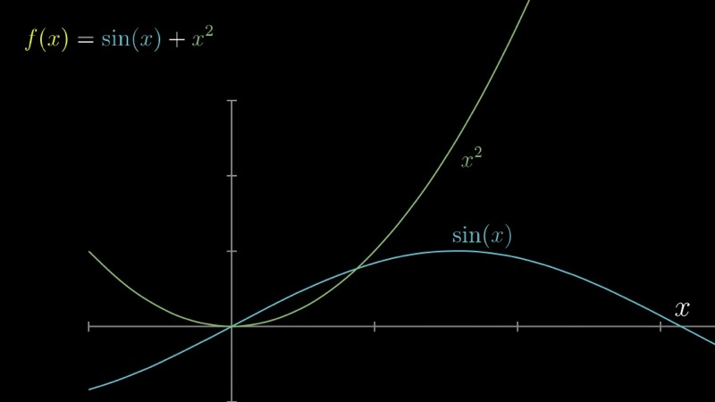
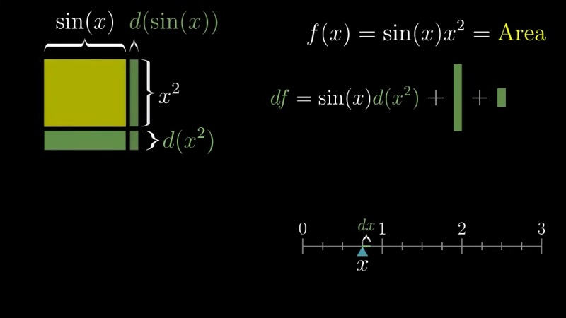
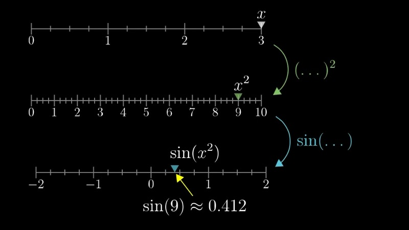
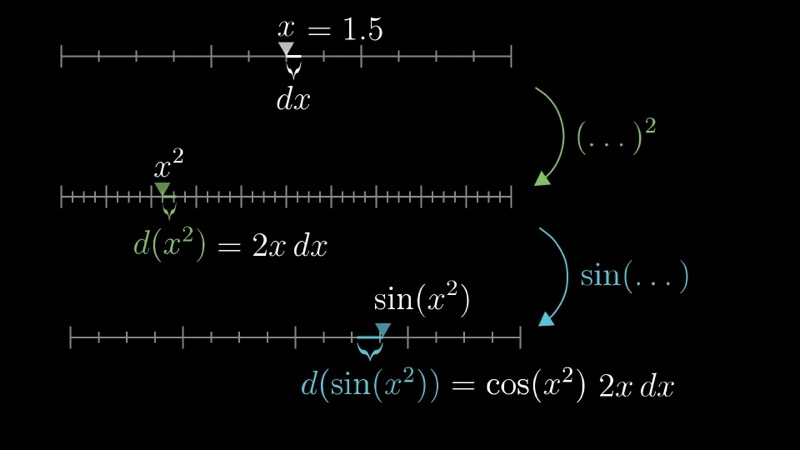

This lesson develops geometric and visual intuitions for the two most important
differentiation rules: the product rule and the chain rule. Rather than treating
these as formulas to memorize, we derive each one from first principles by
examining how small perturbations propagate through composed and multiplied
functions.

::: {.callout-note collapse="true"}
## Prerequisites

- Understanding of the derivative as the ratio $df/dx$ (Chapters 1--2)
- Familiarity with derivatives of elementary functions: $\frac{d}{dx}\sin(x) = \cos(x)$, $\frac{d}{dx}x^2 = 2x$ (Chapter 3)
- Comfort with the notation $f(x)$, $g(x)$, $h(x)$ for named functions
:::

## Topics Covered

- The sum rule as a warm-up: the derivative of a sum is the sum of the derivatives
- The product rule via an area-of-a-rectangle model
- The chain rule via a three-number-line model of function composition
- Cancellation of intermediate differentials as a reflection of the underlying geometry

## Lecture Video

```{=html}
<video controls width="100%" preload="metadata">
  <source src="https://github.com/ymote/3b1b-calculus/releases/download/v1.0/04_Visualizing%20the%20chain%20rule%20and%20product%20rule%20%EF%BD%9C%20Chapter%204%2C%20Essence%20of%20calculus.mp4" type="video/mp4">
</video>
```

## Key Video Frames









## Key Concepts

### The Sum Rule: A Warm-Up

Consider a function defined as the sum of two component functions,

$$
f(x) = g(x) + h(x).
$$

When the input changes from $x$ to $x + dx$, the change in $f$ is

$$
df = dg + dh.
$$

Dividing through by $dx$ yields

$$
\frac{df}{dx} = \frac{dg}{dx} + \frac{dh}{dx}.
$$

The derivative of a sum is the sum of the derivatives. This result is
straightforward, but it serves as a useful template: we ask how a small nudge
$dx$ propagates through the structure of the function, and we read off the
derivative from the resulting expression.

### The Product Rule via an Area Model

Suppose we wish to differentiate the product

$$
f(x) = g(x) \cdot h(x).
$$

We represent this product as the area of a rectangle whose width is $g(x)$ and
whose height is $h(x)$. When the input shifts by $dx$, the width changes by
$dg$ and the height changes by $dh$. The resulting change in area consists of
three pieces:

1. A thin rectangle along the bottom of width $g$ and height $dh$, with area $g \cdot dh$.
2. A thin rectangle along the right side of width $dg$ and height $h$, with area $h \cdot dg$.
3. A tiny corner rectangle of area $dg \cdot dh$, which is proportional to $(dx)^2$ and thus negligible.

Therefore,

$$
df \approx g(x)\, dh + h(x)\, dg.
$$

Substituting $dg = g'(x)\, dx$ and $dh = h'(x)\, dx$, and dividing by $dx$, we obtain the **product rule**:

$$
\frac{d}{dx}\bigl[g(x) \cdot h(x)\bigr] = g(x)\, h'(x) + h(x)\, g'(x).
$$

A useful mnemonic is "left d-right plus right d-left": the first factor times
the derivative of the second, plus the second factor times the derivative of the
first.

#### Constant Multiple as a Special Case

When one of the factors is a constant $c$, the product rule simplifies. Since
$\frac{d}{dx}[c] = 0$, we have

$$
\frac{d}{dx}\bigl[c \cdot h(x)\bigr] = c \cdot h'(x).
$$

Constants simply "pass through" the derivative operator.

### Interactive Desmos Graph: The Product Rule Area Model

```{=html}
<div id="calc_ch04_1" class="desmos-container"></div>
<script src="https://www.desmos.com/api/v1.9/calculator.js?apiKey=dcb31709b452b1cf9dc26972add0fda6"></script>
<script>
  var calc_ch04_1 = Desmos.GraphingCalculator(document.getElementById('calc_ch04_1'), {
    expressions: true, settingsMenu: false, xAxisLabel: '', yAxisLabel: ''
  });
  // g(x) = sin(x), h(x) = x^2; show the rectangle and the two thin strips
  calc_ch04_1.setExpression({ id: 'a', latex: 'a = 1', sliderBounds: { min: 0.3, max: 3, step: 0.01 } });
  calc_ch04_1.setExpression({ id: 'dx', latex: 'd = 0.3', sliderBounds: { min: 0.01, max: 0.5, step: 0.01 } });
  calc_ch04_1.setExpression({ id: 'g_val', latex: 'g = \\sin(a)' });
  calc_ch04_1.setExpression({ id: 'h_val', latex: 'h = a^2' });
  calc_ch04_1.setExpression({ id: 'dg_val', latex: 'g_1 = \\sin(a+d) - \\sin(a)' });
  calc_ch04_1.setExpression({ id: 'dh_val', latex: 'h_1 = (a+d)^2 - a^2' });
  // Main rectangle (original area)
  calc_ch04_1.setExpression({ id: 'rect_main', latex: '0 \\le y \\le h \\left\\{0 \\le x \\le g\\right\\}', color: '#2d70b3', fillOpacity: 0.2 });
  // Bottom strip: g * dh
  calc_ch04_1.setExpression({ id: 'strip_bottom', latex: 'h \\le y \\le h + h_1 \\left\\{0 \\le x \\le g\\right\\}', color: '#388c46', fillOpacity: 0.5 });
  // Right strip: h * dg
  calc_ch04_1.setExpression({ id: 'strip_right', latex: '0 \\le y \\le h \\left\\{g \\le x \\le g + g_1\\right\\}', color: '#c74440', fillOpacity: 0.5 });
  // Corner (negligible)
  calc_ch04_1.setExpression({ id: 'corner', latex: 'h \\le y \\le h + h_1 \\left\\{g \\le x \\le g + g_1\\right\\}', color: '#6042a6', fillOpacity: 0.3 });
  calc_ch04_1.setMathBounds({ left: -0.3, right: 2.5, bottom: -0.5, top: 10 });
</script>
```

Adjust the slider $a$ to choose a value of $x$, and the slider $d$ to control
the size of the nudge $dx$. The green strip represents $g(x)\, dh$, the red
strip represents $h(x)\, dg$, and the small purple corner is $dg \cdot dh$,
which becomes negligible as $d \to 0$.

### The Chain Rule via Three Number Lines

Now consider the composition of two functions,

$$
f(x) = g\bigl(h(x)\bigr).
$$

We visualize this using three number lines arranged vertically:

- **Line 1** holds the input $x$.
- **Line 2** holds the intermediate value $h(x)$.
- **Line 3** holds the final output $g(h(x))$.

A small nudge $dx$ on Line 1 induces a nudge on Line 2 of size

$$
dh = h'(x)\, dx.
$$

This intermediate nudge $dh$, in turn, induces a nudge on Line 3 of size

$$
dg = g'(h)\, dh.
$$

Substituting the expression for $dh$, we find

$$
dg = g'(h(x)) \cdot h'(x)\, dx.
$$

Dividing both sides by $dx$ gives the **chain rule**:

$$
\frac{d}{dx}\bigl[g(h(x))\bigr] = g'(h(x)) \cdot h'(x).
$$

In Leibniz notation, this takes the particularly elegant form

$$
\frac{dg}{dx} = \frac{dg}{dh} \cdot \frac{dh}{dx}.
$$

The apparent "cancellation" of $dh$ is not merely a notational trick; it
reflects the genuine process by which a perturbation propagates through the
intermediate variable.

#### Worked Example: $\sin(x^2)$

Let $g(u) = \sin(u)$ and $h(x) = x^2$. Then $g'(u) = \cos(u)$ and $h'(x) = 2x$.
Applying the chain rule:

$$
\frac{d}{dx}\sin(x^2) = \cos(x^2) \cdot 2x.
$$

At a specific input such as $x = 1.5$, the derivative evaluates to
$2(1.5)\cos(1.5^2) = 3\cos(2.25)$.

### Interactive Desmos Graph: The Chain Rule with Three Functions

```{=html}
<div id="calc_ch04_2" class="desmos-container"></div>
<script>
  var calc_ch04_2 = Desmos.GraphingCalculator(document.getElementById('calc_ch04_2'), {
    expressions: true, settingsMenu: false, xAxisLabel: 'x', yAxisLabel: ''
  });
  calc_ch04_2.setExpression({ id: 'f_inner', latex: 'h(x) = x^2', color: '#2d70b3' });
  calc_ch04_2.setExpression({ id: 'f_outer', latex: 'g(x) = \\sin(x)', color: '#388c46' });
  calc_ch04_2.setExpression({ id: 'f_comp', latex: 'f(x) = \\sin(x^2)', color: '#c74440', lineWidth: 3 });
  calc_ch04_2.setExpression({ id: 'a', latex: 'a = 1.5', sliderBounds: { min: -3, max: 3, step: 0.01 } });
  calc_ch04_2.setExpression({ id: 'tangent', latex: 'y = \\sin(a^2) + \\cos(a^2) \\cdot 2a \\cdot (x - a)', color: '#6042a6', lineStyle: Desmos.Styles.DASHED });
  calc_ch04_2.setExpression({ id: 'pt', latex: '(a, \\sin(a^2))', color: '#c74440', pointSize: 8 });
  calc_ch04_2.setMathBounds({ left: -3.5, right: 3.5, bottom: -2, top: 2 });
</script>
```

The red curve is $f(x) = \sin(x^2)$, the composed function. Move the slider $a$
to see the tangent line (purple, dashed) whose slope is the chain rule
derivative $\cos(a^2) \cdot 2a$.

### Interactive Desmos Graph: Product Rule Function and Its Derivative

```{=html}
<div id="calc_ch04_3" class="desmos-container"></div>
<script>
  var calc_ch04_3 = Desmos.GraphingCalculator(document.getElementById('calc_ch04_3'), {
    expressions: true, settingsMenu: false, xAxisLabel: 'x', yAxisLabel: ''
  });
  calc_ch04_3.setExpression({ id: 'g_func', latex: 'g(x) = \\sin(x)', color: '#2d70b3', lineStyle: Desmos.Styles.DASHED });
  calc_ch04_3.setExpression({ id: 'h_func', latex: 'h(x) = x^2', color: '#388c46', lineStyle: Desmos.Styles.DASHED });
  calc_ch04_3.setExpression({ id: 'product', latex: 'p(x) = \\sin(x) \\cdot x^2', color: '#c74440', lineWidth: 3 });
  calc_ch04_3.setExpression({ id: 'deriv', latex: 'd(x) = \\cos(x) \\cdot x^2 + \\sin(x) \\cdot 2x', color: '#6042a6' });
  calc_ch04_3.setExpression({ id: 'a', latex: 'a = 1', sliderBounds: { min: -3, max: 3, step: 0.01 } });
  calc_ch04_3.setExpression({ id: 'tan_line', latex: 'y = p(a) + d(a)(x - a)', color: '#000000', lineStyle: Desmos.Styles.DASHED });
  calc_ch04_3.setExpression({ id: 'pt', latex: '(a, p(a))', color: '#c74440', pointSize: 8 });
  calc_ch04_3.setMathBounds({ left: -4, right: 4, bottom: -8, top: 8 });
</script>
```

The red curve is $p(x) = \sin(x) \cdot x^2$ and the purple curve is its
derivative $p'(x) = \cos(x) \cdot x^2 + \sin(x) \cdot 2x$. Move the slider $a$
to verify that the tangent line (black, dashed) matches the slope given by the
product rule.

### Combining the Rules

In practice, most functions encountered in modeling involve nested combinations
of sums, products, and compositions. The key insight is that one can always
proceed step by step, peeling away layers one at a time. For instance, to
differentiate

$$
f(x) = \sin(x^2) \cdot e^x,
$$

we first recognize this as a product of $g(x) = \sin(x^2)$ and $h(x) = e^x$.
Applying the product rule:

$$
f'(x) = g'(x) \cdot e^x + \sin(x^2) \cdot e^x.
$$

We then apply the chain rule to find $g'(x) = \cos(x^2) \cdot 2x$, giving

$$
f'(x) = 2x\cos(x^2)\, e^x + \sin(x^2)\, e^x.
$$

### Interactive Python: Numerical Verification of the Product Rule

```{=html}
<div class="pyodide-container">
  <textarea class="code-input" id="code_ch04_1">
import numpy as np
import matplotlib.pyplot as plt

# Product rule: d/dx [sin(x) * x^2] = cos(x)*x^2 + sin(x)*2x
x = np.linspace(0.1, 4, 300)

# The product function and its analytic derivative
f = np.sin(x) * x**2
f_prime_analytic = np.cos(x) * x**2 + np.sin(x) * 2 * x

# Numerical derivative via central differences
dx = 1e-7
f_prime_numerical = (np.sin(x + dx) * (x + dx)**2
                     - np.sin(x - dx) * (x - dx)**2) / (2 * dx)

fig, (ax1, ax2) = plt.subplots(2, 1, figsize=(9, 6), sharex=True)

ax1.plot(x, f, color='#c74440', linewidth=2, label=r'$f(x) = \sin(x)\, x^2$')
ax1.plot(x, f_prime_analytic, color='#6042a6', linewidth=2,
         label=r"$f'(x)$ (product rule)")
ax1.set_ylabel('Value')
ax1.set_title('Product rule: analytic derivative')
ax1.legend()
ax1.grid(True, alpha=0.3)

ax2.semilogy(x, np.abs(f_prime_analytic - f_prime_numerical),
             color='#2d70b3', linewidth=1.5)
ax2.set_xlabel('x')
ax2.set_ylabel('Absolute error')
ax2.set_title('Difference between analytic and numerical derivatives')
ax2.grid(True, alpha=0.3)

plt.tight_layout()
plt.show()
  </textarea>
  <button class="run-btn" onclick="runPyodide('code_ch04_1', 'output_ch04_1', 'plot_ch04_1')">Run ▶</button>
  <div class="output" id="output_ch04_1"></div>
  <div class="plot-output" id="plot_ch04_1"></div>
</div>
```

### Interactive Python: Visualizing the Chain Rule Propagation

```{=html}
<div class="pyodide-container">
  <textarea class="code-input" id="code_ch04_2">
import numpy as np
import matplotlib.pyplot as plt

# Chain rule: d/dx [sin(x^2)] = cos(x^2) * 2x
# Visualize how a nudge dx propagates: dx -> dh = 2x*dx -> dg = cos(h)*dh

x0 = 1.5
dx_values = np.logspace(-1, -6, 50)

actual_dg = np.sin((x0 + dx_values)**2) - np.sin(x0**2)
chain_approx = np.cos(x0**2) * 2 * x0 * dx_values

fig, (ax1, ax2) = plt.subplots(1, 2, figsize=(10, 4))

# Left: compare actual vs chain-rule approximation
ax1.plot(dx_values, actual_dg, 'o-', markersize=3, color='#c74440',
         label=r'Actual $\Delta g$')
ax1.plot(dx_values, chain_approx, '--', color='#2d70b3', linewidth=2,
         label=r"Chain rule: $\cos(x_0^2)\cdot 2x_0\cdot dx$")
ax1.set_xscale('log')
ax1.set_xlabel(r'$dx$')
ax1.set_ylabel(r'Change in $g = \sin(x^2)$')
ax1.set_title(f'Nudge propagation at $x_0 = {x0}$')
ax1.legend(fontsize=9)
ax1.grid(True, alpha=0.3)

# Right: relative error shrinks as dx -> 0
rel_error = np.abs(actual_dg - chain_approx) / np.abs(actual_dg + 1e-30)
ax2.loglog(dx_values, rel_error, 'o-', markersize=3, color='#388c46')
ax2.set_xlabel(r'$dx$')
ax2.set_ylabel('Relative error')
ax2.set_title('Chain rule approximation error')
ax2.grid(True, alpha=0.3)

plt.tight_layout()
plt.show()
  </textarea>
  <button class="run-btn" onclick="runPyodide('code_ch04_2', 'output_ch04_2', 'plot_ch04_2')">Run ▶</button>
  <div class="output" id="output_ch04_2"></div>
  <div class="plot-output" id="plot_ch04_2"></div>
</div>
```

## Summary

::: {.key-formula}
| Concept | Key Result |
|---|---|
| Sum rule | $\frac{d}{dx}\bigl[g(x) + h(x)\bigr] = g'(x) + h'(x)$ |
| Product rule | $\frac{d}{dx}\bigl[g(x)\, h(x)\bigr] = g(x)\, h'(x) + h(x)\, g'(x)$ |
| Product rule (geometric) | $df = g\, dh + h\, dg$ (two thin strips of the area rectangle) |
| Chain rule | $\frac{d}{dx}\bigl[g(h(x))\bigr] = g'(h(x)) \cdot h'(x)$ |
| Chain rule (Leibniz) | $\frac{dg}{dx} = \frac{dg}{dh} \cdot \frac{dh}{dx}$ |
| Constant multiple | $\frac{d}{dx}\bigl[c \cdot f(x)\bigr] = c \cdot f'(x)$ |
:::
