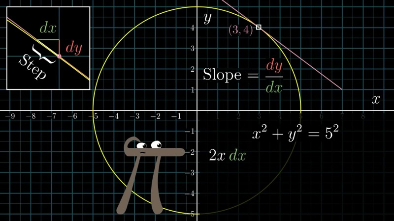
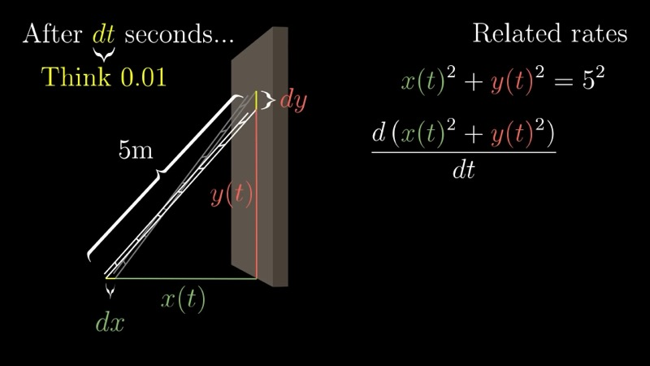
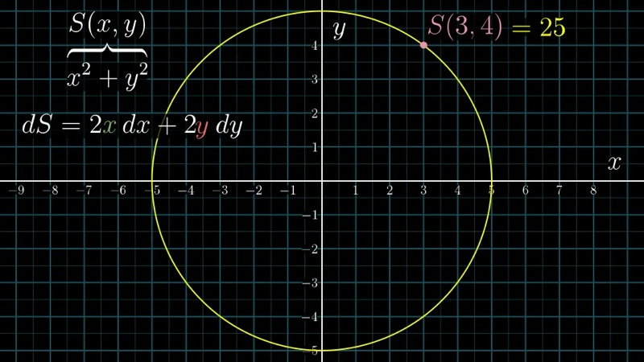
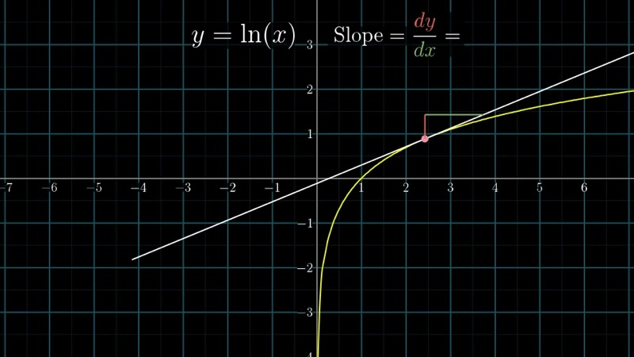

This lesson examines implicit differentiation, a technique for finding the slope
of tangent lines to curves defined by equations in two variables rather than by
explicit functions. We develop the method through the geometry of the circle
$x^2 + y^2 = 25$, connect it to related rates problems, and then generalise
to arbitrary implicit curves.

::: {.callout-note collapse="true"}
## Prerequisites

- The chain rule and product rule for single-variable derivatives (Chapters 3--4)
- Familiarity with the equation of a circle and the Pythagorean theorem
- Basic algebraic manipulation of equations involving $dx$ and $dy$
:::

## Topics Covered

- Curves defined implicitly by equations in $x$ and $y$
- Differentiating both sides of an implicit equation
- The multivariable perspective: $s(x,y) = x^2 + y^2$ and its total differential
- Connection between implicit differentiation and related rates
- Deriving $\frac{d}{dx}\ln(x) = \frac{1}{x}$ via implicit differentiation

## Lecture Video

```{=html}
<div class="video-container"><iframe src="https://www.youtube.com/embed/qb40J4N1fa4" title="Implicit differentiation" frameborder="0" allow="accelerometer; autoplay; clipboard-write; encrypted-media; gyroscope; picture-in-picture; web-share" allowfullscreen></iframe></div>
```

## Key Video Frames









## Key Concepts

### The Problem: Slopes on Implicit Curves

Consider a circle of radius 5 centred at the origin, defined by the equation

$$
x^2 + y^2 = 25.
$$

We wish to find the slope of the tangent line at a point such as $(3, 4)$.
Unlike the curves we have encountered previously, this circle is not the graph
of a single function $y = f(x)$. The variables $x$ and $y$ are interdependent
values related by an equation rather than an explicit input-output relationship.
Such a curve is called an **implicit curve**.

### Differentiating Both Sides

The central technique is to treat both sides of the equation as quantities that
change when we take a tiny step $(dx, dy)$ along the curve, and then
differentiate accordingly.

Beginning with $x^2 + y^2 = 25$, we differentiate each term:

$$
2x\,dx + 2y\,dy = 0.
$$

Solving for the slope $\dfrac{dy}{dx}$, we divide through by $dx$ and
rearrange:

$$
\frac{dy}{dx} = -\frac{x}{y}.
$$

At the point $(3, 4)$, this gives

$$
\frac{dy}{dx}\bigg|_{(3,4)} = -\frac{3}{4}.
$$

This result is consistent with the geometric fact that the tangent to a circle
is perpendicular to the radius at the point of tangency, but the method itself
generalises far beyond circles.

### Interactive Desmos Graph: Tangent Line to the Circle

```{=html}
<div id="calc_ch06_1" class="desmos-container"></div>
<script src="https://www.desmos.com/api/v1.9/calculator.js?apiKey=dcb31709b452b1cf9dc26972add0fda6"></script>
<script>
  var calc_ch06_1 = Desmos.GraphingCalculator(document.getElementById('calc_ch06_1'), {
    expressions: true, settingsMenu: false, xAxisLabel: 'x', yAxisLabel: 'y'
  });
  calc_ch06_1.setExpression({ id: 'circle', latex: 'x^2 + y^2 = 25', color: '#2d70b3' });
  calc_ch06_1.setExpression({ id: 'a', latex: 'a = 3', sliderBounds: { min: -5, max: 5, step: 0.01 } });
  calc_ch06_1.setExpression({ id: 'b', latex: 'b = \\sqrt{25 - a^2}', color: '#388c46' });
  calc_ch06_1.setExpression({ id: 'tangent', latex: 'y - b = -\\frac{a}{b}(x - a)', color: '#c74440' });
  calc_ch06_1.setExpression({ id: 'pt', latex: '(a, b)', color: '#c74440', pointStyle: 'POINT', pointSize: 9 });
  calc_ch06_1.setMathBounds({ left: -8, right: 8, bottom: -8, top: 8 });
</script>
```

Drag the slider $a$ to move the point along the upper semicircle. The red
tangent line has slope $-a/b = -x/y$, as predicted by implicit differentiation.

### The Multivariable Perspective

To understand *why* this procedure works, we introduce a function of two
variables:

$$
s(x, y) = x^2 + y^2.
$$

This function assigns to every point $(x, y)$ in the plane a single number.
Points on our circle are precisely those where $s(x, y) = 25$. Points farther
from the origin yield larger values of $s$; points closer to the origin yield
smaller values.

A tiny step $(dx, dy)$ from any point $(x, y)$ produces a change in $s$ of

$$
ds = 2x\,dx + 2y\,dy.
$$

This expression is the **total differential** of $s$. It tells us how much
$s$ changes for an arbitrary small displacement, and it depends both on the
starting point $(x, y)$ and on the step $(dx, dy)$.

When we restrict ourselves to steps that remain on the circle, we require
$s$ to remain constant at 25. This means $ds = 0$, and so

$$
2x\,dx + 2y\,dy = 0,
$$

which is exactly the equation we obtained by "differentiating both sides."

### Connection to Related Rates

The same equation $x^2 + y^2 = 25$ appears in a different guise when we
consider a 5-metre ladder sliding down a wall. If $y(t)$ denotes the height
of the top of the ladder and $x(t)$ the distance of its base from the wall,
then the Pythagorean theorem gives

$$
x(t)^2 + y(t)^2 = 25
$$

at all times $t$. Differentiating with respect to $t$:

$$
2x\,\frac{dx}{dt} + 2y\,\frac{dy}{dt} = 0.
$$

If, at $t = 0$, we have $y = 4$, $x = 3$, and $\dfrac{dy}{dt} = -1$ m/s
(the ladder is sliding down), then

$$
2(3)\frac{dx}{dt} + 2(4)(-1) = 0
\quad\Longrightarrow\quad
\frac{dx}{dt} = \frac{4}{3} \text{ m/s}.
$$

The algebraic structure is identical to the implicit differentiation problem.
The only difference is that in the related rates setting the tiny nudges $dx$
and $dy$ are tied to a common parameter $t$, whereas in implicit
differentiation they float freely as displacements along the curve.

### A More Complex Example

Consider the implicit curve defined by

$$
\sin(x) \cdot y^2 = x.
$$

To find $\dfrac{dy}{dx}$, we differentiate both sides. On the left we apply the
product rule:

$$
\cos(x)\,dx \cdot y^2 + \sin(x) \cdot 2y\,dy = dx.
$$

Dividing through by $dx$ and solving for $\dfrac{dy}{dx}$:

$$
\frac{dy}{dx} = \frac{1 - y^2 \cos(x)}{2y\sin(x)}.
$$

This formula gives the slope of the tangent line at any point $(x, y)$ that
lies on the curve.

### Interactive Desmos Graph: Implicit Curve $\sin(x)\cdot y^2 = x$

```{=html}
<div id="calc_ch06_2" class="desmos-container"></div>
<script>
  var calc_ch06_2 = Desmos.GraphingCalculator(document.getElementById('calc_ch06_2'), {
    expressions: true, settingsMenu: false, xAxisLabel: 'x', yAxisLabel: 'y'
  });
  calc_ch06_2.setExpression({ id: 'curve', latex: '\\sin(x) \\cdot y^2 = x', color: '#2d70b3' });
  calc_ch06_2.setExpression({ id: 'a', latex: 'a = 1.5', sliderBounds: { min: 0.1, max: 6, step: 0.01 } });
  calc_ch06_2.setExpression({ id: 'b', latex: 'b = \\sqrt{\\frac{a}{\\sin(a)}}', color: '#388c46' });
  calc_ch06_2.setExpression({ id: 'slope', latex: 'm = \\frac{1 - b^2 \\cos(a)}{2 b \\sin(a)}', color: '#c74440' });
  calc_ch06_2.setExpression({ id: 'tangent', latex: 'y - b = m(x - a)', color: '#c74440' });
  calc_ch06_2.setExpression({ id: 'pt', latex: '(a, b)', color: '#c74440', pointStyle: 'POINT', pointSize: 9 });
  calc_ch06_2.setMathBounds({ left: -1, right: 10, bottom: -5, top: 5 });
</script>
```

Adjust the slider $a$ to trace along the upper branch of the curve. The tangent
line slope is computed from the implicit derivative formula derived above.

### Deriving $\frac{d}{dx}\ln(x)$ via Implicit Differentiation

Implicit differentiation also provides an elegant route to new derivative
formulas. Suppose we wish to compute the derivative of $\ln(x)$. We set

$$
y = \ln(x),
$$

and rewrite this as

$$
e^y = x.
$$

Differentiating both sides implicitly:

$$
e^y\,dy = dx.
$$

Solving for $\dfrac{dy}{dx}$:

$$
\frac{dy}{dx} = \frac{1}{e^y}.
$$

Since $e^y = x$ on the curve, we conclude

$$
\frac{d}{dx}\ln(x) = \frac{1}{x}.
$$

### Interactive Desmos Graph: The Natural Logarithm and Its Tangent

```{=html}
<div id="calc_ch06_3" class="desmos-container"></div>
<script>
  var calc_ch06_3 = Desmos.GraphingCalculator(document.getElementById('calc_ch06_3'), {
    expressions: true, settingsMenu: false, xAxisLabel: 'x', yAxisLabel: 'y'
  });
  calc_ch06_3.setExpression({ id: 'ln', latex: 'y = \\ln(x)', color: '#2d70b3' });
  calc_ch06_3.setExpression({ id: 'a', latex: 'a = 2', sliderBounds: { min: 0.1, max: 8, step: 0.01 } });
  calc_ch06_3.setExpression({ id: 'tangent', latex: 'y - \\ln(a) = \\frac{1}{a}(x - a)', color: '#c74440' });
  calc_ch06_3.setExpression({ id: 'pt', latex: '(a, \\ln(a))', color: '#c74440', pointStyle: 'POINT', pointSize: 9 });
  calc_ch06_3.setMathBounds({ left: -1, right: 10, bottom: -4, top: 4 });
</script>
```

Move the slider $a$ to observe how the tangent slope $1/a$ matches the
derivative of $\ln(x)$ at each point.

### Animated: Tangent Line on the Circle $x^2 + y^2 = 25$

```{=html}
<div class="d3-container" id="ch06_d3_circle"></div>
<div class="d3-controls">
  <button id="ch06_d3_circle_play">Play &#9654;</button>
  <button id="ch06_d3_circle_pause">Pause &#9646;&#9646;</button>
  <label>Angle &theta;:</label>
  <input type="range" id="ch06_d3_circle_theta" min="0" max="6.2832" value="0.9273" step="0.01">
  <span class="value-display" id="ch06_d3_circle_info">(3.00, 4.00)  dy/dx = -0.750</span>
</div>
<script src="https://d3js.org/d3.v7.min.js"></script>
<script>
(function() {
  const W = 700, H = 500, margin = {top: 30, right: 30, bottom: 50, left: 60};
  const w = W - margin.left - margin.right, h = H - margin.top - margin.bottom;
  const R = 5;

  const svg = d3.select("#ch06_d3_circle").append("svg")
    .attr("viewBox", `0 0 ${W} ${H}`)
    .append("g").attr("transform", `translate(${margin.left},${margin.top})`);

  const xScale = d3.scaleLinear().domain([-7, 7]).range([0, w]);
  const yScale = d3.scaleLinear().domain([-7, 7]).range([h, 0]);

  // Grid lines
  svg.append("g").attr("transform", `translate(0,${h})`).call(d3.axisBottom(xScale).ticks(14))
    .selectAll("line").attr("stroke", "#ddd");
  svg.append("g").call(d3.axisLeft(yScale).ticks(14))
    .selectAll("line").attr("stroke", "#ddd");

  // Axes through origin
  svg.append("line").attr("x1", xScale(-7)).attr("x2", xScale(7))
    .attr("y1", yScale(0)).attr("y2", yScale(0))
    .attr("stroke", "#999").attr("stroke-width", 0.5);
  svg.append("line").attr("x1", xScale(0)).attr("x2", xScale(0))
    .attr("y1", yScale(-7)).attr("y2", yScale(7))
    .attr("stroke", "#999").attr("stroke-width", 0.5);

  // Axis labels
  svg.append("text").attr("x", w / 2).attr("y", h + 40)
    .attr("text-anchor", "middle").attr("font-size", "14px").attr("fill", "#333").text("x");
  svg.append("text").attr("x", -45).attr("y", h / 2)
    .attr("text-anchor", "middle").attr("font-size", "14px").attr("fill", "#333")
    .attr("transform", `rotate(-90, -45, ${h / 2})`).text("y");

  // Draw circle
  const circlePoints = d3.range(0, 2 * Math.PI + 0.01, 0.02).map(t => [R * Math.cos(t), R * Math.sin(t)]);
  svg.append("path").datum(circlePoints)
    .attr("d", d3.line().x(d => xScale(d[0])).y(d => yScale(d[1])))
    .attr("fill", "none").attr("stroke", "#2d70b3").attr("stroke-width", 2.5);

  // Radius line (from origin to point)
  const radiusLine = svg.append("line")
    .attr("stroke", "#388c46").attr("stroke-width", 1.5).attr("stroke-dasharray", "5,4");

  // Tangent line
  const tangentLine = svg.append("line")
    .attr("stroke", "#c74440").attr("stroke-width", 2);

  // Point on circle
  const pointDot = svg.append("circle")
    .attr("r", 6).attr("fill", "#c74440").attr("stroke", "#fff").attr("stroke-width", 1.5);

  // Slope label near point
  const slopeLabel = svg.append("text")
    .attr("font-size", "13px").attr("font-weight", 600).attr("fill", "#c74440");

  const slider = document.getElementById("ch06_d3_circle_theta");
  const infoSpan = document.getElementById("ch06_d3_circle_info");
  let animId = null;

  function update(theta) {
    const px = R * Math.cos(theta);
    const py = R * Math.sin(theta);
    const slope = (Math.abs(py) < 0.001) ? NaN : -px / py;

    // Point
    pointDot.attr("cx", xScale(px)).attr("cy", yScale(py));

    // Radius
    radiusLine.attr("x1", xScale(0)).attr("y1", yScale(0))
      .attr("x2", xScale(px)).attr("y2", yScale(py));

    // Tangent line: draw from -6 to 6 in x, clipped visually
    if (isFinite(slope)) {
      const tLen = 4;
      const x1 = px - tLen, y1 = py - slope * tLen;
      const x2 = px + tLen, y2 = py + slope * tLen;
      tangentLine.attr("x1", xScale(x1)).attr("y1", yScale(y1))
        .attr("x2", xScale(x2)).attr("y2", yScale(y2))
        .attr("visibility", "visible");
    } else {
      // Vertical tangent at top/bottom
      tangentLine.attr("x1", xScale(px)).attr("y1", yScale(-7))
        .attr("x2", xScale(px)).attr("y2", yScale(7))
        .attr("visibility", "visible");
    }

    // Slope label
    const slopeStr = isFinite(slope) ? slope.toFixed(3) : "\u00b1\u221e";
    slopeLabel.attr("x", xScale(px) + 12).attr("y", yScale(py) - 12)
      .text(`dy/dx = ${slopeStr}`);

    infoSpan.textContent = `(${px.toFixed(2)}, ${py.toFixed(2)})  dy/dx = ${slopeStr}`;
  }

  slider.addEventListener("input", function() {
    update(+this.value);
  });

  document.getElementById("ch06_d3_circle_play").addEventListener("click", function() {
    if (animId) return;
    let theta = +slider.value;
    animId = setInterval(function() {
      theta += 0.02;
      if (theta > 2 * Math.PI) theta -= 2 * Math.PI;
      slider.value = theta;
      update(theta);
    }, 40);
  });

  document.getElementById("ch06_d3_circle_pause").addEventListener("click", function() {
    if (animId) { clearInterval(animId); animId = null; }
  });

  update(+slider.value);
})();
</script>
```

Press **Play** to watch a point travel around the circle $x^2 + y^2 = 25$.
The red tangent line updates in real-time, with slope $dy/dx = -x/y$ displayed
alongside the point. The dashed green radius is always perpendicular to the
tangent, confirming the geometric relationship.

### Animated: Sliding Ladder Related Rates

```{=html}
<div class="d3-container" id="ch06_d3_ladder"></div>
<div class="d3-controls">
  <button id="ch06_d3_ladder_play">Play &#9654;</button>
  <button id="ch06_d3_ladder_reset">Reset</button>
  <label>dy/dt (m/s):</label>
  <input type="range" id="ch06_d3_ladder_speed" min="-2" max="-0.2" value="-1" step="0.1">
  <span class="value-display" id="ch06_d3_ladder_speed_val">dy/dt = -1.0</span>
  <span class="value-display" id="ch06_d3_ladder_info"></span>
</div>
<script>
(function() {
  const W = 700, H = 500, margin = {top: 20, right: 220, bottom: 50, left: 60};
  const w = W - margin.left - margin.right, h = H - margin.top - margin.bottom;
  const L = 5; // ladder length

  const svg = d3.select("#ch06_d3_ladder").append("svg")
    .attr("viewBox", `0 0 ${W} ${H}`)
    .append("g").attr("transform", `translate(${margin.left},${margin.top})`);

  const xScale = d3.scaleLinear().domain([0, 6]).range([0, w]);
  const yScale = d3.scaleLinear().domain([0, 6]).range([h, 0]);

  // Wall (y-axis region)
  svg.append("rect").attr("x", xScale(-0.3)).attr("y", yScale(6))
    .attr("width", xScale(0) - xScale(-0.3) + 4).attr("height", yScale(0) - yScale(6))
    .attr("fill", "#b0b0b0").attr("opacity", 0.3);
  // Floor (x-axis region)
  svg.append("rect").attr("x", xScale(0)).attr("y", yScale(0))
    .attr("width", xScale(6) - xScale(0)).attr("height", 4)
    .attr("fill", "#b0b0b0").attr("opacity", 0.3);

  // Wall line
  svg.append("line").attr("x1", xScale(0)).attr("x2", xScale(0))
    .attr("y1", yScale(0)).attr("y2", yScale(6))
    .attr("stroke", "#555").attr("stroke-width", 2);
  // Floor line
  svg.append("line").attr("x1", xScale(0)).attr("x2", xScale(6))
    .attr("y1", yScale(0)).attr("y2", yScale(0))
    .attr("stroke", "#555").attr("stroke-width", 2);

  // Quarter-circle guide (constraint curve)
  const arcPoints = d3.range(0, Math.PI / 2 + 0.01, 0.02).map(t => [L * Math.cos(t), L * Math.sin(t)]);
  svg.append("path").datum(arcPoints)
    .attr("d", d3.line().x(d => xScale(d[0])).y(d => yScale(d[1])))
    .attr("fill", "none").attr("stroke", "#2d70b3").attr("stroke-width", 1)
    .attr("stroke-dasharray", "4,4").attr("opacity", 0.5);

  // Ladder
  const ladder = svg.append("line")
    .attr("stroke", "#d4760a").attr("stroke-width", 5).attr("stroke-linecap", "round");

  // Points at ends
  const basePoint = svg.append("circle").attr("r", 5).attr("fill", "#c74440");
  const topPoint = svg.append("circle").attr("r", 5).attr("fill", "#388c46");

  // Dimension lines and labels
  const xDimLine = svg.append("line").attr("stroke", "#c74440").attr("stroke-width", 1.5);
  const yDimLine = svg.append("line").attr("stroke", "#388c46").attr("stroke-width", 1.5);
  const xLabel = svg.append("text").attr("font-size", "13px").attr("fill", "#c74440").attr("font-weight", 600);
  const yLabel = svg.append("text").attr("font-size", "13px").attr("fill", "#388c46").attr("font-weight", 600);

  // Right-side rate display panel
  const panel = svg.append("g").attr("transform", `translate(${w + 30}, 30)`);
  panel.append("text").attr("font-size", "14px").attr("font-weight", 700).attr("fill", "#333").text("Rates:");
  const rateDydt = panel.append("text").attr("y", 28).attr("font-size", "13px").attr("fill", "#388c46");
  const rateDxdt = panel.append("text").attr("y", 52).attr("font-size", "13px").attr("fill", "#c74440");
  const rateTime = panel.append("text").attr("y", 82).attr("font-size", "13px").attr("fill", "#555");
  const rateFormula = panel.append("text").attr("y", 116).attr("font-size", "12px").attr("fill", "#666");
  rateFormula.text("2x(dx/dt) + 2y(dy/dt) = 0");
  const rateFormula2 = panel.append("text").attr("y", 138).attr("font-size", "12px").attr("fill", "#666");
  rateFormula2.text("dx/dt = -(y/x)(dy/dt)");

  // Arrow heads for velocity vectors
  const dxArrow = svg.append("line").attr("stroke", "#c74440").attr("stroke-width", 2)
    .attr("marker-end", "url(#ch06_arrow_red)");
  const dyArrow = svg.append("line").attr("stroke", "#388c46").attr("stroke-width", 2)
    .attr("marker-end", "url(#ch06_arrow_green)");

  // Arrow markers
  const defs = svg.append("defs");
  function addArrow(id, color) {
    defs.append("marker").attr("id", id).attr("viewBox", "0 0 10 10")
      .attr("refX", 10).attr("refY", 5).attr("markerWidth", 8).attr("markerHeight", 8)
      .attr("orient", "auto")
      .append("path").attr("d", "M 0 0 L 10 5 L 0 10 z").attr("fill", color);
  }
  addArrow("ch06_arrow_red", "#c74440");
  addArrow("ch06_arrow_green", "#388c46");

  const infoSpan = document.getElementById("ch06_d3_ladder_info");
  const speedSlider = document.getElementById("ch06_d3_ladder_speed");
  const speedVal = document.getElementById("ch06_d3_ladder_speed_val");
  let animId = null;
  let currentY = 4.0;
  let time = 0;

  function draw(xv, yv, dydt) {
    const dxdt = (xv > 0.01) ? -(yv / xv) * dydt : 0;

    ladder.attr("x1", xScale(xv)).attr("y1", yScale(0))
      .attr("x2", xScale(0)).attr("y2", yScale(yv));

    basePoint.attr("cx", xScale(xv)).attr("cy", yScale(0));
    topPoint.attr("cx", xScale(0)).attr("cy", yScale(yv));

    // Dimension annotations
    xDimLine.attr("x1", xScale(0)).attr("y1", yScale(-0.4))
      .attr("x2", xScale(xv)).attr("y2", yScale(-0.4));
    xLabel.attr("x", xScale(xv / 2)).attr("y", yScale(-0.8))
      .attr("text-anchor", "middle").text(`x = ${xv.toFixed(2)}`);

    yDimLine.attr("x1", xScale(-0.4)).attr("y1", yScale(0))
      .attr("x2", xScale(-0.4)).attr("y2", yScale(yv));
    yLabel.attr("x", xScale(-0.8)).attr("y", yScale(yv / 2))
      .attr("text-anchor", "middle").text(`y = ${yv.toFixed(2)}`);

    // Velocity arrows (scaled for visibility)
    const arrowScale = 0.8;
    dxArrow.attr("x1", xScale(xv)).attr("y1", yScale(-0.05))
      .attr("x2", xScale(xv + dxdt * arrowScale)).attr("y2", yScale(-0.05));
    dyArrow.attr("x1", xScale(-0.05)).attr("y1", yScale(yv))
      .attr("x2", xScale(-0.05)).attr("y2", yScale(yv + dydt * arrowScale));

    rateDydt.text(`dy/dt = ${dydt.toFixed(2)} m/s`);
    rateDxdt.text(`dx/dt = ${dxdt.toFixed(2)} m/s`);
    rateTime.text(`t = ${time.toFixed(2)} s`);

    infoSpan.textContent = `x=${xv.toFixed(2)} y=${yv.toFixed(2)} dx/dt=${dxdt.toFixed(2)} dy/dt=${dydt.toFixed(2)}`;
  }

  function reset() {
    if (animId) { clearInterval(animId); animId = null; }
    currentY = 4.0;
    time = 0;
    const xv = Math.sqrt(L * L - currentY * currentY);
    draw(xv, currentY, +speedSlider.value);
  }

  speedSlider.addEventListener("input", function() {
    speedVal.textContent = `dy/dt = ${(+this.value).toFixed(1)}`;
    if (!animId) {
      const xv = Math.sqrt(L * L - currentY * currentY);
      draw(xv, currentY, +this.value);
    }
  });

  document.getElementById("ch06_d3_ladder_play").addEventListener("click", function() {
    if (animId) return;
    const dt = 0.04;
    animId = setInterval(function() {
      const dydt = +speedSlider.value;
      const xv = Math.sqrt(Math.max(0, L * L - currentY * currentY));
      const dxdt = (xv > 0.01) ? -(currentY / xv) * dydt : 0;

      currentY += dydt * dt;
      time += dt;

      if (currentY <= 0.05 || currentY >= L) {
        currentY = Math.max(0.05, Math.min(L - 0.01, currentY));
        clearInterval(animId);
        animId = null;
      }

      const newX = Math.sqrt(Math.max(0, L * L - currentY * currentY));
      draw(newX, currentY, dydt);
    }, 40);
  });

  document.getElementById("ch06_d3_ladder_reset").addEventListener("click", reset);

  reset();
})();
</script>
```

Press **Play** to watch the 5-metre ladder slide down the wall. The green
arrow shows $dy/dt$ (the rate at which the top descends) and the red arrow
shows $dx/dt$ (the rate at which the base moves away from the wall), computed
from the relation $dx/dt = -(y/x)\,(dy/dt)$. Adjust the $dy/dt$ slider to
change the descent speed and observe how $dx/dt$ accelerates as $y \to 0$.

## Summary

::: {.key-formula}
| Concept | Key Result |
|---|---|
| Circle tangent slope | $x^2 + y^2 = r^2 \;\Longrightarrow\; \dfrac{dy}{dx} = -\dfrac{x}{y}$ |
| Total differential | $ds = 2x\,dx + 2y\,dy$ for $s = x^2 + y^2$ |
| Implicit differentiation (general) | Differentiate both sides, set $ds = 0$, solve for $\dfrac{dy}{dx}$ |
| Related rates connection | Same algebra, but $dx$ and $dy$ are tied to $dt$ |
| Derivative of $\ln(x)$ | $y = \ln(x) \;\Longrightarrow\; e^y = x \;\Longrightarrow\; \dfrac{dy}{dx} = \dfrac{1}{x}$ |
:::
