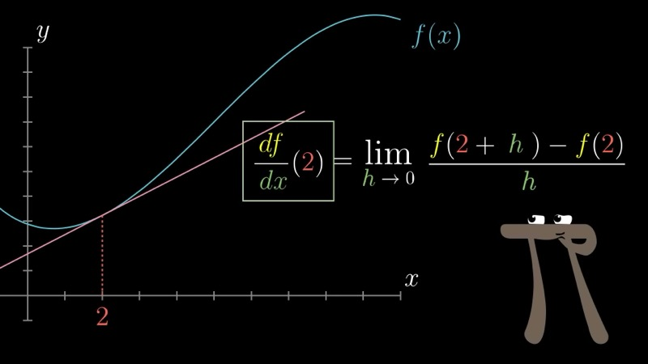
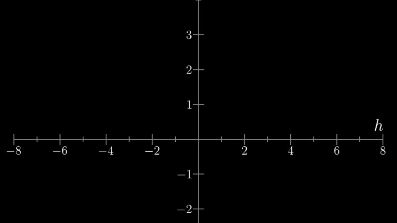
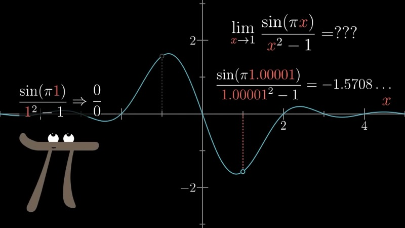
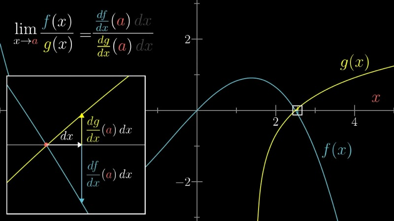

This lesson formalizes the notion of a limit, which undergirds every definition
encountered so far in the series. We connect the intuitive "nudge" interpretation
of derivatives to the standard textbook definition, introduce the rigorous
epsilon-delta characterization of limits, and conclude with L'Hopital's Rule — a
powerful technique for evaluating indeterminate forms.

::: {.callout-note collapse="true"}
## Prerequisites

- Understanding of the derivative as the ratio $df/dx$ in the limit of small nudges (Chapters 2--3)
- Familiarity with basic derivative rules: power rule, chain rule (Chapters 3--4)
- Comfort with the notation $\lim_{x \to a} f(x)$
:::

## Topics Covered

- The formal definition of the derivative as a limit
- Intuitive and rigorous meanings of "approach"
- The epsilon-delta definition of limits
- Indeterminate forms and L'Hopital's Rule

## Lecture Video

```{=html}
<div class="video-container"><iframe src="https://www.youtube.com/embed/kfF40MiS7zA" title="Limits, L'Hopital's rule, and epsilon delta definitions" frameborder="0" allow="accelerometer; autoplay; clipboard-write; encrypted-media; gyroscope; picture-in-picture; web-share" allowfullscreen></iframe></div>
```

## Key Video Frames









## Key Concepts

### The Formal Definition of the Derivative

Throughout the preceding chapters, we have interpreted the derivative of a
function $f$ at a point $x$ as the ratio $df/dx$, where $dx$ is a small but
concrete nudge to the input. The formal definition makes the limiting process
explicit. We replace the infinitesimal symbol $dx$ with an ordinary variable $h$
and write

$$
f'(x) = \lim_{h \to 0} \frac{f(x + h) - f(x)}{h}.
$$

The value $h$ is a genuine, finitely small number — for example, $0.001$ or
$0.0001$. We then ask what the difference quotient approaches as $h$ is taken
arbitrarily close to zero. Nothing in this definition invokes "infinitely small"
quantities; the limit formalism circumvents that notion entirely.

As a concrete illustration, consider $f(x) = x^3$ at $x = 2$. The difference
quotient becomes

$$
\frac{(2 + h)^3 - 2^3}{h} = \frac{(8 + 12h + 6h^2 + h^3) - 8}{h} = 12 + 6h + h^2.
$$

This is a perfectly well-defined function of $h$ for all $h \neq 0$, and its
graph is a parabola with a hole at $h = 0$. As $h \to 0$, the expression
approaches $12$, confirming that $f'(2) = 12$.

### What "Approach" Means: An Intuitive Picture

Consider any function $g(h)$ that is defined for values of $h$ near (but not
necessarily at) some point $h = 0$. We say that $g(h)$ **approaches** the value
$L$ as $h \to 0$ if, by restricting $h$ to a sufficiently small interval around
$0$, the corresponding outputs can be confined to an arbitrarily small interval
around $L$.

When a limit fails to exist, no such confinement is possible. For instance, if a
function jumps from one value on the left of a point to a different value on the
right, then no matter how tightly we restrict the input range, the output range
straddles a gap that never closes.

### The Epsilon-Delta Definition of Limits

The informal description above can be made completely precise. We write

$$
\lim_{x \to a} f(x) = L
$$

and mean the following: for every $\varepsilon > 0$, there exists a
$\delta > 0$ such that

$$
0 < |x - a| < \delta \implies |f(x) - L| < \varepsilon.
$$

The quantifier structure is crucial. The adversary chooses $\varepsilon$ first —
an arbitrarily stringent tolerance on the output. We must then respond with a
$\delta$ — a sufficiently tight restriction on the input — so that every $x$
within $\delta$ of $a$ (excluding $a$ itself) produces an output within
$\varepsilon$ of $L$.

**Example.** We verify that $\lim_{h \to 0}(12 + 6h + h^2) = 12$. Given
$\varepsilon > 0$, we need $|6h + h^2| < \varepsilon$. Restricting $|h| < 1$,
we have $|6h + h^2| \le 6|h| + |h|^2 \le 6|h| + |h| = 7|h|$. Choosing
$\delta = \min(1, \varepsilon / 7)$ ensures the inequality holds.

When a limit does **not** exist, there is some $\varepsilon > 0$ for which no
$\delta$ suffices. Consider a function that approaches $2$ from the right and
$1$ from the left at a given point. Taking $\varepsilon = 0.4$, no matter how
small $\delta$ is chosen, inputs on opposite sides of the point produce outputs
that differ by nearly $1$, which exceeds $2\varepsilon$.

### Interactive Desmos Graph: Exploring the Difference Quotient

```{=html}
<div id="calc_ch07_1" class="desmos-container"></div>
<script src="https://www.desmos.com/api/v1.9/calculator.js?apiKey=dcb31709b452b1cf9dc26972add0fda6"></script>
<script>
  var calc_ch07_1 = Desmos.GraphingCalculator(document.getElementById('calc_ch07_1'), {
    expressions: true, settingsMenu: false, xAxisLabel: 'h', yAxisLabel: 'Q(h)'
  });
  calc_ch07_1.setExpression({ id: 'quotient', latex: 'y = 12 + 6x + x^2', color: '#2d70b3' });
  calc_ch07_1.setExpression({ id: 'hole', latex: '(0, 12)', color: '#c74440', pointStyle: 'OPEN', pointSize: 9 });
  calc_ch07_1.setExpression({ id: 'limit_line', latex: 'y = 12', color: '#388c46', lineStyle: 'DASHED', lineWidth: 1.5 });
  calc_ch07_1.setMathBounds({ left: -4, right: 4, bottom: -2, top: 30 });
</script>
```

The blue curve is the difference quotient $(2+h)^3 - 8)/h = 12 + 6h + h^2$. The
open circle at $h = 0$ marks the point where the expression is undefined, yet
the function clearly approaches $12$ (dashed green line) as $h \to 0$ from
either side.

### Interactive Desmos Graph: The Epsilon-Delta Window

```{=html}
<div id="calc_ch07_2" class="desmos-container"></div>
<script>
  var calc_ch07_2 = Desmos.GraphingCalculator(document.getElementById('calc_ch07_2'), {
    expressions: true, settingsMenu: false, xAxisLabel: 'h', yAxisLabel: 'Q(h)'
  });
  calc_ch07_2.setExpression({ id: 'func', latex: 'y = 12 + 6x + x^2', color: '#2d70b3' });
  calc_ch07_2.setExpression({ id: 'eps', latex: '\\epsilon = 1', sliderBounds: { min: 0.05, max: 5, step: 0.05 } });
  calc_ch07_2.setExpression({ id: 'del', latex: '\\delta = 0.14', sliderBounds: { min: 0.01, max: 2, step: 0.01 } });
  calc_ch07_2.setExpression({ id: 'eps_upper', latex: 'y = 12 + \\epsilon', color: '#c74440', lineStyle: 'DASHED' });
  calc_ch07_2.setExpression({ id: 'eps_lower', latex: 'y = 12 - \\epsilon', color: '#c74440', lineStyle: 'DASHED' });
  calc_ch07_2.setExpression({ id: 'del_left', latex: 'x = -\\delta', color: '#388c46', lineStyle: 'DASHED' });
  calc_ch07_2.setExpression({ id: 'del_right', latex: 'x = \\delta', color: '#388c46', lineStyle: 'DASHED' });
  calc_ch07_2.setExpression({ id: 'shade', latex: '12 - \\epsilon \\le y \\le 12 + \\epsilon \\left\\{-\\delta \\le x \\le \\delta\\right\\}', color: '#ffd700', fillOpacity: 0.15 });
  calc_ch07_2.setMathBounds({ left: -3, right: 3, bottom: 5, top: 20 });
</script>
```

Adjust the $\varepsilon$ slider (red dashed lines) to set an output tolerance
around $12$, then adjust $\delta$ (green dashed lines) to find an input
restriction that keeps the blue curve inside the yellow band. For every choice of
$\varepsilon > 0$, a suitable $\delta$ exists — this is precisely the statement
that the limit equals $12$.

### L'Hopital's Rule

We now turn to a practical technique for evaluating limits of the form $0/0$.
Consider two functions $f$ and $g$ that both vanish at some point $x = a$, so
that the ratio $f(x)/g(x)$ is undefined there. Near $x = a$, each function is
well approximated by its linearization:

$$
f(x) \approx f'(a) \cdot (x - a), \qquad g(x) \approx g'(a) \cdot (x - a).
$$

The ratio of these approximations is

$$
\frac{f(x)}{g(x)} \approx \frac{f'(a)\cdot (x - a)}{g'(a)\cdot (x - a)} = \frac{f'(a)}{g'(a)},
$$

provided $g'(a) \neq 0$. Since the approximations become exact in the limit, we
obtain **L'Hopital's Rule**:

$$
\lim_{x \to a} \frac{f(x)}{g(x)} = \frac{f'(a)}{g'(a)},
$$

whenever the right-hand side is well defined and both $f(a) = g(a) = 0$.

**Example.** Evaluate $\displaystyle\lim_{x \to 1} \frac{\sin(\pi x)}{x^2 - 1}$.

Both numerator and denominator vanish at $x = 1$. Differentiating:

$$
\frac{d}{dx}\sin(\pi x)\Big|_{x=1} = \pi\cos(\pi \cdot 1) = \pi(-1) = -\pi,
$$

$$
\frac{d}{dx}(x^2 - 1)\Big|_{x=1} = 2(1) = 2.
$$

Therefore,

$$
\lim_{x \to 1} \frac{\sin(\pi x)}{x^2 - 1} = \frac{-\pi}{2}.
$$

### Interactive Desmos Graph: L'Hopital's Rule in Action

```{=html}
<div id="calc_ch07_3" class="desmos-container"></div>
<script>
  var calc_ch07_3 = Desmos.GraphingCalculator(document.getElementById('calc_ch07_3'), {
    expressions: true, settingsMenu: false, xAxisLabel: 'x', yAxisLabel: ''
  });
  calc_ch07_3.setExpression({ id: 'ratio', latex: 'y = \\frac{\\sin(\\pi x)}{x^2 - 1}', color: '#2d70b3' });
  calc_ch07_3.setExpression({ id: 'limit_val', latex: 'y = -\\frac{\\pi}{2}', color: '#c74440', lineStyle: 'DASHED', lineWidth: 1.5 });
  calc_ch07_3.setExpression({ id: 'limit_pt', latex: '(1, -\\frac{\\pi}{2})', color: '#c74440', pointStyle: 'OPEN', pointSize: 9 });
  calc_ch07_3.setExpression({ id: 'num', latex: 'y = \\sin(\\pi x)', color: '#388c46', lineWidth: 1 });
  calc_ch07_3.setExpression({ id: 'den', latex: 'y = x^2 - 1', color: '#fa7e19', lineWidth: 1 });
  calc_ch07_3.setMathBounds({ left: -1, right: 3, bottom: -4, top: 4 });
</script>
```

The blue curve is $\sin(\pi x)/(x^2-1)$, which has a hole at $x = 1$. The green
and orange curves show the numerator and denominator individually; both cross
zero at $x = 1$. The dashed red line at $y = -\pi/2$ marks the limiting value
predicted by L'Hopital's Rule.

### A Note on Circular Reasoning

One might wonder whether L'Hopital's Rule could be used to discover new
derivative formulas, since the definition of the derivative is itself a limit of
the form $0/0$. This would be circular: applying the rule requires knowing the
derivatives of the numerator and denominator in advance. The rule is a tool for
evaluating limits of known functions, not for deriving the foundational formulas
of differentiation.

### Animated: Epsilon-Delta Visualization

```{=html}
<div class="d3-container" id="d3_ch07_epsilon_delta"></div>
<div class="d3-controls">
  <button id="d3_ch07_ed_play">Play &#9654;</button>
  <label>Epsilon:</label>
  <input type="range" id="d3_ch07_ed_eps" min="0.1" max="5" value="3" step="0.1">
  <span class="value-display" id="d3_ch07_ed_eps_val">&epsilon; = 3.0</span>
  <label>Delta:</label>
  <input type="range" id="d3_ch07_ed_del" min="0.01" max="2" value="1" step="0.01">
  <span class="value-display" id="d3_ch07_ed_del_val">&delta; = 1.00</span>
  <span class="value-display" id="d3_ch07_ed_status"></span>
</div>
<script src="https://d3js.org/d3.v7.min.js"></script>
<script>
(function() {
  const W = 700, H = 420, margin = {top: 30, right: 30, bottom: 50, left: 60};
  const w = W - margin.left - margin.right, h = H - margin.top - margin.bottom;

  // Function: Q(h) = 12 + 6h + h^2  (difference quotient for x^3 at x=2)
  const L = 12;
  const a = 0;
  function Q(t) { return 12 + 6 * t + t * t; }

  const svg = d3.select("#d3_ch07_epsilon_delta").append("svg")
    .attr("viewBox", `0 0 ${W} ${H}`)
    .append("g").attr("transform", `translate(${margin.left},${margin.top})`);

  const xScale = d3.scaleLinear().domain([-3, 3]).range([0, w]);
  const yScale = d3.scaleLinear().domain([4, 22]).range([h, 0]);

  // Axes
  svg.append("g").attr("transform", `translate(0,${h})`).call(d3.axisBottom(xScale).ticks(8))
    .append("text").attr("x", w / 2).attr("y", 40).attr("fill", "#333")
    .attr("text-anchor", "middle").attr("font-size", "14px").text("h");
  svg.append("g").call(d3.axisLeft(yScale).ticks(8))
    .append("text").attr("x", -h / 2).attr("y", -45).attr("fill", "#333")
    .attr("text-anchor", "middle").attr("transform", "rotate(-90)")
    .attr("font-size", "14px").text("Q(h) = 12 + 6h + h\u00B2");

  // Epsilon band (yellow shading)
  const epsBand = svg.append("rect")
    .attr("fill", "#ffd700").attr("opacity", 0.2);

  // Delta band (green shading)
  const delBand = svg.append("rect")
    .attr("fill", "#388c46").attr("opacity", 0.12);

  // Epsilon lines (red dashed)
  const epsUpper = svg.append("line").attr("stroke", "#c74440").attr("stroke-dasharray", "6,3").attr("stroke-width", 1.5);
  const epsLower = svg.append("line").attr("stroke", "#c74440").attr("stroke-dasharray", "6,3").attr("stroke-width", 1.5);

  // Delta lines (green dashed)
  const delLeft = svg.append("line").attr("stroke", "#388c46").attr("stroke-dasharray", "6,3").attr("stroke-width", 1.5);
  const delRight = svg.append("line").attr("stroke", "#388c46").attr("stroke-dasharray", "6,3").attr("stroke-width", 1.5);

  // Limit line
  svg.append("line")
    .attr("x1", xScale(-3)).attr("x2", xScale(3))
    .attr("y1", yScale(L)).attr("y2", yScale(L))
    .attr("stroke", "#999").attr("stroke-dasharray", "3,3").attr("stroke-width", 1);

  // Limit label
  svg.append("text").attr("x", xScale(3) - 5).attr("y", yScale(L) - 6)
    .attr("text-anchor", "end").attr("font-size", "12px").attr("fill", "#666").text("L = 12");

  // The curve Q(h)
  const curveData = d3.range(-3, 3.01, 0.02).map(t => [t, Q(t)]);
  svg.append("path").datum(curveData)
    .attr("d", d3.line().x(d => xScale(d[0])).y(d => yScale(d[1])))
    .attr("fill", "none").attr("stroke", "#2d70b3").attr("stroke-width", 2.5);

  // Open circle at h=0
  svg.append("circle")
    .attr("cx", xScale(0)).attr("cy", yScale(12))
    .attr("r", 5).attr("fill", "white").attr("stroke", "#c74440").attr("stroke-width", 2);

  // Status label
  const statusEl = document.getElementById("d3_ch07_ed_status");

  function update(eps, del, animate) {
    const dur = animate ? 400 : 0;

    document.getElementById("d3_ch07_ed_eps_val").textContent = "\u03B5 = " + eps.toFixed(1);
    document.getElementById("d3_ch07_ed_del_val").textContent = "\u03B4 = " + del.toFixed(2);

    // Epsilon band
    const yTop = yScale(L + eps), yBot = yScale(L - eps);
    epsBand.transition().duration(dur)
      .attr("x", 0).attr("y", yTop).attr("width", w).attr("height", yBot - yTop);

    epsUpper.transition().duration(dur)
      .attr("x1", 0).attr("x2", w).attr("y1", yTop).attr("y2", yTop);
    epsLower.transition().duration(dur)
      .attr("x1", 0).attr("x2", w).attr("y1", yBot).attr("y2", yBot);

    // Delta band
    const xL = xScale(-del), xR = xScale(del);
    delBand.transition().duration(dur)
      .attr("x", xL).attr("y", 0).attr("width", xR - xL).attr("height", h);

    delLeft.transition().duration(dur)
      .attr("x1", xL).attr("x2", xL).attr("y1", 0).attr("y2", h);
    delRight.transition().duration(dur)
      .attr("x1", xR).attr("x2", xR).attr("y1", 0).attr("y2", h);

    // Check if curve stays within epsilon band for all h in (-delta, delta)
    var contained = true;
    for (var t = -del + 0.001; t < del; t += 0.005) {
      if (t === 0) continue;
      var val = Q(t);
      if (Math.abs(val - L) >= eps) { contained = false; break; }
    }
    statusEl.textContent = contained
      ? "Curve stays within \u03B5-band -- limit condition satisfied"
      : "Curve escapes \u03B5-band -- need smaller \u03B4";
    statusEl.style.color = contained ? "#388c46" : "#c74440";
  }

  var epsSlider = document.getElementById("d3_ch07_ed_eps");
  var delSlider = document.getElementById("d3_ch07_ed_del");

  epsSlider.addEventListener("input", function() { update(+epsSlider.value, +delSlider.value, true); });
  delSlider.addEventListener("input", function() { update(+epsSlider.value, +delSlider.value, true); });

  // Play: animate epsilon shrinking, with delta following
  document.getElementById("d3_ch07_ed_play").addEventListener("click", function() {
    var steps = [
      {eps: 5, del: 0.7},
      {eps: 3.5, del: 0.48},
      {eps: 2, del: 0.27},
      {eps: 1.2, del: 0.16},
      {eps: 0.7, del: 0.09},
      {eps: 0.4, del: 0.05},
      {eps: 0.2, del: 0.025},
      {eps: 0.1, del: 0.013}
    ];
    steps.forEach(function(s, i) {
      setTimeout(function() {
        epsSlider.value = s.eps;
        delSlider.value = s.del;
        update(s.eps, s.del, true);
      }, i * 900);
    });
  });

  update(3, 1, false);
})();
</script>
```

Press **Play** to watch the epsilon and delta bands narrow simultaneously around
the limit point $L = 12$. For the function $Q(h) = 12 + 6h + h^2$, as the
adversary shrinks $\varepsilon$, we can always find a $\delta$ that keeps the
curve inside the yellow output band. The status indicator confirms whether the
current $(\varepsilon, \delta)$ pair satisfies the limit condition.

### Animated: L'Hopital's Rule -- Ratio of Vanishing Functions

```{=html}
<div class="d3-container" id="d3_ch07_lhopital"></div>
<div class="d3-controls">
  <button id="d3_ch07_lh_play">Play &#9654;</button>
  <label>Zoom toward x = 1:</label>
  <input type="range" id="d3_ch07_lh_zoom" min="0" max="60" value="0" step="1">
  <span class="value-display" id="d3_ch07_lh_zoom_val">Window: &plusmn;2.00</span>
  <span class="value-display" id="d3_ch07_lh_ratio_val"></span>
</div>
<script>
(function() {
  const W = 700, H = 420, margin = {top: 30, right: 30, bottom: 50, left: 60};
  const w = W - margin.left - margin.right, h = H - margin.top - margin.bottom;

  // f(x) = sin(pi*x),  g(x) = x^2 - 1,  limit at x=1
  const aVal = 1;
  const limitVal = -Math.PI / 2;
  function f(x) { return Math.sin(Math.PI * x); }
  function g(x) { return x * x - 1; }
  function fPrime(x) { return Math.PI * Math.cos(Math.PI * x); }
  function gPrime(x) { return 2 * x; }

  const svg = d3.select("#d3_ch07_lhopital").append("svg")
    .attr("viewBox", `0 0 ${W} ${H}`)
    .append("g").attr("transform", `translate(${margin.left},${margin.top})`);

  // Axis groups (will be updated on zoom)
  const xAxisG = svg.append("g").attr("transform", `translate(0,${h})`);
  const yAxisG = svg.append("g");

  // Axis labels
  xAxisG.append("text").attr("x", w / 2).attr("y", 40).attr("fill", "#333")
    .attr("text-anchor", "middle").attr("font-size", "14px").text("x");
  yAxisG.append("text").attr("x", -h / 2).attr("y", -45).attr("fill", "#333")
    .attr("text-anchor", "middle").attr("transform", "rotate(-90)")
    .attr("font-size", "14px").text("y");

  // Clipping rect
  svg.append("defs").append("clipPath").attr("id", "ch07_lh_clip")
    .append("rect").attr("width", w).attr("height", h);
  const plotArea = svg.append("g").attr("clip-path", "url(#ch07_lh_clip)");

  // Paths
  const fPath = plotArea.append("path").attr("fill", "none").attr("stroke", "#388c46").attr("stroke-width", 2);
  const gPath = plotArea.append("path").attr("fill", "none").attr("stroke", "#fa7e19").attr("stroke-width", 2);
  const ratioPath = plotArea.append("path").attr("fill", "none").attr("stroke", "#2d70b3").attr("stroke-width", 2.5);

  // Tangent lines (shown at higher zoom)
  const fTangent = plotArea.append("line").attr("stroke", "#388c46").attr("stroke-dasharray", "5,3").attr("stroke-width", 1.5).attr("opacity", 0);
  const gTangent = plotArea.append("line").attr("stroke", "#fa7e19").attr("stroke-dasharray", "5,3").attr("stroke-width", 1.5).attr("opacity", 0);

  // Limit line
  const limitLine = plotArea.append("line").attr("stroke", "#c74440").attr("stroke-dasharray", "6,3").attr("stroke-width", 1.5);

  // Open circle at limit point
  const limitDot = plotArea.append("circle")
    .attr("r", 5).attr("fill", "white").attr("stroke", "#c74440").attr("stroke-width", 2);

  // Legend
  var legend = svg.append("g").attr("transform", `translate(${w - 180}, 10)`);
  [{label: "sin(\u03C0x)", color: "#388c46"}, {label: "x\u00B2 \u2212 1", color: "#fa7e19"},
   {label: "sin(\u03C0x)/(x\u00B2\u22121)", color: "#2d70b3"}, {label: "\u2212\u03C0/2", color: "#c74440"}].forEach(function(d, i) {
    legend.append("line").attr("x1", 0).attr("x2", 18).attr("y1", i * 18).attr("y2", i * 18)
      .attr("stroke", d.color).attr("stroke-width", 2);
    legend.append("text").attr("x", 22).attr("y", i * 18 + 4)
      .attr("font-size", "11px").attr("fill", "#333").text(d.label);
  });

  // Ratio readout
  const ratioEl = document.getElementById("d3_ch07_lh_ratio_val");
  const zoomEl = document.getElementById("d3_ch07_lh_zoom_val");

  function update(zoomLevel, animate) {
    var dur = animate ? 500 : 0;
    // zoomLevel 0..60 maps to half-width 2.0 down to 0.005
    var halfW = 2.0 * Math.pow(0.005 / 2.0, zoomLevel / 60);
    var xMin = aVal - halfW, xMax = aVal + halfW;

    zoomEl.textContent = "Window: \u00B1" + halfW.toFixed(3);

    // Evaluate ratio at the boundary to show convergence
    var edgeX = aVal + halfW * 0.5;
    if (Math.abs(edgeX - aVal) > 1e-12) {
      var ratioVal = f(edgeX) / g(edgeX);
      ratioEl.textContent = "f/g at x=" + edgeX.toFixed(5) + " = " + ratioVal.toFixed(6)
        + "  |  f'/g' = " + (limitVal).toFixed(6);
    }

    // Determine y range from the curves
    var samples = d3.range(xMin, xMax, (xMax - xMin) / 300);
    var yVals = [];
    samples.forEach(function(x) {
      yVals.push(f(x));
      yVals.push(g(x));
      if (Math.abs(x - aVal) > 1e-10) {
        var r = f(x) / g(x);
        if (isFinite(r)) yVals.push(r);
      }
    });
    yVals.push(limitVal);
    var yMin = d3.min(yVals) - 0.2;
    var yMax = d3.max(yVals) + 0.2;
    // Clamp to avoid extreme ranges
    if (yMax - yMin < 0.1) { yMin -= 0.5; yMax += 0.5; }
    if (yMax - yMin > 20) { yMin = Math.max(yMin, -6); yMax = Math.min(yMax, 6); }

    var xScale = d3.scaleLinear().domain([xMin, xMax]).range([0, w]);
    var yScale = d3.scaleLinear().domain([yMin, yMax]).range([h, 0]);

    // Update axes
    xAxisG.transition().duration(dur).call(d3.axisBottom(xScale).ticks(6));
    yAxisG.transition().duration(dur).call(d3.axisLeft(yScale).ticks(6));

    // Generate curve data
    var step = (xMax - xMin) / 400;
    var fData = [], gData = [], rData = [];
    for (var x = xMin; x <= xMax; x += step) {
      fData.push([x, f(x)]);
      gData.push([x, g(x)]);
      if (Math.abs(x - aVal) > step * 0.5) {
        var r = f(x) / g(x);
        if (isFinite(r) && r > yMin - 1 && r < yMax + 1) rData.push([x, r]);
      }
    }

    var line = d3.line().x(function(d) { return xScale(d[0]); }).y(function(d) { return yScale(d[1]); });

    fPath.transition().duration(dur).attr("d", line(fData));
    gPath.transition().duration(dur).attr("d", line(gData));
    ratioPath.transition().duration(dur).attr("d", line(rData));

    // Limit line
    limitLine.transition().duration(dur)
      .attr("x1", xScale(xMin)).attr("x2", xScale(xMax))
      .attr("y1", yScale(limitVal)).attr("y2", yScale(limitVal));

    // Limit dot
    limitDot.transition().duration(dur)
      .attr("cx", xScale(aVal)).attr("cy", yScale(limitVal));

    // Tangent lines become visible at higher zoom
    var tangentOpacity = Math.min(1, Math.max(0, (zoomLevel - 15) / 15));
    var fSlope = fPrime(aVal);
    var gSlope = gPrime(aVal);
    fTangent.transition().duration(dur).attr("opacity", tangentOpacity)
      .attr("x1", xScale(xMin)).attr("y1", yScale(fSlope * (xMin - aVal)))
      .attr("x2", xScale(xMax)).attr("y2", yScale(fSlope * (xMax - aVal)));
    gTangent.transition().duration(dur).attr("opacity", tangentOpacity)
      .attr("x1", xScale(xMin)).attr("y1", yScale(gSlope * (xMin - aVal)))
      .attr("x2", xScale(xMax)).attr("y2", yScale(gSlope * (xMax - aVal)));
  }

  var zoomSlider = document.getElementById("d3_ch07_lh_zoom");
  zoomSlider.addEventListener("input", function() { update(+zoomSlider.value, true); });

  // Play animation: zoom in progressively
  document.getElementById("d3_ch07_lh_play").addEventListener("click", function() {
    var step = 0;
    var maxStep = 60;
    var interval = setInterval(function() {
      step = Math.min(maxStep, step + 1);
      zoomSlider.value = step;
      update(step, true);
      if (step >= maxStep) clearInterval(interval);
    }, 150);
  });

  update(0, false);
})();
</script>
```

Press **Play** to zoom in toward $x = 1$, where both $\sin(\pi x)$ (green) and
$x^2 - 1$ (orange) vanish. As the window shrinks, the curves become
indistinguishable from their tangent lines (dashed), and the ratio $f(x)/g(x)$
(blue) converges visibly to $-\pi/2$ (dashed red). This illustrates the
geometric content of L'Hopital's Rule: near the shared zero, the ratio of the
functions equals the ratio of their slopes.

## Summary

::: {.key-formula}
| Concept | Key Result |
|---|---|
| Formal derivative | $f'(x) = \lim_{h \to 0} \dfrac{f(x+h) - f(x)}{h}$ |
| Epsilon-delta definition | $\lim_{x \to a} f(x) = L$ iff $\forall\, \varepsilon > 0,\; \exists\, \delta > 0$ such that $0 < |x-a| < \delta \Rightarrow |f(x)-L| < \varepsilon$ |
| L'Hopital's Rule | If $f(a) = g(a) = 0$, then $\lim_{x \to a} \dfrac{f(x)}{g(x)} = \dfrac{f'(a)}{g'(a)}$ |
| Worked example | $\lim_{x \to 1} \dfrac{\sin(\pi x)}{x^2 - 1} = \dfrac{-\pi}{2}$ |
:::
