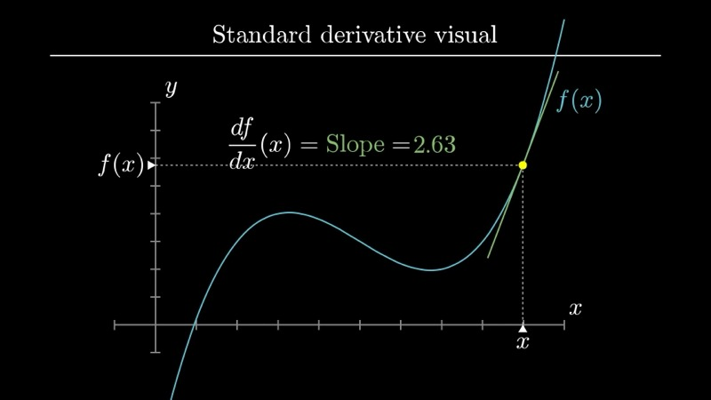
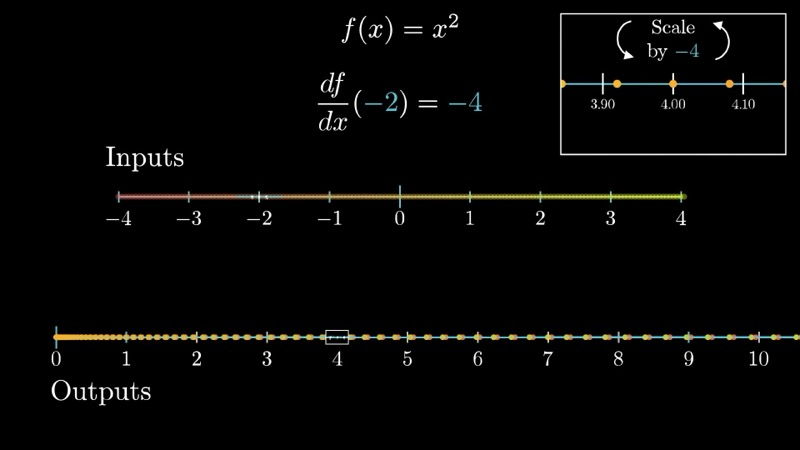
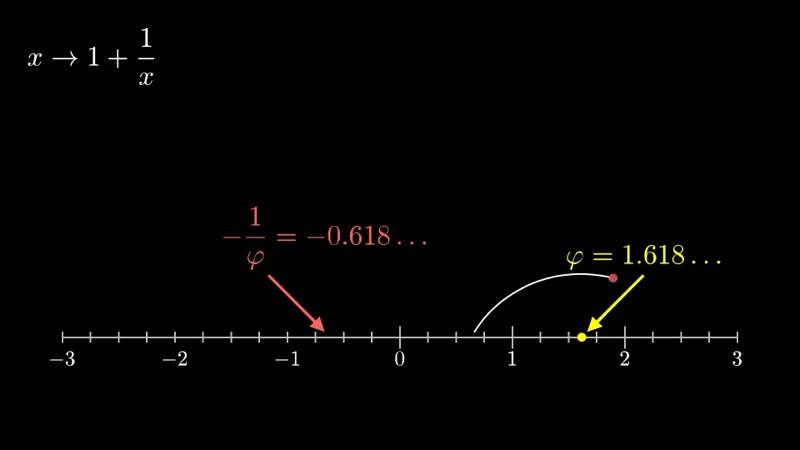
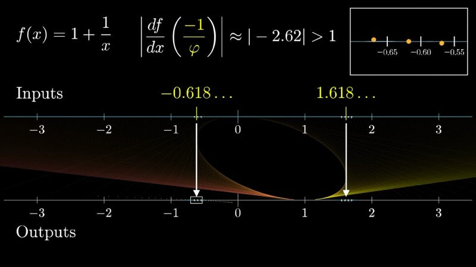

This lesson introduces a complementary perspective on derivatives: viewing
functions as **transformations** that map input points on the number line to
output points on another number line. Rather than interpreting the derivative as
the slope of a graph, we interpret it as a local stretching or squishing factor.
We then apply this viewpoint to analyze the stability of fixed points in an
iterated function, resolving a puzzle about infinite continued fractions.

::: {.callout-note collapse="true"}
## Prerequisites

- Understanding of the derivative as the limit $\lim_{h \to 0} \frac{f(x+h) - f(x)}{h}$
- Familiarity with the graphical interpretation of derivatives as slopes (Chapters 2--3)
- Basic experience with function composition and iteration
:::

## Topics Covered

- The transformational view: functions as mappings from one number line to another
- The derivative as a local stretching/squishing factor
- Fixed points of iterated functions
- Stability analysis via the derivative: stable vs. unstable fixed points
- Application to the infinite continued fraction $1 + \cfrac{1}{1 + \cfrac{1}{1 + \cdots}}$

## Lecture Video

```{=html}
<div class="video-container"><iframe src="https://www.youtube.com/embed/CfW845LNObM" title="The other way to visualize derivatives" frameborder="0" allow="accelerometer; autoplay; clipboard-write; encrypted-media; gyroscope; picture-in-picture; web-share" allowfullscreen></iframe></div>
```

## Key Video Frames









## Key Concepts

### The Standard View: Derivative as Slope

We begin by recalling the conventional picture. Given a function $f : \mathbb{R} \to \mathbb{R}$, we typically graph it in the Cartesian plane and identify the derivative $f'(x_0)$ with the slope of the tangent line at the point $(x_0, f(x_0))$.

This is a powerful and indispensable perspective. However, when we move beyond functions of a single real variable -- into multivariable calculus, complex analysis, or differential geometry -- the "slope of a graph" interpretation ceases to apply directly. A more portable intuition is therefore desirable.

### The Transformational View

We now consider a function $f$ not as a curve in the plane, but as a **transformation** (or mapping) that sends each point on an input number line to a corresponding point on an output number line.

Under this interpretation, the derivative $f'(x_0)$ measures the **local stretching factor** at $x_0$. Concretely, consider a small interval of width $\delta$ centered at $x_0$ on the input line. After applying $f$, that interval is mapped approximately to an interval of width $|f'(x_0)| \cdot \delta$ centered at $f(x_0)$ on the output line.

More precisely, for $h$ small,

$$
f(x_0 + h) \approx f(x_0) + f'(x_0) \cdot h.
$$

This first-order approximation tells us that, locally, the function acts as a linear map that scales displacements by $f'(x_0)$.

- If $|f'(x_0)| > 1$, the function **stretches** the neighborhood around $x_0$.
- If $|f'(x_0)| < 1$, the function **contracts** (squishes) the neighborhood.
- If $f'(x_0) < 0$, the function also **reverses orientation** (flips the neighborhood).
- If $f'(x_0) = 0$, the neighborhood collapses toward a single point.

### Example: $f(x) = x^2$

Consider $f(x) = x^2$, whose derivative is $f'(x) = 2x$. We examine several input values:

| Input $x_0$ | Output $f(x_0)$ | Derivative $f'(x_0)$ | Local behavior |
|---|---|---|---|
| $1$ | $1$ | $2$ | Stretches by factor $2$ |
| $3$ | $9$ | $6$ | Stretches by factor $6$ |
| $\tfrac{1}{4}$ | $\tfrac{1}{16}$ | $\tfrac{1}{2}$ | Contracts by factor $\tfrac{1}{2}$ |
| $0$ | $0$ | $0$ | Collapses to a point |
| $-2$ | $4$ | $-4$ | Stretches by $4$ and reverses |

Near $x_0 = 1$, a cluster of input points spaced evenly around $1$ will, after applying $f$, appear roughly twice as spread out around the output value $1$. Near $x_0 = 0$, any small neighborhood is crushed down toward the origin.

### Interactive Desmos Graph: Transformational View of $f(x) = x^2$

```{=html}
<div id="calc_ch12_1" class="desmos-container"></div>
<script src="https://www.desmos.com/api/v1.9/calculator.js?apiKey=dcb31709b452b1cf9dc26972add0fda6"></script>
<script>
  var calc_ch12_1 = Desmos.GraphingCalculator(document.getElementById('calc_ch12_1'), {
    expressions: true, settingsMenu: false, xAxisLabel: 'x', yAxisLabel: 'f(x)'
  });
  calc_ch12_1.setExpression({ id: 'func', latex: 'y = x^2', color: '#2d70b3' });
  calc_ch12_1.setExpression({ id: 'a', latex: 'a = 1', sliderBounds: { min: -3, max: 3, step: 0.01 } });
  calc_ch12_1.setExpression({ id: 'tangent', latex: 'y = a^2 + 2a(x - a)', color: '#c74440', lineStyle: Desmos.Styles.DASHED });
  calc_ch12_1.setExpression({ id: 'pt', latex: '(a, a^2)', color: '#388c46', pointSize: 10 });
  calc_ch12_1.setExpression({ id: 'deriv_label', latex: 'f\'(a) = 2a', color: '#6042a6' });
  calc_ch12_1.setMathBounds({ left: -4, right: 4, bottom: -2, top: 12 });
</script>
```

Drag the slider $a$ to move along the curve $f(x) = x^2$. The tangent line (dashed) has slope $2a$, which equals the local stretching factor. Near $a = 0$, the tangent is flat (zero stretching); near $a = 2$, the slope is $4$ (fourfold stretching).

### Fixed Points and Iterated Functions

We now turn to a compelling application of the transformational viewpoint. Consider the function

$$
g(x) = 1 + \frac{1}{x}.
$$

A **fixed point** of $g$ is a value $x^*$ satisfying $g(x^*) = x^*$, i.e.,

$$
x^* = 1 + \frac{1}{x^*}.
$$

Multiplying both sides by $x^*$ and rearranging, we obtain

$$
(x^*)^2 - x^* - 1 = 0,
$$

which has two solutions:

$$
x^* = \frac{1 \pm \sqrt{5}}{2}.
$$

These are the **golden ratio** $\phi = \frac{1 + \sqrt{5}}{2} \approx 1.618$ and its companion $\psi = \frac{1 - \sqrt{5}}{2} \approx -0.618$. Note that $\psi = -1/\phi$.

### The Infinite Continued Fraction

The expression

$$
1 + \cfrac{1}{1 + \cfrac{1}{1 + \cfrac{1}{\ddots}}}
$$

can be interpreted as the limit of the sequence obtained by iterating $g$. We pick a seed value $x_0$ and define

$$
x_{n+1} = g(x_n) = 1 + \frac{1}{x_n}.
$$

Since both $\phi$ and $\psi$ are fixed points, both are candidates for the value of the infinite fraction. Yet numerical experimentation reveals that for virtually any positive starting value, the sequence converges to $\phi$, never to $\psi$. The transformational view of derivatives explains why.

### Stability of Fixed Points

We compute the derivative of $g$:

$$
g'(x) = -\frac{1}{x^2}.
$$

At the two fixed points:

$$
g'(\phi) = -\frac{1}{\phi^2} \approx -0.382, \qquad |g'(\phi)| \approx 0.382 < 1,
$$

$$
g'(\psi) = -\frac{1}{\psi^2} \approx -2.618, \qquad |g'(\psi)| \approx 2.618 > 1.
$$

In the transformational picture, when we apply $g$ near $\phi$, a small neighborhood is **contracted** by a factor of approximately $0.38$. Each subsequent iteration of $g$ squeezes points ever closer to $\phi$. This makes $\phi$ a **stable** (or **attracting**) fixed point.

Conversely, near $\psi$, a small neighborhood is **expanded** by a factor of approximately $2.6$ on each iteration. Points are pushed away from $\psi$. This makes $\psi$ an **unstable** (or **repelling**) fixed point.

We may state the general principle as follows:

> Let $x^*$ be a fixed point of a differentiable function $g$. Then $x^*$ is **stable** under iteration of $g$ if $|g'(x^*)| < 1$, and **unstable** if $|g'(x^*)| > 1$.

### Interactive Desmos Graph: Iteration of $g(x) = 1 + 1/x$ (Cobweb Diagram)

```{=html}
<div id="calc_ch12_2" class="desmos-container"></div>
<script>
  var calc_ch12_2 = Desmos.GraphingCalculator(document.getElementById('calc_ch12_2'), {
    expressions: true, settingsMenu: false, xAxisLabel: 'x', yAxisLabel: 'g(x)'
  });
  calc_ch12_2.setExpression({ id: 'g', latex: 'g(x) = 1 + \\frac{1}{x}', color: '#2d70b3' });
  calc_ch12_2.setExpression({ id: 'diag', latex: 'y = x', color: '#888888', lineStyle: Desmos.Styles.DASHED });
  calc_ch12_2.setExpression({ id: 'phi_pt', latex: '\\left(\\frac{1+\\sqrt{5}}{2},\\frac{1+\\sqrt{5}}{2}\\right)', color: '#388c46', pointSize: 10, label: 'phi', showLabel: true });
  calc_ch12_2.setExpression({ id: 'psi_pt', latex: '\\left(\\frac{1-\\sqrt{5}}{2},\\frac{1-\\sqrt{5}}{2}\\right)', color: '#c74440', pointSize: 10, label: 'psi', showLabel: true });
  calc_ch12_2.setExpression({ id: 'x0', latex: 'x_0 = 0.5', sliderBounds: { min: 0.1, max: 5, step: 0.01 } });
  calc_ch12_2.setExpression({ id: 'x1', latex: 'x_1 = g(x_0)' });
  calc_ch12_2.setExpression({ id: 'x2', latex: 'x_2 = g(x_1)' });
  calc_ch12_2.setExpression({ id: 'x3', latex: 'x_3 = g(x_2)' });
  calc_ch12_2.setExpression({ id: 'x4', latex: 'x_4 = g(x_3)' });
  calc_ch12_2.setExpression({ id: 'x5', latex: 'x_5 = g(x_4)' });
  calc_ch12_2.setMathBounds({ left: -2, right: 5, bottom: -1, top: 5 });
</script>
```

The fixed points $\phi$ (green) and $\psi$ (red) are marked where $g(x)$ intersects the line $y = x$. Adjust the seed value $x_0$ and observe that the iterates $x_1, x_2, \ldots$ converge to $\phi$ regardless of the starting point.

### Interactive Desmos Graph: Local Stretching Near Fixed Points

```{=html}
<div id="calc_ch12_3" class="desmos-container"></div>
<script>
  var calc_ch12_3 = Desmos.GraphingCalculator(document.getElementById('calc_ch12_3'), {
    expressions: true, settingsMenu: false, xAxisLabel: 'x', yAxisLabel: ''
  });
  calc_ch12_3.setExpression({ id: 'gprime', latex: 'y = -\\frac{1}{x^2}', color: '#2d70b3' });
  calc_ch12_3.setExpression({ id: 'upper', latex: 'y = 1', color: '#c74440', lineStyle: Desmos.Styles.DASHED });
  calc_ch12_3.setExpression({ id: 'lower', latex: 'y = -1', color: '#c74440', lineStyle: Desmos.Styles.DASHED });
  calc_ch12_3.setExpression({ id: 'phi_line', latex: 'x = \\frac{1+\\sqrt{5}}{2}', color: '#388c46', lineStyle: Desmos.Styles.DASHED });
  calc_ch12_3.setExpression({ id: 'psi_line', latex: 'x = \\frac{1-\\sqrt{5}}{2}', color: '#6042a6', lineStyle: Desmos.Styles.DASHED });
  calc_ch12_3.setExpression({ id: 'shade', latex: '-1 < y < 1', color: '#388c46', fillOpacity: 0.1 });
  calc_ch12_3.setMathBounds({ left: -3, right: 4, bottom: -4, top: 2 });
</script>
```

This graph plots $g'(x) = -1/x^2$. The shaded band marks the **stability region** $|g'| < 1$. At $x = \phi$ (green dashed line), the derivative falls inside this band, confirming stability. At $x = \psi$ (purple dashed line), it lies well outside, confirming instability.

### Animated: Transformational View of $f(x) = x^2$

```{=html}
<div class="d3-container" id="ch12_transform"></div>
<div class="d3-controls">
  <button id="ch12_transform_play">Play &#9654;</button>
  <button id="ch12_transform_reset">Reset</button>
  <label>Center x&#8320;:</label>
  <input type="range" id="ch12_transform_x0" min="-2.5" max="3" value="1" step="0.1">
  <span class="value-display" id="ch12_transform_x0_val">x&#8320; = 1.0</span>
  <span class="value-display" id="ch12_transform_info"></span>
</div>
<script>
(function() {
  const W = 700, H = 340, margin = {top: 30, right: 30, bottom: 30, left: 30};
  const w = W - margin.left - margin.right;
  const hTotal = H - margin.top - margin.bottom;
  const lineY1 = hTotal * 0.25;   // input number line y
  const lineY2 = hTotal * 0.75;   // output number line y
  const arrowRegion = (lineY1 + lineY2) / 2;

  const svg = d3.select("#ch12_transform").append("svg")
    .attr("viewBox", `0 0 ${W} ${H}`)
    .append("g").attr("transform", `translate(${margin.left},${margin.top})`);

  // Scales: input domain [-3, 4], output domain [0, 10] (for x^2 range)
  const xIn = d3.scaleLinear().domain([-3, 4]).range([0, w]);
  const xOut = d3.scaleLinear().domain([-1, 10]).range([0, w]);

  // Input number line
  svg.append("line").attr("x1", 0).attr("y1", lineY1).attr("x2", w).attr("y2", lineY1)
    .attr("stroke", "#333").attr("stroke-width", 1.5);
  svg.append("text").attr("x", w + 5).attr("y", lineY1 + 4)
    .attr("font-size", "12px").attr("fill", "#333").text("Input");
  // Ticks on input
  for (let v = -3; v <= 4; v++) {
    svg.append("line").attr("x1", xIn(v)).attr("y1", lineY1 - 5).attr("x2", xIn(v)).attr("y2", lineY1 + 5)
      .attr("stroke", "#333").attr("stroke-width", 1);
    svg.append("text").attr("x", xIn(v)).attr("y", lineY1 - 10)
      .attr("text-anchor", "middle").attr("font-size", "10px").attr("fill", "#555").text(v);
  }

  // Output number line
  svg.append("line").attr("x1", 0).attr("y1", lineY2).attr("x2", w).attr("y2", lineY2)
    .attr("stroke", "#333").attr("stroke-width", 1.5);
  svg.append("text").attr("x", w + 5).attr("y", lineY2 + 4)
    .attr("font-size", "12px").attr("fill", "#333").text("Output");
  // Ticks on output
  for (let v = 0; v <= 10; v++) {
    svg.append("line").attr("x1", xOut(v)).attr("y1", lineY2 - 5).attr("x2", xOut(v)).attr("y2", lineY2 + 5)
      .attr("stroke", "#333").attr("stroke-width", 1);
    svg.append("text").attr("x", xOut(v)).attr("y", lineY2 + 18)
      .attr("text-anchor", "middle").attr("font-size", "10px").attr("fill", "#555").text(v);
  }

  // Title labels
  svg.append("text").attr("x", w / 2).attr("y", -8)
    .attr("text-anchor", "middle").attr("font-size", "13px").attr("font-weight", 600)
    .attr("fill", "#333").text("f(x) = x\u00B2 : Input \u2192 Output");

  const arrowGroup = svg.append("g");
  const dotInGroup = svg.append("g");
  const dotOutGroup = svg.append("g");

  // f(x) = x^2
  function f(x) { return x * x; }
  function fprime(x) { return 2 * x; }

  const nDots = 11;

  function update(x0, animate) {
    const deriv = fprime(x0);
    const spread = 0.4;
    const pts = d3.range(nDots).map(i => {
      const t = -1 + 2 * i / (nDots - 1);  // t in [-1, 1]
      return x0 + t * spread;
    });

    document.getElementById("ch12_transform_x0_val").textContent =
      `x\u2080 = ${x0.toFixed(1)}`;
    document.getElementById("ch12_transform_info").textContent =
      `f'(${x0.toFixed(1)}) = ${deriv.toFixed(2)} \u2014 local stretch factor: ${Math.abs(deriv).toFixed(2)}`;

    const dur = animate ? 600 : 0;

    // Input dots
    const inDots = dotInGroup.selectAll("circle").data(pts);
    inDots.enter().append("circle")
      .attr("cy", lineY1).attr("r", 5).attr("fill", "#2d70b3").attr("opacity", 0.8)
      .merge(inDots).transition().duration(dur)
      .attr("cx", d => xIn(d));
    inDots.exit().remove();

    // Output dots
    const outData = pts.map(d => f(d));
    const outDots = dotOutGroup.selectAll("circle").data(outData);
    outDots.enter().append("circle")
      .attr("cy", lineY2).attr("r", 5).attr("fill", "#c74440").attr("opacity", 0.8)
      .merge(outDots).transition().duration(dur)
      .attr("cx", d => xOut(d));
    outDots.exit().remove();

    // Arrows connecting input to output
    const arrowData = pts.map((inp, i) => ({inp, out: outData[i]}));
    const arrows = arrowGroup.selectAll("line").data(arrowData);
    arrows.enter().append("line")
      .attr("stroke", "#999").attr("stroke-width", 0.8).attr("stroke-dasharray", "3,3")
      .attr("y1", lineY1 + 6).attr("y2", lineY2 - 6)
      .merge(arrows).transition().duration(dur)
      .attr("x1", d => xIn(d.inp))
      .attr("x2", d => xOut(d.out));
    arrows.exit().remove();

    // Highlight center point on input
    const centerIn = dotInGroup.selectAll(".center-in").data([x0]);
    centerIn.enter().append("circle").attr("class", "center-in")
      .attr("cy", lineY1).attr("r", 7).attr("fill", "none").attr("stroke", "#388c46").attr("stroke-width", 2.5)
      .merge(centerIn).transition().duration(dur)
      .attr("cx", d => xIn(d));

    // Highlight center point on output
    const centerOut = dotOutGroup.selectAll(".center-out").data([f(x0)]);
    centerOut.enter().append("circle").attr("class", "center-out")
      .attr("cy", lineY2).attr("r", 7).attr("fill", "none").attr("stroke", "#388c46").attr("stroke-width", 2.5)
      .merge(centerOut).transition().duration(dur)
      .attr("cx", d => xOut(d));

    // Bracket showing input width
    const inMin = xIn(pts[0]), inMax = xIn(pts[nDots - 1]);
    const bracketIn = svg.selectAll(".bracket-in").data([1]);
    bracketIn.enter().append("line").attr("class", "bracket-in")
      .attr("y1", lineY1 + 14).attr("y2", lineY1 + 14)
      .attr("stroke", "#2d70b3").attr("stroke-width", 2)
      .merge(bracketIn).transition().duration(dur)
      .attr("x1", inMin).attr("x2", inMax);

    const bracketInLabel = svg.selectAll(".bracket-in-label").data([1]);
    bracketInLabel.enter().append("text").attr("class", "bracket-in-label")
      .attr("y", lineY1 + 26).attr("text-anchor", "middle")
      .attr("font-size", "10px").attr("fill", "#2d70b3")
      .merge(bracketInLabel).transition().duration(dur)
      .attr("x", (inMin + inMax) / 2)
      .textTween(function() {
        return function() { return `\u03B4 = ${(2 * spread).toFixed(2)}`; };
      });

    // Bracket showing output width
    const outMin = xOut(Math.min(...outData)), outMax = xOut(Math.max(...outData));
    const bracketOut = svg.selectAll(".bracket-out").data([1]);
    bracketOut.enter().append("line").attr("class", "bracket-out")
      .attr("y1", lineY2 - 14).attr("y2", lineY2 - 14)
      .attr("stroke", "#c74440").attr("stroke-width", 2)
      .merge(bracketOut).transition().duration(dur)
      .attr("x1", outMin).attr("x2", outMax);

    const outWidth = Math.max(...outData) - Math.min(...outData);
    const bracketOutLabel = svg.selectAll(".bracket-out-label").data([1]);
    bracketOutLabel.enter().append("text").attr("class", "bracket-out-label")
      .attr("y", lineY2 - 18).attr("text-anchor", "middle")
      .attr("font-size", "10px").attr("fill", "#c74440")
      .merge(bracketOutLabel).transition().duration(dur)
      .attr("x", (outMin + outMax) / 2)
      .textTween(function() {
        return function() { return `|f'|\u00B7\u03B4 \u2248 ${outWidth.toFixed(2)}`; };
      });
  }

  const slider = document.getElementById("ch12_transform_x0");
  slider.addEventListener("input", () => update(+slider.value, true));

  document.getElementById("ch12_transform_reset").addEventListener("click", function() {
    slider.value = 1;
    update(1, true);
  });

  // Animate: sweep x0 from -2 to 3
  document.getElementById("ch12_transform_play").addEventListener("click", function() {
    let val = -2.0;
    slider.value = val;
    update(val, true);
    const interval = setInterval(() => {
      val = Math.round((val + 0.2) * 10) / 10;
      slider.value = val;
      update(val, true);
      if (val >= 3.0) clearInterval(interval);
    }, 500);
  });

  update(1, false);
})();
</script>
```

Drag the **Center x_0** slider to move a cluster of evenly spaced input dots along the input number line. The output dots on the lower line show where $f(x) = x^2$ maps each point. Observe how the output cluster spreads apart (stretches) when $|f'(x_0)| > 1$ and bunches together (contracts) when $|f'(x_0)| < 1$. The green-circled center point highlights the base point and its image. Press **Play** to sweep automatically across the number line.

### Animated: Cobweb Diagram for $g(x) = 1 + 1/x$

```{=html}
<div class="d3-container" id="ch12_cobweb"></div>
<div class="d3-controls">
  <button id="ch12_cobweb_play">Play &#9654;</button>
  <button id="ch12_cobweb_reset">Reset</button>
  <label>Seed x&#8320;:</label>
  <input type="range" id="ch12_cobweb_x0" min="0.2" max="5" value="0.5" step="0.1">
  <span class="value-display" id="ch12_cobweb_x0_val">x&#8320; = 0.5</span>
  <label style="margin-left:12px;">Iterations:</label>
  <input type="range" id="ch12_cobweb_n" min="1" max="25" value="12" step="1">
  <span class="value-display" id="ch12_cobweb_n_val">n = 12</span>
  <span class="value-display" id="ch12_cobweb_info"></span>
</div>
<script>
(function() {
  const W = 700, H = 500, margin = {top: 30, right: 30, bottom: 50, left: 60};
  const w = W - margin.left - margin.right, h = H - margin.top - margin.bottom;

  const svg = d3.select("#ch12_cobweb").append("svg")
    .attr("viewBox", `0 0 ${W} ${H}`)
    .append("g").attr("transform", `translate(${margin.left},${margin.top})`);

  const phi = (1 + Math.sqrt(5)) / 2;

  const xScale = d3.scaleLinear().domain([0, 5]).range([0, w]);
  const yScale = d3.scaleLinear().domain([0, 5]).range([h, 0]);

  // Axes
  svg.append("g").attr("transform", `translate(0,${h})`).call(d3.axisBottom(xScale).ticks(10))
    .append("text").attr("x", w / 2).attr("y", 40).attr("fill", "#333")
    .attr("text-anchor", "middle").attr("font-size", "14px").text("x");
  svg.append("g").call(d3.axisLeft(yScale).ticks(10))
    .append("text").attr("x", -h / 2).attr("y", -45).attr("fill", "#333")
    .attr("text-anchor", "middle").attr("transform", "rotate(-90)")
    .attr("font-size", "14px").text("g(x)");

  // g(x) = 1 + 1/x curve
  function g(x) { return 1 + 1 / x; }
  const curveData = d3.range(0.15, 5.01, 0.02).map(x => [x, g(x)]);
  svg.append("path").datum(curveData)
    .attr("d", d3.line().x(d => xScale(d[0])).y(d => yScale(d[1])))
    .attr("fill", "none").attr("stroke", "#2d70b3").attr("stroke-width", 2.5);

  // y = x line
  svg.append("line")
    .attr("x1", xScale(0)).attr("y1", yScale(0))
    .attr("x2", xScale(5)).attr("y2", yScale(5))
    .attr("stroke", "#888").attr("stroke-width", 1.5).attr("stroke-dasharray", "6,4");

  // Fixed point markers
  svg.append("circle").attr("cx", xScale(phi)).attr("cy", yScale(phi))
    .attr("r", 7).attr("fill", "#388c46").attr("opacity", 0.8);
  svg.append("text").attr("x", xScale(phi) + 10).attr("y", yScale(phi) - 8)
    .attr("font-size", "13px").attr("fill", "#388c46").attr("font-weight", 600)
    .text("\u03C6 \u2248 1.618");

  // Labels
  svg.append("text").attr("x", xScale(4.3)).attr("y", yScale(g(4.3)) - 8)
    .attr("font-size", "12px").attr("fill", "#2d70b3").text("g(x) = 1 + 1/x");
  svg.append("text").attr("x", xScale(4.5)).attr("y", yScale(4.5) - 8)
    .attr("font-size", "12px").attr("fill", "#888").text("y = x");

  const cobwebGroup = svg.append("g");
  const iterDotGroup = svg.append("g");

  let animTimer = null;

  function drawCobweb(x0, maxIter, animate) {
    cobwebGroup.selectAll("*").remove();
    iterDotGroup.selectAll("*").remove();

    // Build cobweb path segments
    const segments = [];
    let xCur = x0;
    for (let i = 0; i < maxIter; i++) {
      const yCur = g(xCur);
      // Vertical line from (xCur, xCur) to (xCur, g(xCur))
      segments.push({x1: xCur, y1: (i === 0 ? 0 : xCur), x2: xCur, y2: yCur, iter: i, type: 'v'});
      // Horizontal line from (xCur, g(xCur)) to (g(xCur), g(xCur))
      segments.push({x1: xCur, y1: yCur, x2: yCur, y2: yCur, iter: i, type: 'h'});
      xCur = yCur;
    }

    const finalVal = xCur;
    document.getElementById("ch12_cobweb_info").textContent =
      `x_${maxIter} = ${finalVal.toFixed(6)}  |  \u03C6 = ${phi.toFixed(6)}  |  error = ${Math.abs(finalVal - phi).toExponential(2)}`;

    if (animate) {
      // Draw segments one by one
      let idx = 0;
      if (animTimer) clearInterval(animTimer);
      animTimer = setInterval(() => {
        if (idx >= segments.length) { clearInterval(animTimer); animTimer = null; return; }
        const s = segments[idx];
        const color = d3.interpolateRgb("#c74440", "#388c46")(idx / segments.length);
        cobwebGroup.append("line")
          .attr("x1", xScale(s.x1)).attr("y1", yScale(s.y1))
          .attr("x2", xScale(s.x1)).attr("y2", yScale(s.y1))
          .attr("stroke", color).attr("stroke-width", 1.5).attr("opacity", 0.85)
          .transition().duration(250)
          .attr("x2", xScale(s.x2)).attr("y2", yScale(s.y2));

        // Add dot at horizontal endpoint (the next iterate on y=x)
        if (s.type === 'h') {
          iterDotGroup.append("circle")
            .attr("cx", xScale(s.x2)).attr("cy", yScale(s.y2))
            .attr("r", 0).attr("fill", color)
            .transition().delay(250).duration(150).attr("r", 3.5);
        }
        idx++;
      }, 300);
    } else {
      // Draw all at once
      segments.forEach((s, idx) => {
        const color = d3.interpolateRgb("#c74440", "#388c46")(idx / segments.length);
        cobwebGroup.append("line")
          .attr("x1", xScale(s.x1)).attr("y1", yScale(s.y1))
          .attr("x2", xScale(s.x2)).attr("y2", yScale(s.y2))
          .attr("stroke", color).attr("stroke-width", 1.5).attr("opacity", 0.85);
        if (s.type === 'h') {
          iterDotGroup.append("circle")
            .attr("cx", xScale(s.x2)).attr("cy", yScale(s.y2))
            .attr("r", 3.5).attr("fill", color);
        }
      });
    }

    // Starting point
    iterDotGroup.append("circle")
      .attr("cx", xScale(x0)).attr("cy", yScale(0))
      .attr("r", 5).attr("fill", "#c74440").attr("stroke", "#333").attr("stroke-width", 1);
  }

  function readControls() {
    const x0 = +document.getElementById("ch12_cobweb_x0").value;
    const n = +document.getElementById("ch12_cobweb_n").value;
    document.getElementById("ch12_cobweb_x0_val").textContent = `x\u2080 = ${x0.toFixed(1)}`;
    document.getElementById("ch12_cobweb_n_val").textContent = `n = ${n}`;
    return {x0, n};
  }

  document.getElementById("ch12_cobweb_x0").addEventListener("input", function() {
    if (animTimer) { clearInterval(animTimer); animTimer = null; }
    const {x0, n} = readControls();
    drawCobweb(x0, n, false);
  });

  document.getElementById("ch12_cobweb_n").addEventListener("input", function() {
    if (animTimer) { clearInterval(animTimer); animTimer = null; }
    const {x0, n} = readControls();
    drawCobweb(x0, n, false);
  });

  document.getElementById("ch12_cobweb_play").addEventListener("click", function() {
    const {x0, n} = readControls();
    drawCobweb(x0, n, true);
  });

  document.getElementById("ch12_cobweb_reset").addEventListener("click", function() {
    if (animTimer) { clearInterval(animTimer); animTimer = null; }
    document.getElementById("ch12_cobweb_x0").value = 0.5;
    document.getElementById("ch12_cobweb_n").value = 12;
    const {x0, n} = readControls();
    drawCobweb(x0, n, false);
  });

  // Initial draw
  drawCobweb(0.5, 12, false);
})();
</script>
```

Press **Play** to watch the cobweb diagram draw step by step. Starting from seed $x_0$, each iteration alternates between jumping vertically to the curve $g(x) = 1 + 1/x$ and horizontally to the diagonal $y = x$. The path spirals inward toward the golden ratio $\phi \approx 1.618$, demonstrating that $\phi$ is a stable attractor. Adjust the seed and iteration count with the sliders, or press **Reset** to return to the defaults.

### Why This Perspective Matters

The graphical interpretation of the derivative (slope of a tangent line) is specific to functions $f : \mathbb{R} \to \mathbb{R}$ plotted in the Cartesian plane. The transformational interpretation -- the derivative as a local linear scaling factor -- generalizes naturally to:

- **Multivariable calculus**, where the derivative becomes the Jacobian matrix, describing how a mapping stretches, rotates, and shears small regions of $\mathbb{R}^n$.
- **Complex analysis**, where analytic functions act as conformal mappings, and the derivative describes local rotation and scaling in the complex plane.
- **Differential geometry**, where the derivative of a map between manifolds is a linear map between tangent spaces.

In each of these settings, the core idea remains unchanged: the derivative describes the best local linear approximation to a function, encoding how it transforms an infinitesimal neighborhood of a point.

## Summary

::: {.key-formula}
| Concept | Key Result |
|---|---|
| Transformational derivative | $f(x_0 + h) \approx f(x_0) + f'(x_0) \cdot h$; the derivative is the local stretching factor |
| Stretching vs. squishing | $|f'(x_0)| > 1$: stretches; $|f'(x_0)| < 1$: contracts; $f'(x_0) < 0$: reverses |
| Fixed point equation for $g(x) = 1 + 1/x$ | $(x^*)^2 - x^* - 1 = 0 \implies x^* = \phi$ or $x^* = \psi = -1/\phi$ |
| Stability criterion | Fixed point $x^*$ is stable if $|g'(x^*)| < 1$, unstable if $|g'(x^*)| > 1$ |
| Golden ratio as attractor | $|g'(\phi)| = 1/\phi^2 \approx 0.382 < 1$, so $\phi$ is the stable fixed point |
:::
